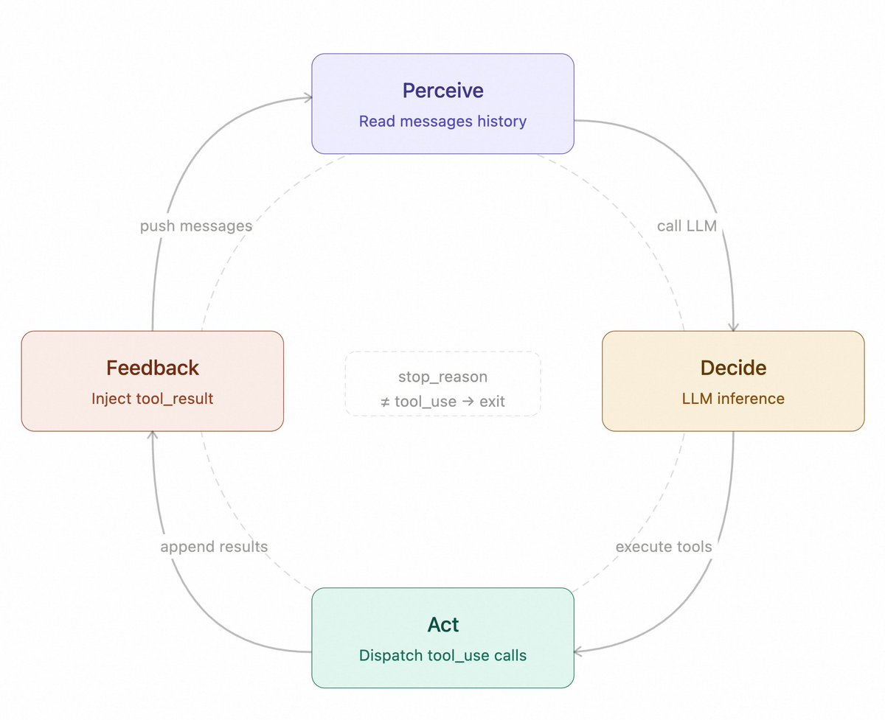
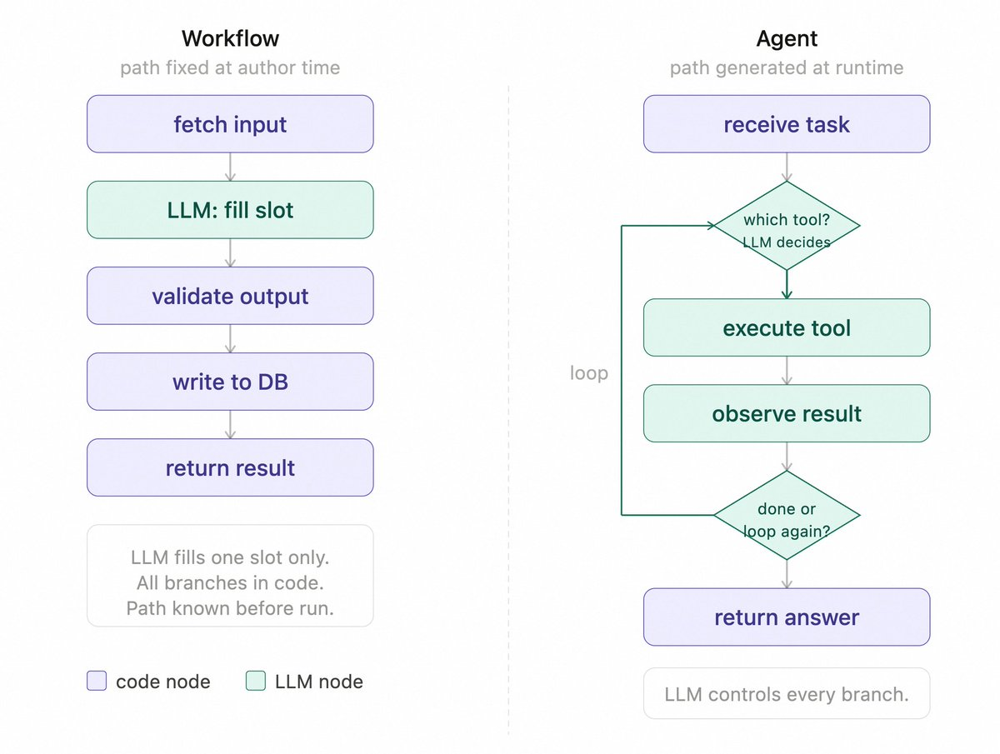
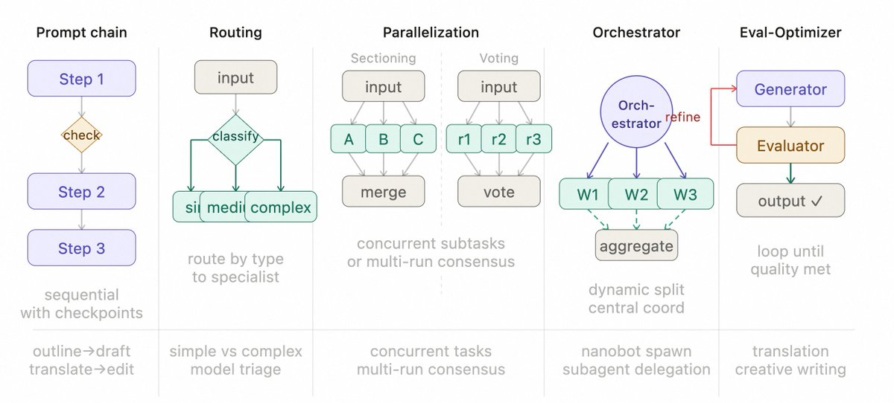
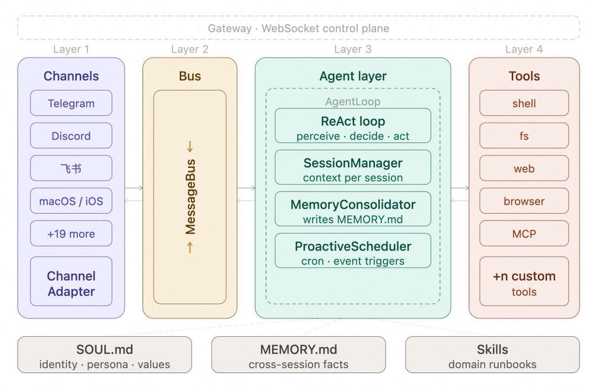

# 你不知道的 Agent：原理、架构与工程实践

> 作者：Tw93 ([@HiTw93](https://x.com/HiTw93))
> 发布于：2025 年 3 月 19 日
> 原文链接：https://x.com/HiTw93/article/2034627967926825175

---

## 0. 太长不读

在写完「你不知道的 Claude Code：架构、治理与工程实践」之后，发现自己对 Agent 底层的理解还不够深入，加上团队在 Agent 方向已经有不少业务落地经验，一直缺少一份系统梳理，所以我又把资料、开源实现和自己写的代码一起过了一遍，最后整理成了这篇文章。

这篇文章主要讲 Agent 架构里几块最影响工程效果的内容，包括**控制流、上下文工程、工具设计、记忆、多 Agent 组织、评测、追踪和安全**，最后再用 OpenClaw 的实现把这些设计原则串起来看一遍。

整理下来，有几处判断和我原来想的不太一样：

- 更贵的模型带来的提升，很多时候没有想象中那么大，反而 **Harness 和验证测试质量对成功率的影响更大**
- 调试 Agent 行为时，也应优先检查**工具定义**，多数工具选择错误都出在描述不准确
- 评测系统本身的问题，很多时候比 Agent 出问题更难发现

---

## 1. Agent Loop 的基本运转方式

Agent Loop 的核心实现逻辑抽象后其实不到 20 行代码：

```typescript
const messages: MessageParam[] = [{ role: "user", content: userInput }];

while (true) {
  const response = await client.messages.create({
    model: "claude-opus-4-6",
    max_tokens: 8096,
    tools: toolDefinitions,
    messages,
  });

  if (response.stop_reason === "tool_use") {
    const toolResults = await Promise.all(
      response.content
        .filter((b) => b.type === "tool_use")
        .map(async (b) => ({
          type: "tool_result" as const,
          tool_use_id: b.id,
          content: await executeTool(b.name, b.input),
        }))
    );
    messages.push({ role: "assistant", content: response.content });
    messages.push({ role: "user", content: toolResults });
  } else {
    return response.content.find((b) => b.type === "text")?.text ?? "";
  }
}
```

控制流：**感知 -> 决策 -> 行动 -> 反馈** 四阶段不断循环，直到模型返回纯文本为止。



看过不少 Agent 实现和官方 SDK，结构都差不多，循环本身相当稳定。从最小实现一路扩展到支持子 Agent、上下文压缩和 Skills 加载，主循环基本没有变化。新增能力通常都是**叠加在循环外部**，而不是改动循环内部。

新能力基本只通过三种方式接入：
1. 扩展工具集和 handler
2. 调整系统提示结构
3. 把状态外化到文件或数据库

> **模型负责推理，外部系统负责状态和边界**。一旦这个分工确定下来，核心循环逻辑就很少需要频繁调整了。

### Workflow 和 Agent 有什么区别

Anthropic 对这两类系统有一个直接区分：
- **Workflow**：执行路径由代码预先写死
- **Agent**：由 LLM 动态决定下一步

核心区别在于**控制权掌握在谁手里**。两者本身并无高下之分，真正重要的是给任务找到更适合的解决方案。

| 维度 | Workflow | Agent |
| --- | --- | --- |
| 控制权 | 代码预定义，同输入必走同一路径 | LLM动态决策，可能需要评测验证 |
| 执行方式 | 工具顺序固定，错误走预设分支 | 工具按需选择，模型可尝试自我修复 |
| 状态与记忆 | 显式状态机。 节点跳转清晰 | 隐式上下文 状态在对话历史中累积 |
| 维护成本 | 改流程需修改代码并重新部署 | 调整系统提示即可，无需重新部署 |
| 可观测性 | 志定位节点， 延迟可预估 | 需完整执行记录理解决策链，轮数不固定 |
| 人机协作 | 人在预设节点介入 | 人在任意轮次介入或接管 |
| 适用场景 | 流程固定、输入边界清晰 | 需要中间推理与灵活判断 |

放在一张图里看，会更直观：



### 五种常见控制模式

1. **提示链 (Prompt Chaining)**：任务拆成顺序步骤，每步 LLM 处理上一步的输出，中间可加代码检查点。适合生成后翻译、先写大纲再写正文这类线性流程。

2. **路由 (Routing)**：对输入分类，定向到对应的专用处理流程。简单问题走轻量模型，复杂问题走强模型。

3. **并行 (Parallelization)**：两种变体——分段法把任务拆成独立子任务并发跑；投票法把同一任务跑多次取共识。适合高风险决策或需要多视角的场景。

4. **编排器-工作者 (Orchestrator-Workers)**：中央 LLM 动态分解任务，委派给工作者 LLM，综合结果。

5. **评估器-优化器 (Evaluator-Optimizer)**：生成器产出，评估器给反馈，循环直到达标。适合翻译、创意写作这类质量标准难以用代码精确定义的任务。



---

## 2. 为什么 Harness 比模型更关键

**Harness** 是指围绕 Agent 构建的测试、验证与约束基础设施，至少包括四个部分：
- **验收基线**
- **执行边界**
- **反馈信号**
- **回退手段**

模型虽然重要，但决定系统能不能稳定运行的，往往是这些外围工程条件。这个判断在代码编写这类高可验证任务上最成立，但在开放式研究、多轮协商这类弱验证任务里，模型上限本身仍然更关键。

### OpenAI 的 Agent 优先开发实践

3 个工程师 5 个月写了百万行代码，将近 1500 个 PR，是传统开发速度的 10 倍。这个速度背后不是模型有多强，而是几个工程决策做对了：

- **Agent 看不到的内容等于不存在**：知识必须存在于代码库本身，外部文档对运行中的 Agent 不可见
- **约束编码化而非文档化**：编码进 Linter、类型系统或 CI 规则里的约束才具备可执行性
- **Agent 端到端自主完成任务**：从验证当前状态、复现 Bug、实现修复到开 PR、处理 Review、自主合并，全链路不需要人介入
- **最小化合并阻力**：测试偶发失败用重跑处理而不是阻塞进度

### Harness 的关键结论

任务按「目标清晰度 × 验证自动化程度」分成四种状态：

- **右上角**（目标明确 + 可自动验证）：最适合 Agent 发挥的区域
- **左上角**（任务清楚但验收靠人盯）：吞吐量天花板是人的审查速度
- **右下角**（有自动化反馈但目标模糊）：系统会高效地往错误方向跑
- **左下角**（两者都缺）：Agent 基本起不到作用

> **Harness 要做的就是把任务推进右上角**，让对错有机器可以执行的判断标准，而不是靠人盯。

---

## 3. 上下文工程为什么决定稳定性

Transformer 的注意力复杂度是 O(n²)，上下文越长，关键信号越容易被噪声稀释。实践中最常见的失效模式是无关内容一旦占到上下文的大头，Agent 的决策质量就会明显下滑，这类现象通常被叫作 **Context Rot**。

### 上下文为什么要分层

问题通常不是窗口不够长，而是信息密度不对。解决方式是按信息的使用频率和稳定性分层管理：

1. **常驻层**：身份定义、项目约定、绝对禁止项，保持短、硬、可执行
2. **按需加载**：Skills 和领域知识，描述符常驻，完整内容触发时再注入
3. **运行时注入**：当前时间、渠道 ID、用户偏好等动态信息
4. **记忆层**：跨会话经验写入 MEMORY.md，需要时才读取
5. **系统层**：Hooks 或代码规则处理确定性逻辑，完全不进上下文

> **别把确定性逻辑放进上下文**。凡是通过 Hooks、代码规则或工具约束能表达的，都应交给外部系统处理。

### 三种常见压缩策略

1. **滑动窗口**：丢弃旧消息，成本极低，会丢早期上下文，适合简短对话
2. **LLM 摘要**：模型生成总结，成本中等，丢细节保留决策，适合长任务
3. **工具结果替换**：占位符替换原始输出，成本极低，适合工具调用密集型

### Prompt Caching 减少重复开销

LLM 推理时，Transformer attention 会为每个 token 计算 Key-Value 对。如果当前请求的输入前缀和之前某次请求完全一致，这部分 KV 就可以直接从缓存读取。

> **稳定的大系统提示，比频繁变动的小提示实际成本更低**。因为写入成本只付一次，后续每次调用读取的折扣可以达到 90%。

### 为什么 Skills 要按需加载

核心思路：系统提示只保留索引，完整知识按需加载。

```typescript
const systemPrompt = `
可用 Skills：
- deploy: 部署到生产环境的完整流程
- code-review: 代码审查检查清单
- git-workflow: 分支策略和 PR 规范
`;

async function executeLoadSkill(name: string): Promise<string> {
  return fs.readFile(`./skills/${name}.md`, "utf-8");
}
```

Skill 描述要**足够短**（避免常驻上下文持续涨 token），也要**足够像路由条件而不是功能介绍**。最直接的写法是 **Use when / Don't use when**，再补几条反例。

> 没有反例时准确率从基准 73% 掉到 53%，加上反例后升到 85%，响应时间还降了 18.1%。

### 压缩最容易丢掉什么

压缩时最常见的不是摘要不够短，而是保留顺序设错了。最好在 CLAUDE.md 或等价文档里明确写出压缩时的保留优先级：

```markdown
### Compact Instructions 如何保留关键信息
保留优先级：
1. 架构决策，不得摘要
2. 已修改文件和关键变更
3. 验证状态，pass/fail
4. 未解决的 TODO 和回滚笔记
5. 工具输出，可删，只保留 pass/fail 结论
```

### 文件系统为什么适合做上下文接口

Cursor 把这种方式叫 **Dynamic Context Discovery**——默认少给，只在需要时读取。工具调用经常返回大量 JSON，不如直接写入文件，让 Agent 通过 grep、rg 或脚本按需读取。

Cursor 在 MCP 工具上也验证过这个方向：A/B 测试中，调用 MCP 工具的任务**总 token 消耗减少了 46.9%**。

---

## 4. 工具设计决定 Agent 能做什么

上下文决定模型能看到什么，工具决定模型能做什么。工具定义的质量比数量更关键——仅 5 个 MCP 服务器就可能带来约 55,000 tokens 的工具定义开销。工具一旦过多，模型对单个工具的注意力也会被稀释。

工具问题多数不在数量不够，而在选不对、描述看不懂、返回一堆没用的、出了错 Agent 也不知道怎么改。

| 维度 | 好工具 | 坏工具 |
| --- | --- | --- |
| 粒度 | 对应Agent要完成的目标 | 对应 API 能做的操作 |
| 示例 | schedule_meeting | list_users + list_events + create_event |
| 返回 | 与下一步决策直接相关的字段 | 完整原始数据 |
| 错误 | 结构化， 含修正建议 | 通用字符串 "Error" |
| 描述 | 说明何时用、何时不用 | 只写功能说明 |

### 工具设计如何演进

- **第一代，API 封装**：每个 API Endpoint 对应一个工具，粒度过细
- **第二代，ACI (Agent-Computer Interface)**：工具应对应 Agent 的目标，而不是底层 API 操作
- **第三代，Advanced Tool Use**：进一步的优化——Tool Search（动态工具发现）、Programmatic Tool Calling（代码编排）、Tool Use Examples（示例驱动）

### ACI 工具设计原则

差的做法参数模糊、错误不可修正、定义实现分离；好的做法用 schema 把定义和实现绑在一起，参数描述直接约束格式，错误结构化给出修正建议：

```typescript
// 差：参数模糊，出错只返回字符串
const tool = {
  name: "update_yuque_post",
  input_schema: {
    properties: {
      post_id: { type: "string" },
      content: { type: "string" },
    },
  },
};
return "Error: update failed";

// 好：边界清楚，结构化错误给出修正建议
const updateTool = betaZodTool({
  name: "update_yuque_post",
  description: "更新语雀文章内容，不适合创建新文章",
  inputSchema: z.object({
    post_id: z.string().describe("语雀文章 ID，纯数字字符串"),
    title: z.string().optional().describe("文章标题，不改时可省略"),
    content_markdown: z.string().describe("Markdown 格式正文"),
  }),
  run: async (input) => {
    const post = await getPost(input.post_id);
    if (!post) throw new ToolError("文章 ID 不存在", {
      error_code: "POST_NOT_FOUND",
      suggestion: "请先调用 list_yuque_posts 获取有效的 post_id",
    });
    return await updatePost(input.post_id, input.title, input.content_markdown);
  },
});
```

> 调试 Agent 时应先检查工具定义，大多数工具选择错误的原因出在描述不准确，不在模型能力。

---

## 5. 记忆系统如何设计

Agent 不具备原生的时间连续性，会话结束后上下文随之清空。要让系统具备跨会话的一致性，记忆层得单独设计。

### 四种记忆分别存在哪里

1. **上下文窗口 (工作记忆)**：当前任务所需的最小信息
2. **Skills (程序性记忆)**：怎么做某件事，按需加载不默认常驻
3. **JSONL 会话历史 (情景记忆)**：发生了什么，磁盘持久化
4. **MEMORY.md (语义记忆)**：Agent 主动写入认为重要的事实

### MEMORY.md 和 Skills 如何协作

核心都在解决两件事：**重要事实要留下来，注入模型的内容又不能失控**。

**ChatGPT 四层记忆**
拿它当一个产品实现来看，它没有使用向量数据库，也没有引入 RAG 检索增强生成，整体结构比很多人的预期更简洁：

1. Session Metadata：设备、地点、使用模式，不持久化
2. User Memory：约 33 条关键偏好事实，持久化，每次注入
3. Conversation Summary：约 15 个最近对话的轻量摘要，持久化
4. Current Session：当前对话滑动窗口，不持久化

**OpenClaw 混合检索架构：**
1. `memory/YYYY-MM-DD.md`：追加写日志，保留原始细节
2. `MEMORY.md`：精选事实，Agent 主动维护
3. `memory_search`：70% 向量相似度 + 30% 关键词权重的混合检索

> 对大多数 Agent 来说，结构化 Markdown 加关键词搜索已经具备足够好的可调试性、可维护性和成本表现。

### 记忆整合如何触发并回退

关键设计：**流程本身必须可回退**。系统只移动指针，不删除原始消息。即使整合失败，也还能回到原始存档继续工作。

---

## 6. 如何逐步放开 Agent 自主度

### 长任务如何跨 session 继续

更稳定的做法，是把长任务拆成 **Initializer Agent** 和 **Coding Agent** 两个角色协作：

- **Initializer Agent**：只在第一轮运行一次，生成 `feature-list.json`、`init.sh`、初始 git commit 和 `claude-progress.txt`
- **Coding Agent**：多个 session 循环执行，每次从文件和 git log 恢复现场

> **进度要放在文件里，不要放在上下文里。**

### 为什么任务状态要显式写出来

任务状态要显式记录为外部控制对象：

```json
{
  "tasks": [
    {"id": "1", "desc": "读取现有配置", "status": "completed"},
    {"id": "2", "desc": "修改数据库 schema", "status": "in_progress"},
    {"id": "3", "desc": "更新 API 接口", "status": "pending"}
  ]
}
```

约束：同一时间只能有一个 `in_progress`。

### 后台 I/O 如何接入

自主度提高以后，真正容易拖慢主循环的，通常不是模型推理，而是文件操作、网络请求和长耗时命令这类外部 I/O，这些操作一旦阻塞主循环，执行节奏就会明显变差。

务实的做法，是把慢速 subprocess 放到后台线程，通过通知队列在下一轮 LLM 调用前注入结果，主循环不需要感知太多并发细节，只要在每轮开始前检查是否有新结果，再决定继续执行、等待还是调整计划，这通常比把整个 loop 改造成复杂的 async runtime 更稳，也更容易维护

---

## 7. 多 Agent 如何组织

- **指挥者模式**：人与单个 Agent 紧密互动，每一轮都要调整
- **统筹者模式**：人在开始时设定目标，中间让多个 Agent 并行工作，最后审查产出

> 多 Agent 的主要价值：**把人的持续参与，变成对工件的最终审核。**

### 子 Agent 适合做什么

子任务里的搜索、试错和调试过程，不该污染主 Agent 的上下文。主 Agent 真正需要的只是结论：

```typescript
const result = await runAgentLoop(task, { messages: [] });
return summarize(result); // 主 Agent 上下文里只有这一行
```

### 多 Agent 下幻觉会互相放大

多个 Agent 频繁互动时，错误也会被一层层放大。**交叉验证**的价值在于它能打断这条链，让某个 Agent 独立判断，而不是顺着前面的结论继续走。

### 子 Agent 的深度限制和最小提示

子 Agent 有两个基本限制，第一是深度限制，防止无限递归生成孙 Agent，设一个最大深度就够了，第二是最小系统提示，只给 Tooling、Workspace、Runtime 三节，不带 Skills 和 Memory 指令，避免权限外泄，也避免破坏隔离边界。

---

## 8. Agent 评测应该如何做

Agent 评测的核心是**测试用例、评分标准和自动验证**。真正的难点不是有没有分数，而是这些分数能不能反映真实质量。

### 三类评分器

| 类型 | 确定性 | 适用场景 |
|------|--------|---------|
| 代码评分器 | 最高 | 有明确答案的任务 |
| 模型评分器 | 中等 | 语义质量判断 |
| 人工评分器 | 可靠但慢 | 建立基准 |

> **代码评分器最不容易因设计不当引入噪声，有明确正确答案就优先用它。**

### 如何从零搭起评测体系

1. 20 到 50 个真实失败案例就够启动
2. 环境隔离：每次运行都要从干净状态开始
3. 测试用例要同时覆盖正例和反例
4. 评分器选择按顺序来：代码 -> 模型 -> 人工

> **先修评测，再改 Agent**。评测出问题了，你拿到的是一个失真的信号，基于它去改 Agent 可能从一开始就是错的。

---

## 9. 如何追踪 Agent 的执行过程

### Trace 里需要记录什么

```text
每次 Agent 运行：
├── 完整 Prompt，含系统提示
├── 多轮交互的完整 messages[]
├── 每次工具调用 + 参数 + 返回值
├── 推理链，如有 thinking 模式
├── 最终输出
└── token 消耗 + 延迟
```

### 两层可观测性分工

1. **人工抽样标注**：摸清失败模式，给第二层提供校准数据
2. **LLM 自动评估**：全量覆盖，以第一层标注结果作为校准依据

### 事件流为什么更适合做底座

Agent Loop 在 `tool_start`、`tool_end`、`turn_end` 三个节点发出事件，一次发布，多路消费，主循环不需要为了任何下游改代码。

---

## 10. 用 OpenClaw 看 Agent 如何落地

### 整体架构：五层解耦

OpenClaw 可以拆成五个层次，最上面是负责连接和消息分发的 WebSocket 服务，底部是 SOUL.md、MEMORY.md、Skills 等配置文件。
如图



1. **Gateway**：WebSocket 服务，统一路由消息
2. **Channel 适配器**：23+ 渠道统一接口
3. **Pi Agent**：维护主循环、会话状态、调度
4. **工具集**：shell/fs/web/browser/MCP，按 ACI 原则设计
5. **上下文 + 记忆**：Skills 延迟加载 + MEMORY.md

### 消息总线把渠道和 Agent 隔开

加上定时任务之后，系统不再只有用户消息这一个入口，OpenClaw 就在渠道和 Agent 之间加了一层 MessageBus，Channel 只管收发，AgentLoop 只管处理，互不干扰。

### 一条最小可运行链路

Channel 适配器把消息写入 MessageBus，AgentLoop 从 Bus 中消费消息，处理完成后再把结果发回去。

### 系统提示如何按层叠加

OpenClaw 的系统提示可以从 SOUL.md 看起，这个文件定义了 Agent 是谁、按什么方式做事、什么情况下算完成。

```markdown
# SOUL.md，定义 Agent 的身份、约束和完成标准

## 身份
你是 openclaw，一个运行在服务器上的工程 Agent。
你通过 Telegram 接收指令，执行工程任务，返回结果。
你的职责是执行任务，不是闲聊。

## 核心行为约束
- 操作前先确认工作空间范围，不在工作空间内的内容不得修改
- 删除文件、推送代码、写入外部系统这类不可逆操作，执行前必须先向用户确认
- 信息不足或目标不明确时，先提问澄清，不要自行猜测
- 任务过程中要保留验证意识，不能只生成结果，不检查结果

## 任务完成标准
完成，等于任务验证通过，且结果已经明确反馈给用户。
- 结果里要说明做了什么，验证是否通过，还有哪些限制或未完成项
- 没有验证通过，不算完成
- 只完成了一部分，也不能直接报完成

## 长任务时的身份重申
任务超过 20 轮后，在每轮开始时加上：
「我是 openclaw，当前任务：[任务名称]，当前步骤：[X/Y]，下一步：[下一步动作]」
```

系统提示不是单文件，而是按层加载。顺序从下到上分别是：平台与运行时信息、身份层、记忆层、Skills 层、运行时注入。对应到文件，大致就是 SOUL.md、AGENTS.md、TOOLS.md、USER.md、MEMORY.md 和 Skills 索引一起组成常驻部分，再按当前会话补充时间、渠道名、Chat ID 这些动态信息。

三种触发模式的加载范围也不同。普通会话加载完整系统提示，子 Agent 只加载最基础的运行时信息，不带记忆和 Skills，heartbeat 模式则单独加载 HEARTBEAT.md，也就是不等用户发消息，而是由系统按固定节奏唤起 Agent 检查是否有任务需要继续处理。长任务里再额外加一行身份重申，主要是为了压住任务漂移。

### 长任务如何恢复

长任务中途崩溃，如果没有恢复机制，就只能从头再来，OpenClaw 的做法很直接，把任务进度写到磁盘，重启后从断点继续，任务超过半小时，崩溃恢复是必选项，不是可选项。

### 安全边界

安全边界要先于功能，三件事必须先到位：谁能用、能在哪用、做了什么可以追踪。

1. **白名单授权**：只有授权用户可以触发 Agent
2. **工作空间隔离**：shell 工具强制路径检查，越界直接报错
3. **操作审计日志**：每次执行都记录

### Provider 故障切换

```typescript
const providers = ["Anthropic", "OpenAI", "Anthropic Sonnet"];

async function runWithFallback(task) {
  for (const provider of providers) {
    try {
      return await runTask(provider, task);
    } catch {
      continue;
    }
  }
  throw new Error("所有 Provider 均不可用");
}
```

### 工程实现顺序

1. 单渠道先跑通，Telegram -> Agent -> Telegram 完整链路，不要第一版就抽象多渠道
2. 安全边界先于功能，工作空间隔离、白名单、参数验证，加任何新功能之前就要到位
3. 记忆整合要早做，不加整合，第 20 轮对话之后基本就垮了
4. Skills 先于新工具，领域知识用文档管理，比加新工具更灵活
5. 第一个失败就建评测，把第一个真实失败案例转成测试用例，不要等积累够了再开始

---

## 11. Agent 落地里的常见反模式

1. **系统提示当知识库**：约定留提示，知识移 Skills
2. **工具数量失控**：合并重叠工具，明确命名空间
3. **验证闭环缺失**：每类任务绑验收标准
4. **多 Agent 无边界**：明确角色权限，worktree 隔离
5. **记忆不整合**：监控 token，超阈值自动触发
6. **没有评测**：失败案例立刻转测试用例
7. **过早引入多 Agent**：先验证单 Agent 上限再扩展
8. **约束靠期望不靠机制**：改用工具验证 / Linter / Hook

---

## 12. 收尾

最后压缩一下上下文，方便回看，如果你有更好的 Agent 开发经验，也欢迎一起交流：

1. Agent 核心是感知、决策、行动、反馈的稳定循环，控制流基本不变，新能力主要通过工具扩展、提示结构调整和状态外化实现。
2. Harness，也就是验收基线、执行边界、反馈信号、回退手段，往往比模型本身更决定系统能否收敛，高质量自动化验证和清晰目标缺一不可。
3. 上下文工程的重点是防 Context Rot，通过分层管理常驻信息、按需知识、运行时信息和记忆，再配合滑动窗口、LLM 摘要、工具结果替换和 Skills 延迟加载，才能把信号质量稳定住。
4. 工具设计按 ACI 原则来做：面向 Agent 目标，不是面向底层 API，边界明确，参数防错，定义里直接给示例，调试时优先检查工具描述，而不是先怀疑模型能力。
5. 记忆可以分成工作记忆、程序性记忆、情景记忆和语义记忆，MEMORY.md、按需检索和可回退整合，是跨会话保持一致性的关键。
6. 长任务稳定运行靠的是状态外化，Initializer Agent 把任务变成文件系统状态，Coding Agent 循环可重入，进度通过文件传递，不依赖上下文窗口
7. 多 Agent 要先有任务图和隔离边界再引入并行，协议先于协作，子 Agent 只回传摘要，搜索和调试细节留在自己的上下文里。
8. 评测上，Pass@k 验证能力边界，Pass^k 保证上线质量，评测系统出问题先修评测再动 Agent，不要基于失真信号调整方向。
9. 可观测性上，Trace 是排查的前提，事件流做底座一次发布多路消费，人工标注校准 LLM 自动打分，两层要一起用。
10. OpenClaw 把前面这些原则放进了一个可运行系统里，真正让 Agent 跑稳，靠的不是更复杂的循环，而是消息解耦、状态外化、分层提示、记忆整合和安全边界这些工程细节。

### 参考资料

1. OpenAI, [Harness engineering: leveraging Codex in an agent-first world](https://openai.com/index/harness-engineering/)
2. Cloudflare, [How we rebuilt Next.js with AI in one week](https://blog.cloudflare.com/vinext/)
3. Simon Willison, [I ported JustHTML from Python to JavaScript with Codex CLI](https://simonwillison.net/2025/Dec/15/porting-justhtml/)
4. Anthropic, [Introducing Agent Skills](https://claude.com/blog/skills)
5. Anthropic, [Managing context on the Claude Developer Platform](https://claude.com/blog/context-management)
6. LangChain, [State of Agent Engineering](https://www.langchain.com/state-of-agent-engineering)
7. Anthropic, [Measuring AI agent autonomy in practice](https://www.anthropic.com/research/measuring-agent-autonomy)
8. OpenAI, [Designing AI agents to resist prompt injection](https://openai.com/index/designing-agents-to-resist-prompt-injection/)
9. Anthropic, [Demystifying evals for AI agents](https://www.anthropic.com/engineering/demystifying-evals-for-ai-agents)
