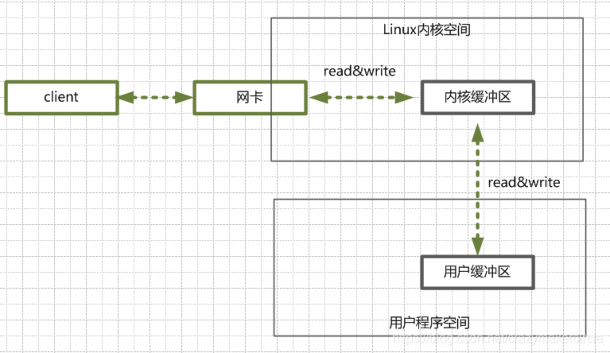
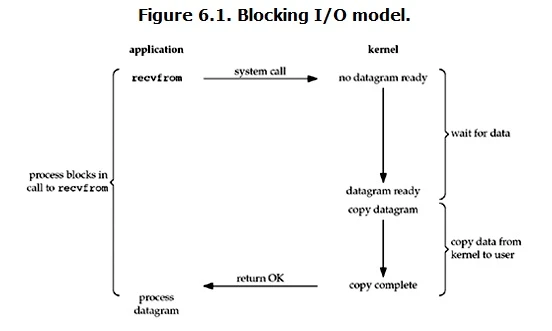
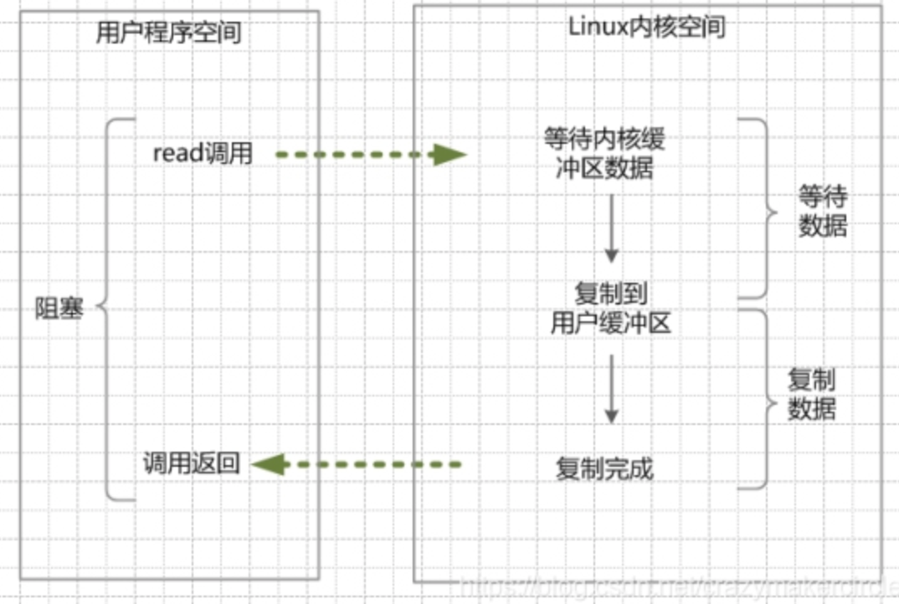
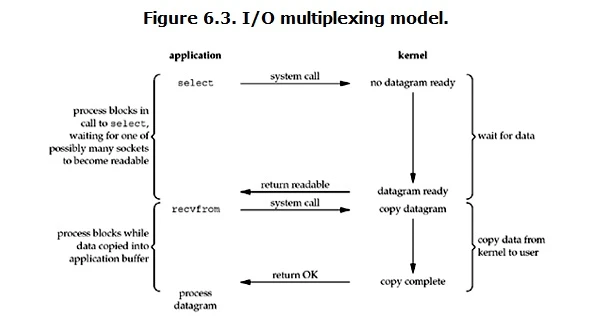
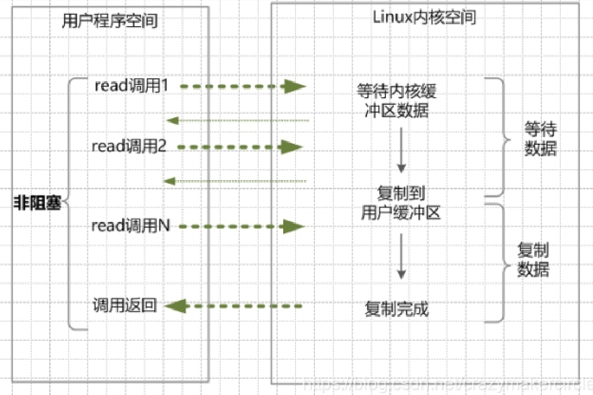
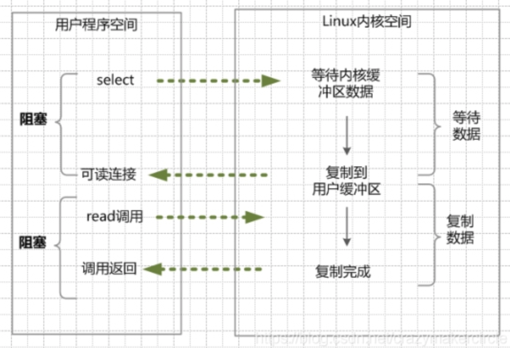
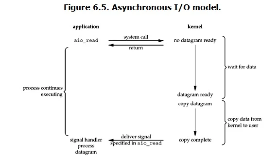
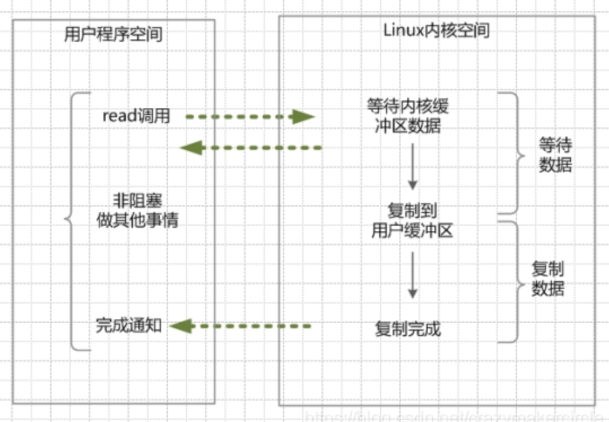

# I/O

## 概念 同步异步 synchronous/asynchronous 阻塞非阻塞 blocking/non-blocking

直接阅读 Unix Networking Programming Vol 1, Chapter 6 会更容易理解

### Asynchronous, Non-Blocking, Event-Base architectures

[What's the difference between: Asynchronous, Non-Blocking, Event-Base architectures? - Stack Overflow](https://stackoverflow.com/questions/7931537/whats-the-difference-between-asynchronous-non-blocking-event-base-architectu/9489547#9489547)

**Asynchronous** Asynchronous literally means not synchronous. Email is asynchronous. You send a mail, you don't expect to get a response NOW. But it is not non-blocking. Essentially what it means is an architecture where "components" send messages to each other without expecting a response immediately. HTTP requests are synchronous. Send a request and get a response.

**Non-Blocking** This term is mostly used with IO. What this means is that when you make a system call, it will return immediately with whatever result it has without putting your thread to sleep (with high probability). For example non-blocking read/write calls return with whatever they can do and expect caller to execute the call again. try_lock for example is non-blocking call. It will lock only if lock can be acquired. Usual semantics for systems calls is blocking. read will wait until it has some data and put calling thread to sleep.

**Event-base** This term comes from libevent. non-blocking read/write calls in themselves are useless because they don't tell you "when" should you call them back (retry). select/epoll/IOCompletionPort etc are different mechanisms for finding out from OS "when" these calls are expected to return "interesting" data. libevent and other such libraries provide wrappers over these event monitoring facilities provided by various OSes and give a consistent API to work with which runs across operating systems. Non-blocking IO goes hand in hand with Event-base.

I think these terms overlap. For example HTTP protocol is synchronous but HTTP implementation using non-blocking IO can be asynchronous. Again a non-blocking API call like read/write/try_lock is synchronous (it immediately gives a response) but "data handling" is asynchronous.

### asynchronous and non-blocking calls? also between blocking and synchronous

[asynchronous and non-blocking calls? also between blocking and synchronous - Stack Overflow](https://stackoverflow.com/questions/2625493/asynchronous-and-non-blocking-calls-also-between-blocking-and-synchronous)

In many circumstances they are different names for the same thing, but in some contexts they are quite different. So it depends. Terminology is not applied in a totally consistent way across the whole software industry.

For example in the classic sockets API, a non-blocking socket is one that simply returns immediately with a special "would block" error message, whereas a blocking socket would have blocked. You have to use a separate function such as select or poll to find out when is a good time to retry.

But asynchronous sockets (as supported by Windows sockets), or the asynchronous IO pattern used in .NET, are more convenient. You call a method to start an operation, and the framework calls you back when it's done. Even here, there are basic differences. Asynchronous Win32 sockets "marshal" their results onto a specific GUI thread by passing Window messages, whereas .NET asynchronous IO is free-threaded (you don't know what thread your callback will be called on).

So **they don't always mean the same thing**. To distil the socket example, we could say:

* **Blocking and synchronous** mean the same thing: you call the API, it hangs up the thread until it has some kind of answer and returns it to you.
* **Non-blocking** means that if an answer can't be returned rapidly, the API returns immediately with an error and does nothing else. So there must be some related way to query whether the API is ready to be called (that is, to simulate a wait in an efficient way, to avoid manual polling in a tight loop).
* **Asynchronous** means that the API always returns immediately, having started a "background" effort to fulfil your request, so there must be some related way to obtain the result.

## Java IO读写原理

主要参考 [10 分钟看懂 NIO 底层原理](https://www.cnblogs.com/crazymakercircle/p/10225159.html)，但文章在多路复用部分使用 Reactor 并错误解释为异步非阻塞。

[你管这破玩意叫 IO 多路复用？- 无聊的闪客](https://mp.weixin.qq.com/s/YdIdoZ_yusVWza1PU7lWaw)

用户程序进行IO的读写，基本上会用到 `read & write` 两大系统调用。可能不同操作系统，名称不完全一样，但是功能是一样的。

先强调一个基础知识：`read`系统调用，并不是把数据直接从物理设备，读数据到内存。`write`系统调用，也不是直接把数据，写入到物理设备。

`read`系统调用，是把数据从内核缓冲区复制到进程缓冲区；而`write`系统调用，是把数据从进程缓冲区复制到内核缓冲区。这个两个系统调用，都不负责数据在内核缓冲区和磁盘之间的交换。底层的读写交换，是由操作系统kernel内核完成的。

### 内核缓冲与进程缓冲区

缓冲区的目的，是为了减少频繁的系统IO调用。系统调用需要保存之前的进程数据和状态等信息，而结束调用之后回来还需要恢复之前的信息，为了减少这种损耗时间、也损耗性能的系统调用，于是出现了缓冲区。

有了缓冲区，操作系统使用read函数把数据从内核缓冲区复制到进程缓冲区，write把数据从进程缓冲区复制到内核缓冲区中。等待缓冲区达到一定数量的时候，再进行IO的调用，提升性能。至于什么时候读取和存储则由内核来决定，用户程序不需要关心。

在linux系统中，系统内核也有个缓冲区叫做内核缓冲区。每个进程有自己独立的缓冲区，叫做进程缓冲区。

所以，用户程序的IO读写程序，大多数情况下，并没有进行实际的IO操作，而是在读写自己的进程缓冲区。

### java IO读写的底层流程

1. 客户端请求
    Linux通过网卡，读取客户端的请求数据，将数据读取到内核缓冲区。
2. 获取请求数据
    服务器从内核缓冲区读取数据到Java进程缓冲区。

服务端：

1. 服务器端业务处理
    Java服务端在自己的用户空间中，处理客户端的请求。
2. 服务器端返回数据
    Java服务端已构建好的响应，从用户缓冲区写入系统缓冲区。
3. 发送给客户端
    Linux内核通过网络 I/O ，将内核缓冲区中的数据，写入网卡，网卡通过底层的通讯协议，会将数据发送给目标客户端。

## 四种主要的IO模型

Unix Networking Programming Vol 1, Chapter 6.

把数据 IO 分为两个阶段：数据准备 和 数据读取（从内核向进程复制数据），阻塞是在数据准备阶段等待，同步是指用户自己读数据

常见的IO模型有四种：

1. 同步阻塞IO（Blocking IO）

    首先，解释一下这里的**阻塞与非阻塞（blocking/non-blocking）**：

    * 阻塞IO，指的是需要内核IO操作彻底完成后，才返回到用户空间，执行用户的操作。阻塞指的是用户空间程序的执行状态，用户空间程序需等到IO操作彻底完成。传统的IO模型都是同步阻塞IO。在java中，默认创建的socket都是阻塞的。

    其次，解释一下**同步与异步（synchronous/asynchronous）**：
    * 同步IO，是一种用户空间与内核空间的调用发起方式。同步IO是指用户空间线程是主动发起IO请求的一方，内核空间是被动接受方。异步IO则反过来，是指内核kernel是主动发起IO请求的一方，用户线程是被动接受方。

2. 同步非阻塞IO（Non-blocking IO）
    非阻塞IO，指的是用户程序不需要等待内核IO操作完成后，内核立即返回给用户一个状态值，用户空间无需等到内核的IO操作彻底完成，可以立即返回用户空间，执行用户的操作，处于非阻塞的状态。
    简单的说：阻塞是指用户空间（调用线程）一直在等待，而且别的事情什么都不做；非阻塞是指用户空间（调用线程）拿到状态就返回，IO操作可以干就干，不可以干，就去干别的事情。
    非阻塞IO要求socket被设置为NONBLOCK。

    强调一下，这里所说的NIO（同步非阻塞IO）模型，并非Java的NIO（New IO）库。

3. IO多路复用（IO Multiplexing）
    阻塞 和 非阻塞 是指数据就绪前，用户线程的状态。两者都是 同步IO，即数据就绪后，由用户线程负责数据拷贝到用户空间，此时是同步拷贝的。因此是 阻塞同步IO 和 非阻塞同步IO。

    IO多路复用是在 非阻塞IO 的基础上，原因每次只询问单个数据状态，多路复用 则是询问多个数据状态，即多个数据复用在同一个线程上处理。数据在内核缓冲区就绪后，用户线程依旧是同步IO拷贝的。
    Java中的Selector和Linux中的epoll都是这种模型。

4. 异步IO（Asynchronous IO）
    异步IO，指的是用户空间与内核空间的调用方式反过来。用户空间线程是变成被动接受的，内核空间是主动调用者。

    这一点，有点类似于Java中比较典型的模式是回调模式，用户空间线程向内核空间注册各种IO事件的回调函数，由内核去主动调用。

## 同步阻塞IO（Blocking IO）

发起一个blocking socket的read读操作系统调用，流程大概是这样：

1. 当用户线程调用了read系统调用，内核（kernel）就开始了IO的第一个阶段：准备数据。很多时候，数据在一开始还没有到达（比如，还没有收到一个完整的Socket数据包），这个时候kernel就要等待足够的数据到来。
2. 当kernel一直等到数据准备好了，它就会将数据从kernel内核缓冲区，拷贝到用户缓冲区（用户内存），然后kernel返回结果。
3. 从开始IO读的read系统调用开始，用户线程就进入阻塞状态。一直到kernel返回结果后，用户线程才解除block的状态，重新运行起来。

所以，blocking IO的特点就是在内核进行IO执行的两个阶段，用户线程都被block了。

### BIO的优点

程序简单，在阻塞等待数据期间，用户线程挂起。用户线程基本不会占用 CPU 资源。

### BIO的缺点

一般情况下，会为每个连接配套一条独立的线程，或者说一条线程维护一个连接成功的IO流的读写。在并发量小的情况下，这个没有什么问题。但是，当在高并发的场景下，需要大量的线程来维护大量的网络连接，内存、线程切换开销会非常巨大。因此，基本上，BIO模型在高并发场景下是不可用的。

## 同步非阻塞NIO（None Blocking IO）

在linux系统下，可以通过设置socket使其变为non-blocking。NIO 模型中应用程序在一旦开始IO系统调用，会出现以下两种情况：

1. 在内核缓冲区没有数据的情况下，系统调用会立即返回，返回一个调用失败的信息。
2. 在内核缓冲区有数据的情况下，是阻塞的，直到数据从内核缓冲复制到用户进程缓冲。复制完成后，系统调用返回成功，应用进程开始处理用户空间的缓存数据。

举个栗子。发起一个non-blocking socket的read读操作系统调用，流程是这个样子：

1. 在内核数据没有准备好的阶段，用户线程发起IO请求时，立即返回。用户线程需要不断地发起IO系统调用。
2. 内核数据到达后，用户线程发起系统调用，用户线程阻塞。内核开始复制数据。它就会将数据从kernel内核缓冲区，拷贝到用户缓冲区（用户内存），然后kernel返回结果。
3. 用户线程才解除block的状态，重新运行起来。经过多次的尝试，用户线程终于真正读取到数据，继续执行。

### NIO的特点

应用程序的线程需要不断的进行 I/O 系统调用，轮询数据是否已经准备好，如果没有准备好，继续轮询，直到完成系统调用为止。

### NIO的优点

每次发起的 IO 系统调用，在内核的等待数据过程中可以立即返回。用户线程不会阻塞，实时性较好。

### NIO的缺点

需要不断的重复发起IO系统调用，这种不断的轮询，将会不断地询问内核，这将占用大量的 CPU 时间，系统资源利用率较低。

总之，NIO模型在高并发场景下，也是不可用的。一般 Web 服务器不使用这种 IO 模型。一般很少直接使用这种模型，而是在其他IO模型中使用非阻塞IO这一特性。java的实际开发中，也不会涉及这种IO模型。

再次说明，Java NIO（New IO） 不是IO模型中的NIO模型，而是另外的一种模型，叫做IO多路复用模型（ IO multiplexing ）。

## IO多路复用模型(I/O multiplexing）

阻塞 和 非阻塞 是指数据就绪前，用户线程的状态。两者都是 同步IO，即数据就绪后，由用户线程负责数据拷贝到用户空间，此时是同步拷贝的。因此是 阻塞同步IO 和 非阻塞同步IO。

IO多路复用是在 非阻塞IO 的基础上，原因每次只询问单个数据状态，多路复用 则是询问多个数据状态，即多个数据复用在同一个线程上处理。数据在内核缓冲区就绪后，用户线程依旧是同步IO拷贝的。

如何避免同步非阻塞NIO模型中轮询等待的问题呢？这就是IO多路复用模型。

IO多路复用模型，就是通过一种新的系统调用，一个进程可以监视多个文件描述符，一旦某个描述符就绪（一般是内核缓冲区可读/可写），内核kernel能够通知程序进行相应的IO系统调用。

select，poll，epoll都是IO多路复用的机制。I/O多路复用就通过一种机制，可以监视多个描述符，一旦某个描述符就绪（一般是读就绪或者写就绪），能够通知程序进行相应的读写操作。但select，poll，epoll本质上都是同步I/O，因为他们都需要在读写事件就绪后自己负责进行读写，也就是说这个读写过程是阻塞的。

select系统调用，是目前几乎在所有的操作系统上都有支持，具有良好跨平台特性。epoll是在linux 2.6内核中提出的，是select系统调用的linux增强版本。

IO多路复用模型的基本原理就是select/epoll系统调用，单个线程不断的轮询select/epoll系统调用所负责的成百上千的socket连接，当某个或者某些socket网络连接有数据到达了，就返回这些可以读写的连接。因此，好处也就显而易见了——通过一次select/epoll系统调用，就查询到到可以读写的一个甚至是成百上千的网络连接。

举个栗子。发起一个多路复用IO的的read读操作系统调用，流程是这个样子：

在这种模式中，首先不是进行read系统调动，而是进行select/epoll系统调用。当然，这里有一个前提，需要将目标网络连接，提前注册到select/epoll的可查询socket列表中。然后，才可以开启整个的IO多路复用模型的读流程。

1. 进行select/epoll系统调用，查询可以读的连接。kernel会查询所有select的可查询socket列表，当任何一个socket中的数据准备好了，select就会返回。
当用户进程调用了select，那么整个线程会被block（阻塞掉）。
2. 用户线程获得了目标连接后，发起read系统调用，用户线程阻塞。内核开始复制数据。它就会将数据从kernel内核缓冲区，拷贝到用户缓冲区（用户内存），然后kernel返回结果。
3. 用户线程才解除block的状态，用户线程终于真正读取到数据，继续执行。

### 多路复用IO的特点

IO多路复用模型，建立在操作系统kernel内核能够提供的多路分离系统调用select/epoll基础之上的。多路复用IO需要用到两个系统调用（system call）， 一个select/epoll查询调用，一个是IO的读取调用。
和NIO模型相似，多路复用IO需要轮询。负责select/epoll查询调用的线程，需要不断的进行select/epoll轮询，查找出可以进行IO操作的连接。
另外，多路复用IO模型与前面的NIO模型，是有关系的。对于每一个可以查询的socket，一般都设置成为non-blocking模型。只是这一点，对于用户程序是透明的（不感知）。

### 多路复用IO的优点

用select/epoll的优势在于，它可以同时处理成千上万个连接（connection）。与一条线程维护一个连接相比，I/O多路复用技术的最大优势是：系统不必创建线程，也不必维护这些线程，从而大大减小了系统的开销。

Java的NIO（new IO）技术，使用的就是IO多路复用模型。在linux系统上，使用的是epoll系统调用。

### 多路复用IO的缺点

本质上，select/epoll系统调用，属于同步IO，也是阻塞IO。都需要在读写事件就绪后，自己负责进行读写，也就是说这个读写过程是阻塞的。
如何充分的解除线程的阻塞呢？那就是异步IO模型。

## 信号驱动模型

用的不多

## 异步IO模型（asynchronous IO）

如何进一步提升效率，解除最后一点阻塞呢？这就是异步IO模型，全称asynchronous I/O，简称为AIO。即经典的Proactor设计模式，也称为异步非阻塞IO

AIO的基本流程是：用户线程通过系统调用，告知kernel内核启动某个IO操作，用户线程返回。kernel内核在整个IO操作（包括数据准备、数据复制）完成后，通知用户程序，用户执行后续的业务操作。

kernel的数据准备是将数据从网络物理设备（网卡）读取到内核缓冲区；kernel的数据复制是将数据从内核缓冲区拷贝到用户程序空间的缓冲区。

1. 当用户线程调用了read系统调用，立刻就可以开始去做其它的事，用户线程不阻塞。
2. 内核（kernel）就开始了IO的第一个阶段：准备数据。当kernel一直等到数据准备好了，它就会将数据从kernel内核缓冲区，拷贝到用户缓冲区（用户内存）。
3. kernel会给用户线程发送一个信号（signal），或者回调用户线程注册的回调接口，告诉用户线程read操作完成了。
4. 用户线程读取用户缓冲区的数据，完成后续的业务操作。

### 异步IO模型的特点

在内核kernel的等待数据和复制数据的两个阶段，用户线程都不是block(阻塞)的。用户线程需要接受kernel的IO操作完成的事件，或者说注册IO操作完成的回调函数，到操作系统的内核。所以说，异步IO有的时候，也叫做信号驱动 IO 。

### 异步IO模型缺点

需要完成事件的注册与传递，这里边需要底层操作系统提供大量的支持，去做大量的工作。

目前来说， Windows 系统下通过 IOCP 实现了真正的异步 I/O。但是，就目前的业界形式来说，Windows 系统，很少作为百万级以上或者说高并发应用的服务器操作系统来使用。

而在 Linux 系统下，异步IO模型在2.6版本才引入，目前并不完善。所以，这也是在 Linux 下，实现高并发网络编程时都是以 IO 复用模型模式为主。

### 小结一下

四种IO模型，理论上越往后，阻塞越少，效率也是最优。在这四种 I/O 模型中，前三种属于同步 I/O，因为其中真正的 I/O 操作将阻塞线程。只有最后一种，才是真正的异步 I/O 模型，可惜目前Linux 操作系统尚欠完善。
