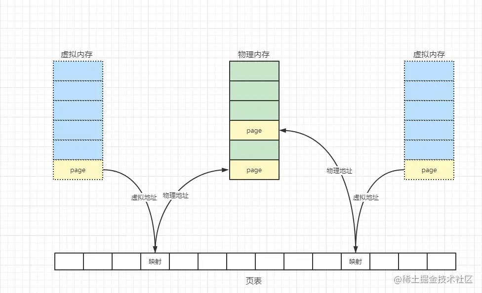

# 操作系统内核空间与用户空间

## 内存分页

为了节约内存，提高使用效率，操作系统会将内存拆成一个个的小块来使用，在 Linux 中，这每一小块叫做 page(页) ，大小一般为4k

## 虚拟地址空间

在多任务操作系统中，每个进程都运行在属于自己的虚拟内存中，这块空间被称为 Virtual Address Space(虚拟地址空间)

### 为什么要有虚拟地址空间

为了让进程之间相互隔离。

假如让进程直接操作物理内存，很有可能会出现，不同进程都操作了同一物理内存地址，造成相互影响。于是就抽象出来 虚拟地址空间 这样一个中间层，让一块 虚拟地址空间 映射到一块 物理地址空间 上

如上图，两块虚拟内存通过page table(页表) 将自己映射到物理内存上，进程只能看到虚拟内存(当然它自己是不知道内存是虚拟的)，进程只能"运行"在虚拟地址空间,只会操作属于自己的虚拟内存，因此进程之间不会相互影响

### 虚拟地址空间的大小及分配

操作系统需要为每一个进程分配属于自己的虚拟内存，那这个虚拟内存要分配多大呢？

在没有虚拟地址空间之前，是根据进程的需要按需分配物理内存的。但有了虚拟地址空间，分配策略可以变一下，先把虚拟地址空间分配的大些，但不立马建立与物理内存的映射，而是用到的时候，用多少，建立多少

这样物理内存的大小虽然不变，但是内存分配的灵活性大大的提高了，进程也不用担心地址会跟别的进程冲突，尽管用就是

在 32 位操作系统中，操作系统会为每个进程分配最大为 4G(2 的 32 次方)的虚拟地址空间

## 用户空间（user space）与内核空间（kernel space）

操作系统虽然为每个进程都分配了虚拟地址空间，但 虚拟地址空间中并不是所有的区域都可以为进程所用

操作系统将虚拟地址空间 分为用户空间和内核空间，对 32 位操作系统而言，它的寻址空间（虚拟地址空间）为 2 的 32 次方，也就是 4G。

在 Linux 的虚拟地址空间中，用户空间和内核空间的大小比例为 3:1，而在 window 中则为 2:2

针对 Linux 操作系统而言，而较低的 3G 字节（从虚拟地址 0x00000000 到 0xBFFFFFFF）由各个进程使用，称为用户空间。最高的 1G 字节（从虚拟地址 0xC0000000 到 0xFFFFFFFF）由内核使用，称为内核空间。

每个进程 4G 地址空间的分布情况如下：

实际上，程序员只能使用虚拟地址。系统中每个进程有各自的私有用户空间（0～3G），这个空间对系统中的其他进程是不可见的，而内核空间则是各个进程共享的。换句话说就是， 最高 1G 的内核空间是被所有进程共享的！

### 为什么会有内核空间

为了系统的安全，现代的操作系统一般都强制用户进程不能直接操作内核的，所有的系统调用都要交给内核完成

但是内核也要运行在内存中，为了防止用户进程干扰，操作系统为内核单独划分了一块内存区域，这块区域就是内核空间，系统内核运行在内核空间中.

当进程运行在内核空间时就处于内核态，而进程运行在用户空间时则处于用户态。

* 在内核态下，进程运行在内核地址空间中，此时 CPU 可以执行任何指令。运行的代码也不受任何的限制，可以自由地访问任何有效地址，也可以直接进行端口的访问。
* 在用户态下，进程运行在用户地址空间中，被执行的代码要受到 CPU 的诸多检查，它们只能访问映射其地址空间的页表项中规定的在用户态下可访问页面的虚拟地址，且只能对任务状态段（TSS）中 I/O 许可位图（I/O Permission Bitmap）中规定的可访问端口进行直接访问。

对于以前的 DOS 操作系统来说，是没有内核空间、用户空间以及内核态、用户态这些概念的。可以认为所有的代码都是运行在内核态的，因而用户编写的应用程序代码可以很容易的让操作系统崩溃掉。

### 内核空间与用户空间的映射

在 Linux 中，系统启动时，就需要将内核加载到物理内存的内核空间上运行。

但对于进程，物理内存对它是不可见的，但它又需要使用内核来完成各种系统调用，而内核实际又在物理内存上。怎么解决这个矛盾？

Linux 想了一个办法，将进程的虚拟地址空间中的内核空间映射到物理内存中的内核空间上，内核就“搬到”虚拟内存中了。而在进程看了，自己的内存中就有了内核了，就可以通过内核进行各种系统调用了
在 Linux 中，内核空间是持续的，并且所有进程的虚拟地址空间中的内核空间都映射到同样的物理内存的内核空间

如上图 进程a 和 进程b 的内核空间都映射到了同一块物理内存区域，而用户空间的地址，则被映射到了不同的物理内存区域

## 用户态与内核态

程序运行在用户空间的时候，进程处于用户态，程序进入到内核运行后，进程处于内核态，这两种状态的切换就被称为上行文切换。

在 Linux 系统中，所有的系统资源管理都是在内核空间中完成的。比如读写磁盘文件、分配回收内存、从网络接口读写数据等等。应用程序是无法直接进行这样的操作的。但是可以通过内核提供的接口来完成这样的任务。

比如应用程序要读取磁盘上的一个文件，它可以向内核发起一个 “系统调用” 告诉内核：”我要读取磁盘上的某某文件”。其实就是通过一个特殊的指令让进程从用户态进入到内核态，在内核空间中，CPU 可以执行任何的指令，当然也包括从磁盘上读取数据。具体过程是先把数据读取到内核空间中，然后再把数据拷贝到用户空间并从内核态切换到用户态。此时应用程序已经从系统调用中返回并且拿到了想要的数据，可以开开心心的往下执行了。

简单来说，就是应用程序把操作系统资源的工作（从磁盘读取文件）统一交给系统内核来执行，系统内核做这些事情既专业又高效。

从内核空间和用户空间的角度来看整个 Linux 系统的结构，大致可以分为三个部分，从下往上依次为：硬件 -> 内核空间 -> 用户空间。在硬件之上，内核控制了所有硬件资源的使用权，用户空间中的程序只有通过内核暴露的系统调用接口（System Interface）才能使用到系统中的硬件资源。

### 用户态切换到内核态的 3 种方式

有三种方式会导致用户态切换到内核态

* 系统调用 : 这是用户态进程主动要求切换到内核态的一种方式，用户态进程通过系统调用申请使用操作系统提供的服务程序完成工作，而系统调用的机制其核心还是使用了操作系统为用户特别开放的一个中断来实现，例如 Linux 的 int 80h 中断。
* 异常 : 当 CPU 在执行运行在用户态下的程序时，发生了某些事先不可知的异常，这时会触发由当前运行进程切换到处理此异常的内核相关程序中，也就转到了内核态，比如缺页异常。
* 外围设备的中断 : 当外围设备完成用户请求的操作后，会向 CPU 发出相应的中断信号，这时 CPU 会暂停执行下一条即将要执行的指令转而去执行与中断信号对应的处理程序，如果先前执行的指令是用户态下的程序，那么这个转换的过程自然也就发生了由用户态到内核态的切换。

## 参考文章

* [操作系统 虚拟地址空间、用户空间、内核空间、用户态与内核态 - 掘金](https://juejin.cn/post/6990237426903957540)
* [Linux 内核空间和用户空间 – 人人都懂物联网](https://getiot.tech/linux-kernel/linux-kernel-space-and-user-space.html)
* [Linux 内核空间与用户空间 - sparkdev - 博客园](https://www.cnblogs.com/sparkdev/p/8410350.html)
