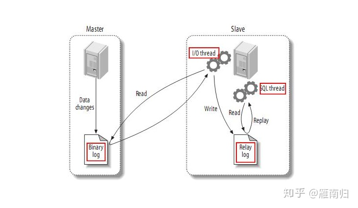

# MySQL 8.0

Support for up to 64 indexes per table. Each index may consist of 1 to 16 columns or parts of columns. The maximum index width for InnoDB tables is either 767 bytes or 3072 bytes.

## 1.3 What Is New in MySQL 8.0

### Optimizer

1. MySQL now supports invisible indexes.
2. MySQL now supports descending indexes
3. MySQL now supports creation of functional index key parts that index expression values rather than column values.
4. In MySQL 8.0.14 and later, trivial WHERE conditions arising from constant literal expressions are removed during preparation, rather than later on during optimization.
5. In MySQL 8.0.16 and later, MySQL can use constant folding at optimization time to handle comparisons between a column and a constant value where the constant is out of range or on a range boundary with respect to the type of the column, rather than doing so for each row at execution time.
6. Beginning with MySQL 8.0.16, the semijoin optimizations used with IN subqueries can now be applied to EXISTS subqueries as well.
7. As of MySQL 8.0.17, the server rewrites any incomplete SQL predicates (that is, predicates having the form WHERE value, in which value is a column name or constant expression and no comparison operator is used)
8. In MySQL 8.0.17 and later a WHERE condition having NOT IN (subquery) or NOT EXISTS (subquery) is transformed internally into an antijoin. (An antijoin returns all rows from the table for which there is no row in the table to which it is joined matching the join condition.)
9. Beginning with MySQL 8.0.21, a single-table UPDATE or DELETE statement can now in many cases make use of a semijoin transformation or subquery materialization.
10. Improved hash join performance.  MySQL 8.0.23 reimplements the hash table used for hash joins, resulting in several improvements in hash join performance.

### Multi-valued indexes

Beginning with MySQL 8.0.17, InnoDB supports the creation of a multi-valued index, which is a secondary index defined on a JSON column that stores an array of values and which can have multiple index records for a single data record.

### EXPLAIN ANALYZE Statement

A new form of the EXPLAIN statement, EXPLAIN ANALYZE, is implemented in MySQL 8.0.18, providing expanded information about the execution of SELECT statements in TREE format for each iterator used in processing the query, and making it possible to compare estimated cost with the actual cost of the query. This information includes startup cost, total cost, number of rows returned by this iterator, and the number of loops executed.

## 主从复制

[MySQL 并行复制演进及 MySQL 8.0 中基于 WriteSet 的优化 -雁南归](https://zhuanlan.zhihu.com/p/37129637)
[谈谈MySQL的WriteSet并行复制](https://www.cnblogs.com/JiangLe/p/9650728.html)

MySQL的主从架构依赖于 MySQL Binlog 功能， Master节点上产生Binlog并将Binlog写入到Binlog文件中。

Slave节点上启动两个线程：一个IO线程，从MySQL上捞取Binlog日志并写入到本地的RelayLog日志；另一个SQL线程，不断的从RelayLog日志中读取日志，并解析执行。

这样通过在主机和从机上增加几个文件的顺序读写操作，就可以保证所有在主机上执行过的SQL语句都在从机上一摸一样的执行过一遍。

复制延迟，指的就是一个事务在Master执行完成以后，要多久以后才能在Slave上执行完成。

从MySQL 5.5 开始，MySQL官方提供了半同步复制插件，每个事务的Binlog需要保证传输到Slave写入 RelayLog 后才能提交，这种架构在主从之间提供了数据完整性，保证了主机在发生故障后从机可以拥有完整的数据副本。因此，复制延迟通常发生在SQL线程执行的过程中。

### 5.6 中的并行复制 — Schema级别的并行复制

5.6中若开启并行回放的功能，便会启动多个WorkThread ，而原来负责回放的SQLThread会转变成Coordinator角色，负责判断事务能否并行执行并分发给WorkThread。

如果事务分别属于不同的Schema，并且不是DDL语句且没有跨Schema操作，那么就可以并行回放，否则需要等所有Worker线程执行完成后再执行当前日志中的内容。

### 5.7 中的并行复制 - 基于Group Commit 的并行复制

5.6 中引入Group Commit技术，这是为了解决事务提交的时候需要fsync导致并发性不够而引入的。

简单来说，就是由于事务提交时必须将Binlog写入到磁盘上而调用fsync，这是一个代价比较高的操作，事务并发提交的情况下，每个事务各自获取日志锁并进行fsync会导致事务实际上以串行的方式写入Binlog文件，这样就大大降低了事务提交的并发程度。

5.6中采用的Group Commit技术将事务的提交阶段分成了 Flush, Sync, Commit 三个阶段，每个阶段维护一个队列，并且由该队列中第一个线程负责执行该步骤，这样实际上就达到了一次可以将一批事务的Binlog fsync到磁盘的目的，这样的一批同时提交的事务称为同一个Group的事务。

Group Commit 虽然是属于并行提交的技术，但是却意外的解决了从机上事务并行回放的一个难题————既如何判断哪些事务可以并行回放。如果一批事务是同时Commit的，那么这些事务必然不会互斥的持有锁，也不会有执行上的相互依赖，因此这些事务必然可以并行的回放。

因此MySQL 5.7 中引入了新的并行回放类型， 由参数 `slave_parallel_type` 决定，默认值DATABASE将会采用5.6版本中的SCHEMA级别的并行回放，设置为 `LOGICAL_LOCK` 则会采用基于GroupCommit的并行回放，同一个Group内的事务将会在Slave上并行回放。

为了标记事务所属的组，MySQL 5.7 版本在产生 Binlog 日志时会有两个特殊的值记录在Binlog Event中， last_committed 和 sequence_number , 其中 last_committed 指的是该事务提交时，上一个事务提交的编号，sequence_number 是事务提交的序列号，在一个Binlog文件内单调递增。如果两个事务的 last_committed 值一致，这两个事务就是在一个组内提交的。

### MySQL 8.0 中的并行复制

通过基于 WriteSet 的冲突检测，在主机上产生 Binlog 的时候，不再基于组提交，而是基于事务本身的更新冲突来确定并行关系。

MySQL 8.0中引入了一种新的机制来判断事务能否并行回放，通过检测事务在运行过程中是否存在写冲突来决定从机上的回放顺序，这使得从机上的并发程度不再依赖于主机。

MySQL 8.0 中引入参数 binlog_transaction_depandency_tracking 用于控制如何决定事务的依赖关系。该值有三个选项：默认的 COMMIT_ORDERE 表示继续使用5.7中的基于组提交的方式决定事务的依赖关系；WRITESET 表示使用写集合来决定事务的依赖关系；还有一个选项 WRITESET_SESSION 表示使用 WriteSet 来决定事务的依赖关系，但是同一个Session内的事务不会有相同的 last_committed 值。
