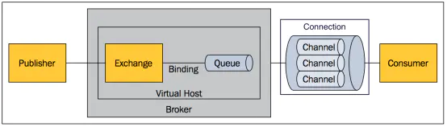
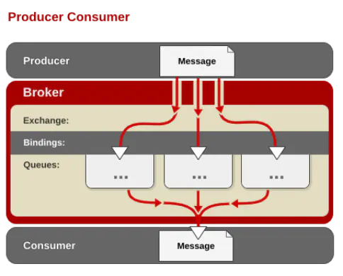
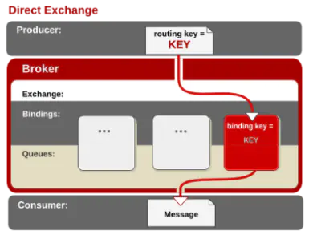
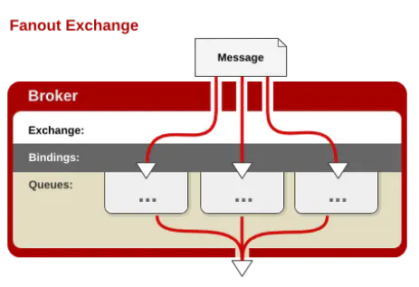
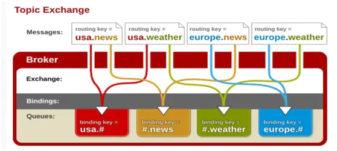

# RabbitMQ

[RabbitMQ Server](https://github.com/rabbitmq/rabbitmq-server/)

## [Troubleshooting Guidance](https://www.rabbitmq.com/troubleshooting.html)

crash file /usr/local/rabbitmq/var/lib/rabbitmq/erl_crash.dump

## Basic command

[Command Line Tools](https://www.rabbitmq.com/cli.html)

* `rabbitmqctl` for service management and general operator tasks
* `rabbitmq-diagnostics` for diagnostics and health checking
* `rabbitmq-plugins` for plugin management
* `rabbitmq-queues` for maintenance tasks on queues, in particular quorum queues
* `rabbitmq-upgrade` for maintenance tasks related to upgrades

``` bash
# start stop
service rabbitmq-server start
service rabbitmq-server stop
service rabbitmq-server status
rabbitmqctl status
# 环境信息
rabbitmqctl environment
# log path: /usr/local/rabbitmq/var/log/
# /var/log/rabbitmq/

rabbitmqctl list_vhosts
rabbitmqctl list_queues -p <vhost>
rabbitmqctl list_consumers -p <vhost>
rabbitmqctl list_exchanges -p push-center
rabbitmqctl list_users # 查看用户
rabbitmqctl list_user_permissions username
rabbitmqctl purge_queue -p <vhost> queue.name.development
curl -X DELETE -i -u guest:guest "http://localhost:15672/api/queues/local/gongzhonghao.refreshAccessToken.queue.name.development"
```

### Management

By default, RabbitMQ have a user named guest with password guest. We will create own administrator account on RabbitMQ server, change password :

``` bash
rabbitmqctl add_user admin password
rabbitmqctl set_user_tags admin administrator
rabbitmqctl set_permissions -p / admin ".*" ".*" ".*"

rabbitmqctl add_vhost vhost_name
rabbitmqctl set_permissions -p vhost_name admin ".*" ".*" ".*"
```

RabbitMQ has a web management console. To enable web management console run : `rabbitmq-plugins enable rabbitmq_management`
`http://localhost:15672/   guest / guest`

`curl -i -u guest:guest "http://localhost:15672/api/overview"`
`curl -i -u guest:guest "http://localhost:15672/api/queues/push-center/push.schedule.push.queue.name.publish"`

The OS limits are controlled via a configuration file at `/etc/systemd/system/rabbitmq-server.service.d/limits.conf`

* rabbitmq-diagnostics status
* rabbitmqctl --help
* rabbitmq-diagnostics status --help

`rabbitmq-diagnostics observer` is a command-line tool similar to top, htop, vmstat. [Command-line Based Observer Tool](https://www.rabbitmq.com/monitoring.html#diagnostics-observer)

## 概念介绍

[消息队列之 RabbitMQ - 简书](https://www.jianshu.com/p/79ca08116d57)

### 消息模型

所有 MQ 产品从模型抽象上来说都是一样的过程：

消费者（consumer）订阅某个队列。生产者（producer）创建消息，然后发布到队列（queue）中，最后将消息发送到监听的消费者。

RabbitMQ 是 AMQP 协议的一个开源实现，所以其内部实际上也是 AMQP 中的基本概念



1. Message: 消息，消息是不具名的，它由消息头和消息体组成。消息体是不透明的，而消息头则由一系列的可选属性组成，这些属性包括routing-key（路由键）、priority（相对于其他消息的优先权）、delivery-mode（指出该消息可能需要持久性存储）等。
2. Publisher 消息的生产者，也是一个向交换器发布消息的客户端应用程序。
3. Exchange 交换器 接收，分配消息，用来接收生产者发送的消息并将这些消息路由给服务器中的队列。
4. Binding 绑定，用于消息队列和交换器之间的关联。一个绑定就是基于路由键将交换器和消息队列连接起来的路由规则，所以可以将交换器理解成一个由绑定构成的路由表。
5. Queue 消息队列，用来保存消息直到发送给消费者。它是消息的容器，也是消息的终点。一个消息可投入一个或多个队列。消息一直在队列里面，等待消费者连接到这个队列将其取走。
6. Connection 网络连接，比如一个TCP连接。
7. Channel 信道，多路复用连接中的一条独立的双向数据流通道。信道是建立在真实的TCP连接内地虚拟连接，AMQP 命令都是通过信道发出去的，不管是发布消息、订阅队列还是接收消息，这些动作都是通过信道完成。因为对于操作系统来说建立和销毁 TCP 都是非常昂贵的开销，所以引入了信道的概念，以复用一条 TCP 连接。
8. Consumer 消息的消费者，表示一个从消息队列中取得消息的客户端应用程序。
9. Virtual Host 虚拟主机，表示一批交换器、消息队列和相关对象。虚拟主机是共享相同的身份认证和加密环境的独立服务器域。每个 vhost 本质上就是一个 mini 版的 RabbitMQ 服务器，拥有自己的队列、交换器、绑定和权限机制。vhost 是 AMQP 概念的基础，必须在连接时指定，RabbitMQ 默认的 vhost 是 / 。
10. Broker 表示消息队列服务器实体。

### AMQP 中的消息路由

AMQP 中消息的路由过程和 Java 开发者熟悉的 JMS 存在一些差别，AMQP 中增加了 Exchange 和 Binding 的角色。生产者把消息发布到 Exchange 上，消息最终到达队列并被消费者接收，而 Binding 决定交换器的消息应该发送到那个队列。



### Exchange 类型

Exchange分发消息时根据类型的不同分发策略有区别，目前共四种类型：direct、fanout、topic、headers 。headers 匹配 AMQP 消息的 header 而不是路由键，此外 headers 交换器和 direct 交换器完全一致，但性能差很多，目前几乎用不到了。

#### direct

消息中的路由键（routing key）如果和 Binding 中的 binding key 一致， 交换器就将消息发到对应的队列中。路由键与队列名完全匹配，如果一个队列绑定到交换机要求路由键为“dog”，则只转发 routing key 标记为“dog”的消息，不会转发“dog.puppy”，也不会转发“dog.guard”等等。它是完全匹配、单播的模式。



#### fanout

每个发到 fanout 类型交换器的消息都会分到所有绑定的队列上去。fanout 交换器不处理路由键，只是简单的将队列绑定到交换器上，每个发送到交换器的消息都会被转发到与该交换器绑定的所有队列上。很像子网广播，每台子网内的主机都获得了一份复制的消息。fanout 类型转发消息是最快的。



#### topic

topic 交换器通过模式匹配分配消息的路由键属性，将路由键和某个模式进行匹配，此时队列需要绑定到一个模式上。它将路由键和绑定键的字符串切分成单词，这些单词之间用点隔开。它同样也会识别两个通配符：符号`#`和符号`*`。`#`匹配0个或多个单词，`*`匹配不多不少一个单词。



## Installation

[Downloading and Installing RabbitMQ](https://www.rabbitmq.com/download.html)

### Installing RabbitMQ in a Kubernetes cluster

[Installing RabbitMQ Cluster Operator in a Kubernetes cluster](https://www.rabbitmq.com/kubernetes/operator/install-operator.html)
[Using RabbitMQ Cluster Kubernetes Operator](https://www.rabbitmq.com/kubernetes/operator/using-operator.html)
[Deploying RabbitMQ to Kubernetes: What’s Involved?](https://www.rabbitmq.com/blog/2020/08/10/deploying-rabbitmq-to-kubernetes-whats-involved/)

### Ubuntu

install erlang

``` bash
wget https://packages.erlang-solutions.com/erlang-solutions_1.0_all.deb
dpkg -i erlang-solutions_1.0_all.deb
apt update
apt install erlang erlang-nox
```

install rabbitmq `apt-get install rabbitmq-server`

### [Production Checklist](https://www.rabbitmq.com/production-checklist.html)

#### Virtual Hosts

In multi-tenant environments, use a separate vhost for each tenant/environment, e.g. project1_development, project1_production, project2_development, project2_production, and so on.
