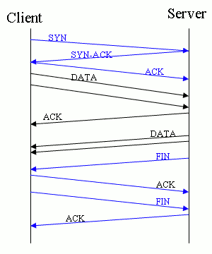

# HTTP note

## Recent

跨域资源共享（CORS）:Access-Control-Allow-Origin就是所谓的资源共享了，它的值*表示允许任意网站向这个接口请求数据，也可以设置成指定的域名，如：
response.writeHead(200, { "Access-Control-Allow-Origin": "http://yoursite.com"});
configure Access-Control-Allow-Origin to avoid unknown domain visit
在开发RESTful API时，要注意CORS功能的实现，直接拿现有的轮子来用即可

HTTP 接口参数:

1. 首先根据一定的规则生成签名信息，防止信息篡改，对不同传输格式分别进行一下处理，Json格式：一般取指定的字段组成字符串通过MD5生成签名信息，然后放到json中的作为sign的值。
2. 其次通过RSA加解密算法对要传输的字符串进行加密
3. 通过URLBase64进行加密

## HTTP长连接

### 是什么

HTTP1.1规定了默认保持长连接（HTTP persistent connection ，也有翻译为持久连接），数据传输完成了保持TCP连接不断开（不发RST包、不四次握手），等待在同域名下继续用这个通道传输数据；相反的就是短连接

### 长连接的过期时间

服务器有时候会告诉客户端超时时间`Keep-Alive: timeout=20`表示这个TCP通道可以保持20秒
另外还可能有`max=XXX`，表示这个长连接最多接收XXX次请求就断开

### 长连接的数据传输完成识别

1. 是判断传输数据是否达到了Content-Length指示的大小；
2. 动态生成的文件没有Content-Length，它是分块传输（chunked），这时候就要根据chunked编码来判断，chunked编码的数据在最后有一个空chunked块，表明本次传输数据结束

### 并发连接数的数量限制

在web开发中需要关注浏览器并发连接的数量，RFC文档说，客户端与服务器最多就连上两通道，但服务器、个人客户端要不要这么做就随人意了，有些服务器就限制同时只能有1个TCP连接，导致客户端的多线程下载（客户端跟服务器连上多条TCP通道同时拉取数据）发挥不了威力，有些服务器则没有限制

### 容易混淆的概念——TCP的keep alive和HTTP的Keep-alive

TCP的keep alive是检查当前TCP连接是否活着；HTTP的Keep-alive是要让一个TCP连接活久点

TCP keep alive的表现：当一个连接“一段时间”没有数据通讯时，一方会发出一个心跳包（Keep Alive包），如果对方有回包则表明当前连接有效，继续监控

## HTTP/1.1 vs. HTTP/2

| content                   | HTTP/1.1  | HTTP/2    |
|---                        |---        |---        |
| Transfer protocol         | Text      |  Binary   |
| Headers                   | Plain text| Compressed|
| Multiplexing              |  No       | Yes       |
| Requests per Connections  | 1         | Multiple  |
| Server Push               | No        |  Yes      |
| Release Year              |  1997     |  2015     |

## HTTP/3.0

Google QUIC 协议

1. 基于UDP
2. TLS 链接的建立 一次后，重复请求时简化为使用 connection id，节省连接时间。

## HTTPS Introduction

### [阮一峰](http://www.ruanyifeng.com)

[SSL/TLS协议运行机制的概述](http://www.ruanyifeng.com/blog/2014/02/ssl_tls.html)
[图解SSL/TLS协议](http://www.ruanyifeng.com/blog/2014/09/illustration-ssl.html)

[HTTPS 升级指南](http://www.ruanyifeng.com/blog/2016/08/migrate-from-http-to-https.html)

https SSL增加的时间大概多少 time(ssl) = 3 * time(tcp)
HTTP耗时 = TCP握手(三个包)
HTTPs耗时 = TCP握手(三个包) + SSL握手(需要9个包)


SSL process


SSL message


SSL tcp process

### Keyless SSL

https CDN 部署方式, 私钥不需要提供给CDN

CloudFlare宣布，开始提供Keyless服务，即你把网站放到它们的CDN上，不用提供自己的私钥，也能使用SSL加密链接.

1. [CloudFlare的说明 Announcing Keyless SSL™: All the Benefits of CloudFlare Without Having to Turn Over Your Private SSL Keys](https://blog.cloudflare.com/announcing-keyless-ssl-all-the-benefits-of-cloudflare-without-having-to-turn-over-your-private-ssl-keys/)
2. [Keyless SSL: The Nitty Gritty Technical Details](https://blog.cloudflare.com/keyless-ssl-the-nitty-gritty-technical-details/)
3. [网宿推出无证书https加速方案](http://www.chinanetcenter.com/Home/News/420)

### JSSE

[Java Secure Socket Extension (JSSE) Reference Guide](https://docs.oracle.com/javase/8/docs/technotes/guides/security/jsse/JSSERefGuide.html)

### Nginx 配置 HTTPS 服务器

Author: Mihan 凹凸实验室 [Nginx 配置 HTTPS 服务器](https://mp.weixin.qq.com/s?__biz=MzIxMzExMjYwOQ==&mid=2651890628&idx=1&sn=ef48f59b49fede80813ac1f53dee22e2&scene=23&srcid=0823lFKQB1MdUfoGjf5h1cCk#rd)

#### 配置 HTTPS

要开启 HTTPS 服务，在配置文件信息块(server block)，必须使用监听命令 listen 的 ssl 参数和定义服务器证书文件和私钥文件，如下所示

```bash
server {
    #ssl参数
    listen              443 ssl;
    server_name         example.com;
    #证书文件
    ssl_certificate     example.com.crt;
    #私钥文件
    ssl_certificate_key example.com.key;
    ssl_protocols       TLSv1 TLSv1.1 TLSv1.2;
    ssl_ciphers         HIGH:!aNULL:!MD5;
    #...
}
```

证书文件会作为公用实体發送到每台连接到服务器的客戶端，私钥文件作为安全实体，**应该被存放在具有一定权限限制的目录文件，并保证 Nginx 主进程有存取权限。**
`ssl_protocols` 和 `ssl_ciphers` 可以用来限制连接只包含 SSL/TLS 的加強版本和算法

### HTTPS服务器优化

减少 CPU 运算量
SSL 的运行计算需要消耗额外的 CPU 资源，一般多核处理器系统会运行多个工作进程(worker processes )，进程的数量不会少于可用的 CPU 核数。SSL 通讯过程中『握手』阶段的运算最占用 CPU 资源，有两个方法可以减少每台客户端的运算量：

* 激活 keepalive 长连接，一个连接发送更多个请求
* 复用 SSL 会话参数，在并行并发的连接数中避免进行多次 SSL『握手』

这些会话会存储在一个 SSL 会话缓存里面，通过命令 ssl_session_cache 配置，可以使缓存在机器间共享，然后利用客戶端在『握手』阶段使用的 seesion id 去查询服务端的 session cathe(如果服务端设置有的话)，简化『握手』阶段。

### 使用 HSTS 策略强制浏览器使用 HTTPS 连接

HSTS -- HTTP Strict Transport Security，HTTP严格传输安全。它允许一个 HTTPS 网站要求浏览器总是通过 HTTPS 来访问，这使得攻击者在用戶与服务器通讯过程中拦截、篡改信息以及冒充身份变得更为困难.

要在 Nginx 配置文件加上以下头信息就可以了

``` nginx
add_header Strict-Transport-Security "max-age=31536000; includeSubDomains;preload" always;
```

* `max-age`: 设置单位时间内強制使用 HTTPS 连接
* `includeSubDomains`: 可选，所有子域同时生效
* `preload`: 可选，非规范值，用于定义使用『HSTS 预加载列表』
* `always`: 可选，保证所有响应都发送此响应头，包括各种內置错误响应

浏览器在获取该响应头后，在 max-age 的时间内，如果遇到 HTTP 连接，就会通过 307 跳转強制使用 HTTPS 进行连接，并忽略其它的跳转设置（如 301 重定向跳转）

浏览器禁用 hsts：chrome://net-internals/#hsts 或者 edge://net-internals/#hsts
[Clear the HSTS Settings](https://kb.teramind.co/en/articles/9399979-how-to-clear-the-hsts-settings)

## PEM, DER, CRT, and CER

CSR (Certificate Signing Request)

cer 格式 等价于 PEM 格式，使用 vi 打开 copy 到的内容是一样的

格式介绍：

* cer 格式
* PEM 格式

filename extensions, such as .crt, .cer, .pem, or .der generally map to two major encoding schemes for X.509 certificates and keys: PEM (Base64 ASCII), and DER (binary).

[PEM, DER, CRT, and CER: X.509 Encodings and Conversions - SSL.com](https://www.ssl.com/guide/pem-der-crt-and-cer-x-509-encodings-and-conversions/#)

### PEM (originally “Privacy Enhanced Mail”)

PEM (originally “Privacy Enhanced Mail”) is the most common format for X.509 certificates, CSRs, and cryptographic keys. A PEM file is a text file containing one or more items in Base64 ASCII encoding, each with plain-text headers and footers (e.g. `-----BEGIN CERTIFICATE-----` and -----END CERTIFICATE-----). A single PEM file could contain an end-entity certificate, a private key, or multiple certificates forming a complete chain of trust.

PEM files are usually seen with the extensions `.crt`, `.pem`, `.cer`, and `.key` (for private keys), but you may also see them with different extensions. For example, the SSL.com CA bundle file available from the download table in a certificate order has the extension .ca-bundle.

View contents of PEM certificate file `openssl x509 -in CERTIFICATE.pem -text -noout`

### PKCS#7 (also known as P7B)

`PKCS#7` (also known as P7B) is a container format for digital certificates that is most often found in Windows and Java server contexts, and usually has the extension `.p7b`. PKCS#7 files are not used to store private keys.

Convert PEM certificate with chain of trust to PKCS#7 `openssl crl2pkcs7 -nocrl -certfile CERTIFICATE.pem -certfile MORE.pem -out CERTIFICATE.p7b`

### PKCS#12 (also known as PKCS12 or PFX)

`PKCS#12` (also known as PKCS12 or PFX) is a common binary format for storing a certificate chain and private key in a single, encryptable file, and usually have the filename extensions `.p12` or `.pfx`.

Convert PEM certificate with chain of trust and private key to PKCS#12 `openssl pkcs12 -export -out CERTIFICATE.pfx -inkey PRIVATEKEY.key -in CERTIFICATE.crt -certfile MORE.crt`

Extract Only Private Key `openssl pkcs12 -info -in INFILE.p12 -nodes -nocerts`
SavePrivate Keys to Files `openssl pkcs12 -in INFILE.p12 -out OUTFILE.key -nodes -nocerts`

Extract Only Certificates `openssl pkcs12 -info -in INFILE.p12 -nokeys`
Save Certificates to Files `openssl pkcs12 -in INFILE.p12 -out OUTFILE.crt -nokeys`

### DER (Distinguished Encoding Rules)

DER (Distinguished Encoding Rules) is a binary encoding for X.509 certificates and private keys. Unlike PEM, DER-encoded files do not contain plain text statements such as `-----BEGIN CERTIFICATE-----`. DER files are most commonly seen in Java contexts.

Convert DER-encoded certificate to PEM `openssl x509 -inform der -in DER_CERTIFICATE.der -out PEM_CERTIFICATE.pem`
Convert PEM certificate to DER `openssl x509 -outform der -in CERTIFICATE.pem -out CERTIFICATE.der`

View contents of DER-encoded certificate file `openssl x509 -inform der -in CERTIFICATE.der -text -noout`
Convert DER-encoded certificate to PEM `openssl x509 -inform der -in CERTIFICATE.der -out CERTIFICATE.pem`

To convert a DER certificate to PKCS#12 it should first be converted to PEM, then combined with any additional certificates and/or private key.

## OpenSSL 证书

### [Create CSR using OpenSSL Without Prompt (Non-Interactive)](https://www.shellhacks.com/create-csr-openssl-without-prompt-non-interactive/ )

Create CSR and Key Without Prompt using OpenSSL

`openssl req -nodes -newkey rsa:2048 -keyout example.key -out example.csr -subj "/C=GB/ST=London/L=London/O=Global Security/OU=IT Department/CN=example.com"`

#### Generate CSR From the Existing Key using OpenSSL

`openssl req -new -key example.key -out example.csr -subj "/C=GB/ST=London/L=London/O=Global Security/OU=IT Department/CN=example.com"`

### Convert private key version

Newer versions of OpenSSL say `BEGIN PRIVATE KEY` because they contain the private key + an OID that identifies the key type (this is known as PKCS8 format). Old versions of OpenSSL say `BEGIN RSA PRIVATE KEY`
To get the old-style key (known as either PKCS1 or traditional OpenSSL format) you can do this:
`openssl rsa -in server.key -out server_new.key`
Alternately, if you have a PKCS1 key and want PKCS8: `openssl pkcs8 -topk8 -nocrypt -in privkey.pem`

### Checking Using OpenSSL

[The Most Common OpenSSL Commands](https://www.sslshopper.com/article-most-common-openssl-commands.html)

* Check a Certificate Signing Request (CSR) `openssl req -noout -text -in example.com.csr`
* Check a private key `openssl rsa -check -in privateKey.key`
* Check a certificate `openssl x509 -text -noout -in certificate.crt`
* Check a PKCS#12 file (.pfx or .p12) `openssl pkcs12 -info -in keyStore.p12`
* Connect to 443 `openssl s_client -connect www.example.com:443`
* Extract the certificate from the .p12 file to a .pem file `openssl pkcs12 -in certificate.p12 -out certificate.pem -nodes`
* Extract the certificate from the .cer file to a .pem file `openssl x509 -in certificate.cer -out certificate.pem -outform PEM`
* Get expired date from URL `openssl s_client -connect example.com:443 -servername example.com 2>/dev/null | openssl x509 -noout -dates`
* Get expired date `openssl x509 -noout -enddate -in certificate.pem`
* Get expired date `openssl x509 -noout -dates -in nginx/05/ssl/example.com.crt`
* Get expired date `openssl pkcs12 -in certificate.p12 -nodes | openssl x509 -noout -enddate`

openssl s_client -connect example.com:443 -showcerts -servername example.com
openssl s_client -connect example.com:443 -servername example.com 2>/dev/null
openssl s_client -connect example.com:443 -servername example.com -debug

### 证书文件与私钥不匹配

比较方式

```sh
# 证书 md5
openssl x509 -noout -modulus -in certificate.crt|openssl md5
# 私钥 md5
openssl rsa -noout -modulus -in  private.key|openssl md5
```

### openssl Options

`openssl version -d | awk '{print $2}'` to get the local system stores its preconfig-ured CA certificates

openssl req certificate request generating utility
-nodes if a private key is created it will not be encrypted
-newkey creates a new certificate request and a new private key
rsa:2048 generates an RSA key 2048 bits in size
-key specifies the file to read the private key from
-keyout the filename to write the newly created private key to
-out specifies the output filename
-subj sets certificate subject
-new generates a new certificate request
-passout pass:"${pass}"
-passin pass:"${pass}"
-dates get start date and expired date

-subj arg Replaces subject field of input request with specified data and outputs modified request. The arg must be formatted as /type0=value0/type1=value1/type2=…, characters may be escaped by \ (backslash), no spaces are skipped.

The fields, required in CSR are listed below:

|Field  |Meaning             |Example
|:---   |:---                |
|/C=    |Country             |GB
|/ST=   |State               |London
|/L=    |Location            |London
|/O=    |Organization        |Global Security
|/OU=   |Organizational Unit |IT Department
|/CN=   |Common Name         |example.com (the domain name the Certificate will be issued for, e.g. *.example.com)

## [acme 生成证书](https://github.com/acmesh-official/acme.sh/wiki/说明)

```sh
# 下载生成脚本
curl  https://get.acme.sh | sh -s email=my@example.com

# 执行脚本生成证书
acme.sh --issue  -d www.example.com --webroot  /data/www/acme

# 脚本添加 crontab 自动更新证书
47 0 * * * "/root/.acme.sh"/acme.sh --cron --home "/root/.acme.sh" > /dev/null

# 获取过期时间
openssl x509 -noout -enddate -in www.example.com.cer
```
