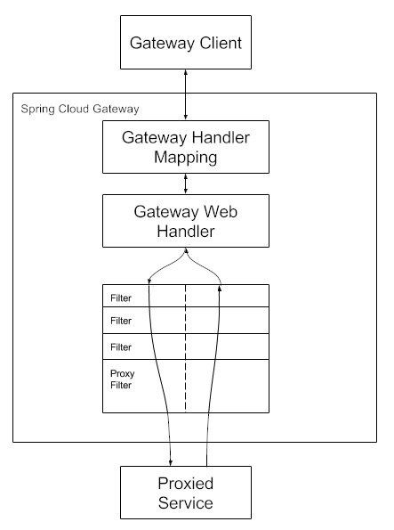

# Spring Cloud Gateway

[Spring Cloud Gateway single html 4.1.0-M1](https://docs.spring.io/spring-cloud-gateway/docs/4.1.0-M1/reference/html/)
[Spring Cloud Gateway Docs 4.1.5](https://docs.spring.io/spring-cloud-gateway/reference/index.html)

[Spring Cloud Gateway Docs 4.1.5 中文](https://docs.springframework.org.cn/spring-cloud-gateway/reference/spring-cloud-gateway/starter.html)

[Spring Cloud Gateway Getting Started](https://spring.io/projects/spring-cloud-gateway)

## 什么是API网关

API网关是一个服务器，是系统的唯一入口。  从面向对象设计的角度看，它与外观模式类似。

API网关封装了系统内部架构，为每个客户端提供一个定制的API。它可能还具有其它职责，如身份验证、监控、负载均衡、缓存、协议转换、限流熔断、静态响应处理。

API网关方式的核心要点是，所有的客户端和消费端都通过统一的网关接入微服务，在网关层处理所有的非业务功能。通常，网关也是提供REST/HTTP的访问API。

## 网关的主要功能

微服务网关作为微服务后端服务的统一入口，它可以统筹管理后端服务，主要分为数据平面和控制平面：

数据平面主要功能是接入用户的HTTP请求和微服务被拆分后的聚合。使用微服务网关统一对外暴露后端服务的API和契约，路由和过滤功能正是网关的核心能力模块。另外，微服务网关可以实现拦截机制和专注跨横切面的功能，包括协议转换、安全认证、熔断限流、灰度发布、日志管理、流量监控等。

控制平面主要功能是对后端服务做统一的管控和配置管理。例如，可以控制网关的弹性伸缩；可以统一下发配置；可以对网关服务添加标签；可以在微服务网关上通过配置Swagger功能统一将后端服务的API契约暴露给使用方，完成文档服务，提高工作效率和降低沟通成本。

* 路由功能：路由是微服务网关的核心能力。通过路由功能微服务网关可以将请求转发到目标微服务。在微服务架构中，网关可以结合注册中心的动态服务发现，实现对后端服务的发现，调用方只需要知道网关对外暴露的服务API就可以透明地访问后端微服务。
* 负载均衡：API网关结合负载均衡技术，利用Eureka或者Consul等服务发现工具，通过轮询、指定权重、IP地址哈希等机制实现下游服务的负载均衡。
* 统一鉴权：一般而言，无论对内网还是外网的接口都需要做用户身份认证，而用户认证在一些规模较大的系统中都会采用统一的单点登录（Single Sign On）系统，如果每个微服务都要对接单点登录系统，那么显然比较浪费资源且开发效率低。API网关是统一管理安全性的绝佳场所，可以将认证的部分抽取到网关层，微服务系统无须关注认证的逻辑，只关注自身业务即可。
* 协议转换：API网关的一大作用在于构建异构系统，API网关作为单一入口，通过协议转换整合后台基于REST、AMQP、Dubbo等不同风格和实现技术的微服务，面向Web Mobile、开放平台等特定客户端提供统一服务。
* 指标监控：网关可以统计后端服务的请求次数，并且可以实时地更新当前的流量健康状态，可以对URL粒度的服务进行延迟统计，也可以使用Hystrix Dashboard查看后端服务的流量状态及是否有熔断发生。
* 限流熔断：在某些场景下需要控制客户端的访问次数和访问频率，一些高并发系统有时还会有限流的需求。在网关上可以配置一个阈值，当请求数超过阈值时就直接返回错误而不继续访问后台服务。当出现流量洪峰或者后端服务出现延迟或故障时，网关能够主动进行熔断，保护后端服务，并保持前端用户体验良好。
* 黑白名单：微服务网关可以使用系统黑名单，过滤HTTP请求特征，拦截异常客户端的请求，例如DDoS攻击等侵蚀带宽或资源迫使服务中断等行为，可以在网关层面进行拦截过滤。比较常见的拦截策略是根据IP地址增加黑名单。在存在鉴权管理的路由服务中可以通过设置白名单跳过鉴权管理而直接访问后端服务资源。
* 灰度发布：微服务网关可以根据HTTP请求中的特殊标记和后端服务列表元数据标识进行流量控制，实现在用户无感知的情况下完成灰度发布。
* 流量染色：和灰度发布的原理相似，网关可以根据HTTP请求的Host、Head、Agent等标识对请求进行染色，有了网关的流量染色功能，我们可以对服务后续的调用链路进行跟踪，对服务延迟及服务运行状况进行进一步的链路分析。
* 文档中心：网关结合Swagger，可以将后端的微服务暴露给网关，网关作为统一的入口给接口的使用方提供查看后端服务的API规范，不需要知道每一个后端微服务的Swagger地址，这样网关起到了对后端API聚合的效果。
* 日志审计：微服务网关可以作为统一的日志记录和收集器，对服务URL粒度的日志请求信息和响应信息进行拦截。

## 网关对比

[Selecting the right open-source API Gateway technology | by Houcem Berrayana | Medium](https://medium.com/@berrayana/selecting-the-right-open-source-api-gateway-technology-eb295f076939)

[java - 5种API网关技术选型，yyds！ - 码猿技术专栏 - SegmentFault 思否](https://segmentfault.com/a/1190000042375194)

[5 种主流API网关技术选型，yyds！以下文章来源于楼仔 ，作者楼仔 API网关是微服务项目的重要组成部分，今天来聊聊 - 掘金](https://juejin.cn/post/7220244579672014908)

### OpenResty based Technology

OpenResty is a kind of platform that lets you program on top of Nginx. It uses Lua scripts as a scripting language.

1. Kong: Kong is one of the most popular API gateway solutions built on top of OpenResty. It provides various features like routing, security, analytics, and transformations. Kong can be extended using Lua for custom logic and plugins.
2. 3scale (Red Hat): 3scale, now part of Red Hat, offers an API management platform that includes an API gateway. While not explicitly based on OpenResty, it does allow you to use Nginx as a component for its API gateway functionality.
3. APISIX: APISIX is an open-source API gateway that is based on OpenResty and comes with prebuilt plugins and a dashboard.

### Java-based API Gateways

1. Netflix Zuul
2. Spring Cloud Gateway
3. [Apache ShenYu 介绍](https://shenyu.apache.org/zh/docs/index)

| 网关               | 限流                                                                 | 鉴权                          | 监控                                                                 | 易用性                           | 可维护性                                   | 成熟度                                 |
|--------------------|----------------------------------------------------------------------|-------------------------------|----------------------------------------------------------------------|---------------------------------|--------------------------------------------|----------------------------------------|
| Spring Cloud Gateway | 可以通过IP, 用户, 集群限流, 提供了相应的接口进行扩展                     | 普通鉴权、auth2.0              | Gateway Metrics Filter                                               | 简单易用                         | spring系列 可扩展强, 易配置 可维护性好       | spring社区成熟, 但gateway资源较少       |
| Zuul2              | 可以通过配置文件配置集群限流和单服务器限流 亦可通过filter实现限流扩展     | filter中实现                   | filter中实现                                                         | 参考资料较少                     | 可维护性较差                               | 资料少                           |
| OpenResty          | 需要lua开发                                                           | 需要lua开发                    | 需要开发                                                             | 简单易用, 但是需要进行的lua开发很多 | 可维护性较差, 将来需要维护大量lua脚本      | 很成熟资料很多                         |
| Kong               | 根据秒, 分, 时, 天, 月, 年, 根据用户进行限流。可在原码的基础上进行开发   | 普通鉴权, Key Auth鉴权, HMAC, auth2.0 | 可上报datadog, 记录请求数量, 请求数据量, 应答数据量, 接收于发送的时间间隔, 状态码数量, kong内运行时间 | 简单易用, api转发通过管理员接口配置, 开发需要lua脚本 | 可维护性较差, 将来需要维护大量lua库       | 相对成熟, 用户问题汇总, 社区, 插件开源 |

1. **Spring Cloud Gateway**：
   * 这是Spring Cloud的新一代API网关，基于WebFlux框架实现，旨在为微服务架构提供一种简单而有效的统一的API路由管理方式。
   * 它支持动态路由、内置到Spring Handler映射中的路由匹配、基于HTTP请求的路由匹配（Path、Method、Header、Host等）。
   * 还集成了Hystrix断路器、支持过滤器作用于匹配的路由，并且可以修改HTTP请求和响应。
   * 支持Spring Cloud DiscoveryClient配置路由，与服务发现与注册配合使用，也支持限流。

2. **Netflix Zuul**：
   * Zuul是Netflix开源的API网关解决方案，它分为Zuul 1.x和Zuul 2.x两个版本。Zuul 1.x使用阻塞式I/O，而Zuul 2.x引入了非阻塞式I/O。
   * Zuul 1.x适合中小型项目，而Zuul 2.x更适用于需要高性能的场景。
   * 它与Spring Cloud生态中的其他组件如Eureka、Ribbon、Hystrix等可以很好地配合使用。

3. **Nginx**：
   * Nginx是一个高性能的HTTP和反向代理服务器，也是一个邮件代理服务器、通用TCP/UDP代理服务器。它可以作为API网关使用，以其高稳定性和丰富的配置选项而闻名。
   * Nginx不是特定于Spring生态系统的，因此它可以被用于任何Web应用程序，作为一个非常灵活的选择。

4. **Kong**：
   * Kong是一个基于OpenResty（Nginx + Lua模块）编写的API Gateway项目，提供高可用、易扩展的特性。
   * 它基于Nginx和Apache Cassandra或PostgreSQL构建，提供RESTful API来操作和配置API管理系统。

5. **Tyk**：
   * Tyk是一个模块化的开源API网关，允许集成第三方中间件或部署自定义插件，根据公司需求调整实施。

6. **AWS API Gateway**：
   * 这是AWS提供的托管服务，用于创建、发布、维护、监控和保护API。

7. **Traefik**：
   * Traefik是一个开源的边缘路由器，支持动态配置和微服务架构。

每种网关都有其特定的优势和劣势，选择正确的API网关取决于具体需求已经使用的技术。例如，如果已经深度集成了Spring Cloud生态，那么Spring Cloud Gateway可能是一个更好的选择，因为它提供了与Spring生态的原生集成和高性能。

## Spring Cloud Gateway 术语

### Route（路由）

网关的基本构建块。它由 ID、目标 URI、一组断言和一组过滤器定义。如果聚合断言为真，则匹配路由。

### Predicate（断言）

这是一个 Java 8 函数断言 Predicate。输入类型是 Spring Framework ServerWebExchange。这使您可以匹配 HTTP 请求中的任何内容，例如标头或参数。

### Filter（过滤器）

这些是由特定工厂构建的 GatewayFilter 的实例。在这里，您可以在发送下游请求之前或之后修改请求和响应。

**WebFilter** implementations work for all endpoints and **HandlerFilterFunction** implementations will only work for Router-based ones.

## Spring Cloud Gateway 工作原理

客户端向 Spring Cloud Gateway 发出请求。如果网关处理器映射确定请求与某个路由匹配，则将其发送到网关 Web 处理器。此处理器会通过特定于请求的过滤器链运行请求。过滤器以虚线分隔的原因是，过滤器可以在发送代理请求之前和之后都运行逻辑。所有“预”过滤器逻辑都将执行。然后发出代理请求。发出代理请求后，将运行“后”过滤器逻辑。

## Spring Cloud Gateway 例子

[Getting Started | Building a Gateway](https://spring.io/guides/gs/gateway)
