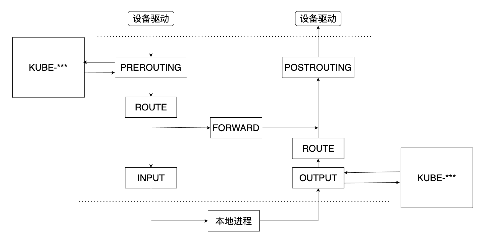
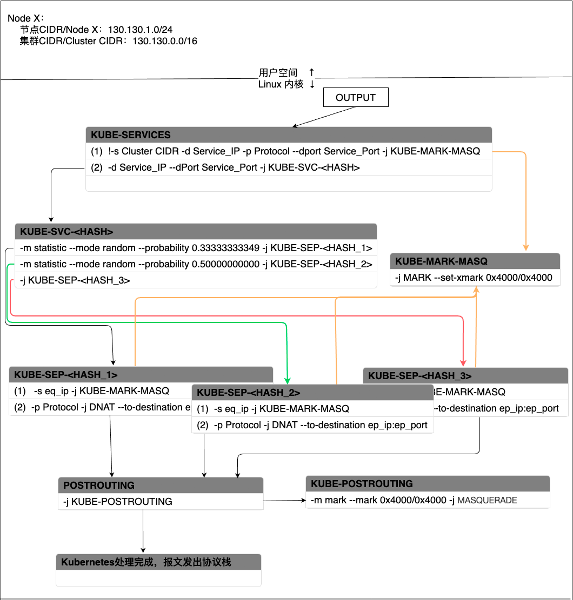
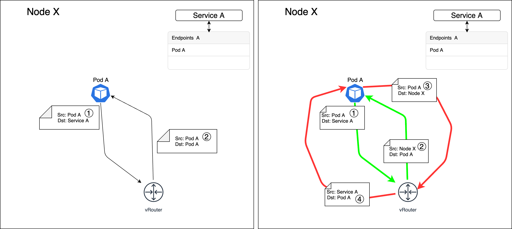
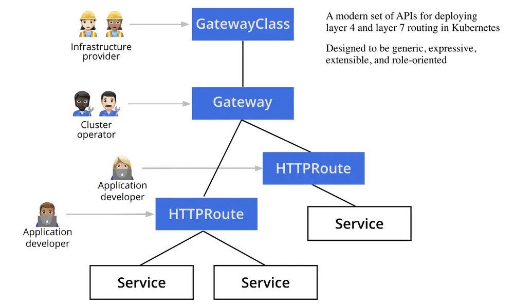

# kubernetesNotes

Container Network Interface (CNI)

## Recent

batch delete `kdelp $(kgp -l | grep Evicted | awk '{print $1}')`
kubelet summary API `http://localhost:8001/api/v1/nodes/node-name/proxy/stats/summary`

install arthas: `kubectl exec -it podName -- /bin/bash -c "wget https://arthas.aliyun.com/arthas-boot.jar && java -jar arthas-boot.jar"`

### 获取信息 排查问题

kubectl get events -A -o custom-columns=FirstSeen:.firstTimestamp,LastSeen:.lastTimestamp,Count:.count,From:.source.component,Type:.type,Reason:.reason,Message:.message |less

查看指定 pod 的 events
kubectl get events --watch -o custom-columns=Created:.metadata.creationTimestamp,FirstSeen:.firstTimestamp,LastSeen:.lastTimestamp,Count:.count,From:.source.component,Type:.type,Reason:.reason,Message:.message --field-selector involvedObject.kind=Pod, involvedObject.name=pod-test-78b7567ccc-b96kb

kubectl get events -o custom-columns=Created:.metadata.creationTimestamp,FirstSeen:.firstTimestamp,LastSeen:.lastTimestamp,Count:.count,From:.source.component,Type:.type,Reason:.reason,Message:.message --field-selector involvedObject.kind=Pod --sort-by=.metadata.creationTimestamp |less
kubectl get events -o custom-columns=Created:.metadata.creationTimestamp,FirstSeen:.firstTimestamp,LastSeen:.lastTimestamp,Count:.count,From:.source.component,Type:.type,Reason:.reason,Message:.message --sort-by=.metadata.creationTimestamp |less

kubectl get pods -A -o=jsonpath='{range .items[*]}{.spec.containers[].resources.requests.memory}{"\t"}{.status.hostIP}{"\t"}{.metadata.name}{"\n"}{end}' | grep 145

```sh
# get pod image
kubectl get deployment -o json ems-backend -o=jsonpath='{.spec.template.spec.containers[0].image}' | awk -F : '{print $NF}'
```

## kubectl

[kubectl Overview](https://jamesdefabia.github.io/docs/user-guide/kubectl-overview/)
[kubectl-cheatsheet An assortment of compact kubectl examples](https://github.com/fabric8io/kansible/blob/master/vendor/k8s.io/kubernetes/docs/user-guide/kubectl-cheatsheet.md)

```sh
#   mkdir -p $HOME/.kube
#   sudo cp -i /etc/kubernetes/admin.conf $HOME/.kube/config
#   sudo chown $(id -u):$(id -g) $HOME/.kube/config
# Alternatively, if you are the root user, you can run:
#   export KUBECONFIG=/etc/kubernetes/admin.conf
kubectl --kubeconfig=/etc/kubernetes/admin.conf get nodes
kubectl help get
```

`minikube start` Starting a Minikube virtual machine
`kubectl explain pod` kubectl explain to discover possible API object fields
`kubectl explain pod.spec` drill deeper to find out more about each attribute
`kubectl api-resources` Print the supported API resources on the server

`kubectl --kubeconfig=/path/to/cluster-admin.config --namespace monitoring get pod`

`kubectl cluster-info` Displaying cluster information
`kubectl get nodes/pods/secrets/services/deployment`
    `-o wide` request additional columns to display
    `-o yaml` get a YAML descriptor of an existing pod
    `-o json`
    `--show-labels`
    `-L, --label-columns=[]` switch and have each displayed in its own column `-L creation_method,env`
    `-l, --selector=''`
    `-A, --all-namespaces=false` If present, list the requested object(s) across all namespaces
    `-w, --watch` watch for changes
    `--v 6` verbose logging

`kubectl get pods --selector='labelName=labelValue'`
    `'!env'`
    `'env'`
    `env in (prod,devel)`
    `env notin (prod,devel)`

`kubectl create`
  `-f, --filename=[]` Filename, directory, or URL to files to use to create the resource
  `--record` record the command

`kubectl delete pods pod_name`
  `--force` force to delete

`kubectl describe node NODE_NAME`

`kubectl cp /path/to/file /target/path`

Deploying your Node.js app: create ReplicationController `kubectl run kubia --image=luksa/kubia --port=8080 --generator=run/v1`
Accessing your web application:  creating a service object `kubectl expose rc kubia --type=LoadBalancer --name kubia-http`
accessing your service through its external ip `curl 104.155.74.57:8080`

`kubectl scale rc kubia --replicas=3` increasing the desired replica count

`kubectl create -f FILE_NAME.yaml` command is used for creating any resource (not only pods) from a YAML or JSON file.
`kubectl apply -f FILE_NAME.yaml` 更新
`kubectl apply -f FOLDER` 更新

```sh
# cat <<EOF | kubectl apply -f -
kubectl apply -f - <<EOF
apiVersion: v1
kind: ConfigMap
metadata:
  name: testmap
  namespace: monitoring
data:
  webconfig.yml: |
    basic_auth_users:
      prometheus: password
EOF

```

`kubectl edit deploy piggy-mongo` open the YAML definition in your default text editor 修改
`kubectl patch svc nodeport -p '{"spec":{"externalTrafficPolicy":"Local"}}'` 添加

`docker logs <container id>`
`kubectl logs kubia-manual` retrieving a pod’s log with kubectl logs
`kubectl logs kubia-manual -c <container name>` specifying the container name when getting logs of a multi-container pod
    `--previous` figure out why the previous container

`kubectl exec -it <pod name> -- /bin/sh`  进入pod内部
`kubectl exec -it [POD_NAME] -c [CONTAINER_NAME] -- /bin/sh -c "kill 1"` restart the specific container

```sh
# forwarding a local network port 8888 to a port 8080 in the pod
kubectl port-forward pod-name 8888:8080
# make this port listen to 0.0.0.0
kubectl port-forward --address 0.0.0.0 svc/[service-name] -n [namespace] [external-port]:[internal-port]
```

`k top node` node 资源使用情况
`k top pod` pod 资源使用情况
`k top pod --containers` container 资源使用情况

COMMUNICATING WITH PODS THROUGH THE API SERVER
`kubectl proxy`
use localhost:8001 rather than the actual API server host and port. You’ll send a request to the kubia-0 pod like this:
`curl localhost:8001/api/v1/namespaces/default/pods/kubia-0/proxy/`

`kubectl autoscale deployment kubia --cpu-percent=30 --min=1 --max=5` creates the HorizontalPodAutoscaler(HPA) object for you and sets the Deployment called kubia as the scaling target
`kubectl get hpa` HorizontalPodAutoscaler
a container’s CPU utilization is the container’s actual CPU usage divided by its requested CPU
`kubectl cordon <node>` marks the node as unschedulable (but doesn’t do anything with pods running on that node).
`kubectl drain <node>` marks the node as unschedulable and then evicts all the pods from the node.

### Common

`kubectl logs -f --tail=10 pod-name`
  `-o custom-columns` option an
  `--sort-by=<jsonpath_exp>` sort the resource list, `--sort-by=.metadata.name`
[Resource types](https://kubernetes.io/docs/reference/kubectl/overview/#resource-types)

[JSONPath Support](https://kubernetes.io/docs/reference/kubectl/jsonpath/)
`kubectl get pods -A -o=jsonpath='{range .items[*]}{.status.hostIP}{"\t"}{.spec.containers[].resources.requests.cpu}{"\t"}{.spec.containers[].resources.requests.memory}{"\t"}{.metadata.name}{"\n"}{end}' --sort-by='.status.hostIP'`

```sh
# get name cpu
kubectl get pods -o custom-columns=NAME:.metadata.name,CPU:.spec.containers
# get the pod's IP address
kubectl get pod multi-container-pod -o jsonpath={.status.podIP}
```

### Debug

排查问题
`kubectl get events`
`kubectl -n namespace top pods --containers`
`kubectl top pod --all-namespaces | sort --reverse --key 4 --numeric | grep -v system | less` sort by memory
`kubectl get events -o custom-columns=Created:.metadata.creationTimestamp,FirstSeen:.firstTimestamp,LastSeen:.lastTimestamp,Count:.count,From:.source.component,Type:.type,Reason:.reason,Message:.message --field-selector involvedObject.kind=Pod,involvedObject.name=mysql-test-78b7567ccc-b96kb`
`kubectl get events --sort-by=.metadata.creationTimestamp`
`kubectl get events -o yaml|less`

jsonpath 查询申请的内存
`kubectl get pods -A -o=jsonpath='{range .items[*]}{.spec.containers[].resources.requests.memory}{"\t"}{.status.hostIP}{"\t"}{.metadata.name}{"\n"}{end}' | grep 145`

go-template `kubectl get pods -o go-template='{{range .items}}{{.status.podIP}}{{"\n"}}{{end}}'`

`kubectl cluster-info dump`

## Concept

OCI: Open Container Initiative
CRI: Container Runtime Interface
runc 是一个兼容oci的容器运行时。它实现OCI规范并运行容器进程。

### [Requests and limits](https://kubernetes.io/docs/concepts/configuration/manage-resources-containers/#meaning-of-memory)

Meaning of memory，Mi表示（1Mi=1024x1024）,M表示（1M=1000x1000）（其它单位类推， 如Ki/K Gi/G）
For example, the following represent roughly the same value: `128974848, 129e6, 129M, 123Mi`
1 (byte), 1k (kilobyte) or 1Ki (kibibyte), 1M (megabyte) or 1Mi (mebibyte)

Meaning of CPU:
The expression 0.1 is equivalent to the expression 100m, which can be read as "one hundred millicpu". Some people say "one hundred millicores", and this is understood to mean the same thing. A request with a decimal point, like 0.1, is converted to 100m by the API, and precision finer than 1m is not allowed. For this reason, the form 100m might be preferred.
`0.1 = 100m`

get all pods along with cpu and memory requirements in kubernetes `kubectl get po -o custom-columns="Name:metadata.name,CPU-request:spec.containers[*].resources.requests.cpu,CPU-limit:spec.containers[*].resources.limits.cpu,memory-request:spec.containers[*].resources.requests.memory,memory-limit:spec.containers[*].resources.limits.memory" --sort-by=".spec.containers[*].resources.limits.memory`

### PVC

`kubectl get pvc` volume claim

`kubectl patch pvc test-pvc -p '{"spec":{"resources":{"requests":{"storage":"50Gi"}}}}'` resize pvc

```json
{
    "apiVersion": "v1",
    "kind": "PersistentVolumeClaim",
    "metadata": {
        "annotations": {
            "pv.kubernetes.io/bind-completed": "yes",
            "pv.kubernetes.io/bound-by-controller": "yes",
            "volume.beta.kubernetes.io/storage-provisioner": "cluster.local/nfs-subdir-external-provisioner",
            "volume.kubernetes.io/storage-provisioner": "cluster.local/nfs-subdir-external-provisioner"
        },
        "name": "pvc-test",
        "namespace": "default"
    },
    "spec": {
        "accessModes": [
            "ReadWriteOnce"
        ],
        "resources": {
            "requests": {
                "storage": "1Mi"
            }
        },
        "storageClassName": "nfs-client",
        "volumeMode": "Filesystem",
        "volumeName": "pvc-f10cff78-eac8-4e4a-9de3-1b82ec7446f2"
    }
}
```

### Pod

`k port-forward pod-name 8001:5000` 本地端口 8001 转发到 pod 的端口 5000

`kubectl delete pods $(kubectl get pods | grep Evicted |awk '{print $1}')` delete Evicted pods in current namespace

`kubectl get pods -A | grep Evicted | awk '{print "kubectl delete pods -n ",$1,$2}' | bash -x` delete Evicted pods in all namespaces

#### [Assign Pods to Nodes](https://kubernetes.io/docs/concepts/scheduling-eviction/assign-pod-node/)

`nodeName: foo-node # schedule pod to specific node`

```yaml
nodeSelector:
  svrtype: web

```

### Service

访问URI: `SERVICE_NAME.NAMESPACE.svc.cluster.local`
 `svc.cluster.local` is a configurable cluster domain suffix used in all cluster local service names.

[Debug Services](https://kubernetes.io/docs/tasks/debug-application-cluster/debug-service/)

### Deployment

```sh
# [kubectl rollout restart | Kubernetes](https://kubernetes.io/docs/reference/kubectl/generated/kubectl_rollout/)

# Restart a deployment
kubectl rollout restart deployment/nginx
# deployment 历史记录
kubectl rollout history deployment deployment-name
# Changes the container image defined in a Pod
kubectl set image deployment kubia nodejs=luksa/kubia:v3
# the progress of the rollout
kubectl rollout status deployment kubia
# displaying a deployment’s rollout history
kubectl rollout history deployment kubia
# undoing a rollout
kubectl rollout undo deployment kubia
kubectl rollout undo deployment kubia --to-revision=1
kubectl rollout history deployment/<Deployment-name>  --revision=<revision-number>  -o yaml
```

deployment strategies:

* RollingUpdate
* Recreate

### Label

`kubectl label pod kubia-manual creation_method=manual` Modifying labels of existing pods
    `--overwrite`
`kubectl get pod -l creation_method=manual` Listing pods using a label selector
`kubectl get pod -l env` To list all pods that include the env label
`kubectl get po -l '!env'` To list all pods that don’t have the env label

### Namespaces

`kubectl create ns name`
`kubectl get ns`
`kubectl get pod --namespace kube-system`

`kubectl config set-context --current --namespace=piggy` change namespace
`alias kcn='kubectl config set-context $(kubectl config current-context) --namespace '`

`kubectl create -f dev.json`

```json
{
  "apiVersion": "v1",
  "kind": "Namespace",
  "metadata": {
    "name": "dev",
    "labels": {
      "name": "dev"
    }
  }
}
```

`kubectl delete ns custom-namespace` delete the whole namespace (the pods will be deleted along with the namespace automatically)
`kubectl delete po --all` Deleting all pods in a namespace, while keeping the namespace
`kubectl delete all --all` Deleting (almost) all resources in a namespace

### Ingress

[Annotations - Ingress-Nginx Controller](https://kubernetes.github.io/ingress-nginx/user-guide/nginx-configuration/annotations/#custom-max-body-size)

```yaml
apiVersion: networking.k8s.io/v1
kind: Ingress
metadata:
  name: ingress-test
  namespace: default
  annotations:
    # HTTP 413 错误 （ Request entity too large 请求实体太大 ）
    # Custom max body size
    # https://kubernetes.github.io/ingress-nginx/user-guide/nginx-configuration/annotations/#custom-max-body-size
    nginx.ingress.kubernetes.io/proxy-body-size: "0"
    # Client Body Buffer Size
    # https://kubernetes.github.io/ingress-nginx/user-guide/nginx-configuration/annotations/#client-body-buffer-size
    nginx.ingress.kubernetes.io/client-body-buffer-size: 21m

    # Configuration snippet
    # Using this annotation you can add additional configuration to the NGINX location
    # https://kubernetes.github.io/ingress-nginx/user-guide/nginx-configuration/annotations/#configuration-snippet
    nginx.ingress.kubernetes.io/configuration-snippet: |
        client_body_buffer_size 21m;

    # 为Nginx Ingress配置HTTPS协议的后端服务，默认是HTTP，如果后端服务混合两种协议，可以配置多个相同域名的 Ingress
    # https://kubernetes.github.io/ingress-nginx/user-guide/nginx-configuration/annotations/#backend-protocol
    nginx.ingress.kubernetes.io/backend-protocol:  "HTTPS"
    # 永久重定向
    nginx.ingress.kubernetes.io/permanent-redirect: "https://www.example.com"
    nginx.ingress.kubernetes.io/permanent-redirect-code: "308" # 重定向返回状态码
    # 302 临时重定向
    nginx.ingress.kubernetes.io/temporal-redirect: "https://www.volcengine.com" # 重定向到指定的目标网站
    # 开启 HTTP 重定向到 HTTPS
    nginx.ingress.kubernetes.io/ssl-redirect: "true" # 开启 HTTP 重定向到 HTTPS

    # enable gzip
    nginx.ingress.kubernetes.io/server-snippet: |
      gzip on;
      gzip_types text/plain text/css application/json application/x-javascript text/xml application/xml application/xml+rss text/javascript;

```

设置默认的 ingressclass
`kubectl -n ingress-nginx patch ingressclass nginx -p '{"metadata":{"annotations":{"ingressclass.kubernetes.io/is-default-class":"true"}}}'`

```json
{
    "apiVersion": "networking.k8s.io/v1",
    "kind": "IngressClass",
    "metadata": {
        "annotations": {
            "kubectl.kubernetes.io/last-applied-configuration": "{\"apiVersion\":\"networking.k8s.io/v1\",\"kind\":\"IngressClass\",\"metadata\":{\"annotations\":{},\"labels\":{\"app.kubernetes.io/component\":\"controller\",\"app.kubernetes.io/instance\":\"ingress-nginx\",\"app.kubernetes.io/name\":\"ingress-nginx\",\"app.kubernetes.io/part-of\":\"ingress-nginx\",\"app.kubernetes.io/version\":\"1.11.2\"},\"name\":\"nginx\"},\"spec\":{\"controller\":\"k8s.io/ingress-nginx\"}}\n"
        },
        "labels": {
            "app.kubernetes.io/component": "controller",
            "app.kubernetes.io/instance": "ingress-nginx",
            "app.kubernetes.io/name": "ingress-nginx",
            "app.kubernetes.io/part-of": "ingress-nginx",
            "app.kubernetes.io/version": "1.11.2"
        },
        "name": "nginx"
    },
    "spec": {
        "controller": "k8s.io/ingress-nginx"
    }
}
```

nginx ingress enable gzip [ConfigMap - Ingress-Nginx Controller](https://kubernetes.github.io/ingress-nginx/user-guide/nginx-configuration/configmap/#use-gzip)

example: [Kubernetes Ingress Compression | James Joy's Blog](https://jamesjoy.site/posts/2023-06-12-kubernetes-ingress-compression)

nginx enable gzip [Compression and Decompression | NGINX Documentation](https://docs.nginx.com/nginx/admin-guide/web-server/compression)

```sh
kecm ingress-nginx-controller -n ingress-nginx -o yaml
```

```yaml
# Edit the file to add use-gzip: "true" and enable-brotli: "true":
apiVersion: v1
data:
  allow-snippet-annotations: "true"
  use-proxy-protocol: "true"
  use-gzip: "true"
  enable-brotli: "true"
kind: ConfigMap
metadata:
  name: ingress-nginx-controller
  namespace: ingress-nginx
```

### ConfigMap

```sh
kubectl create configmap fortune-config --from-literal=sleep-interval=2 --from-literal=foo=bar --from-literal=bar=baz
kubectl create -f fortune-config.yaml
kubectl create configmap my-config --from-file=config-file.conf
kubectl create configmap my-config --from-file=/path/to/dir

# PATCH
kubectl patch configmap tcp-services --type merge -p '{"data":{"5672": "rabbitmq-system/rabbitmqcluster:5672"}}'

# creating a tls certificate for the ingress
kubectl create secret tls tls-secret-name --cert=tls.cert --key=tls.key
# 包含自定义文件
kubectl create secret generic generic-name --from-file=https.key --from-file=https.cert --from-file=foo

# Copying Kubernetes Secrets Between Namespaces:
kubectl get secret <secret-name> --namespace=<source-namespace>  -o yaml \
  | sed 's/namespace: <from-namespace>/namespace: <to-namespace>/' \
  | kubectl create -f -

# Update k8s ConfigMap or Secret without deleting the existing one
kubectl create configmap foo --from-file foo.properties -o yaml --dry-run=client | kubectl apply -f -

# 创建 configMap 的同时增加 label
kubectl label configmap my-config app=grafana env=test
kubectl create configmap --from-file=... --overrides='{"metadata":{"label":"app": "awesomeapp"}}'
kubectl create cm foo -o yaml --dry-run|kubectl label -f- --dry-run -o yaml --local f=b

# 使用文件创建，并引用已有的文件 file1.txt
cat <<EOF > configmap.yaml
apiVersion: v1
kind: ConfigMap
metadata:
  name: my-configmap
data:
  file1.txt: |
    $(cat file1.txt)
  file2.txt: |
    $(cat file2.txt)
EOF
```

### System

`kubectl get events` 查看相关事件

### [Managing Resources for Containers](https://kubernetes.io/docs/concepts/configuration/manage-resources-containers/)

* **request**: the scheduler uses this information to decide which node to place the Pod on. The kubelet also reserves at least the request amount of that system resource specifically for that container to use.  It is default to the limits if requests is not set explicitly.
* **limit**: the kubelet enforces those limits so that the running container is not allowed to use more of that resource than the limit you set

#### Exceeding the limits

CPU: when a CPU limit is set for a container, the process isn’t given more CPU time than the configured limit.
Memory: When a process tries to allocate memory over its limit, the process is killed (it’s said the container is OOMKilled, where OOM stands for Out Of Memory)

#### pod QoS classes

* BestEffort (the lowest priority)
  1. It’s assigned to pods that don’t have any requests or limits set at all (in any of their containers)
  2. They will be the first ones killed when memory needs to be freed for other pods.
* Burstable
  In between BestEffort and Guaranteed is the Burstable QoS class. All other pods fall into this class
  When two single-container pods exist, both in the Burstable class, the system will kill the one using more of its requested memory than the other, percentage-wise
* Guaranteed (the highest)
  1. Requests and limits need to be set for both CPU and memory.
  2. They need to be set for each container.
  3. They need to be equal (the limit needs to match the request for each resource in each container).

##### which process gets killed when memory is low

First in line to get killed are pods in the BestEffort class, followed by Burstable pods, and finally Guaranteed pods, which only get killed if system processes need memory.

### Advanced Scheduling

`kubectl taint node node1.k8s node-type=production:NoSchedule` adds a taint with key node-type, value production and the NoSchedule

Three possible effects exist:

* `NoSchedule`, which means pods won’t be scheduled to the node if they don’t tol- erate the taint.
* `PreferNoSchedule` is a soft version of NoSchedule, meaning the scheduler will try to avoid scheduling the pod to the node, but will schedule it to the node if it can’t schedule it somewhere else.
* `NoExecute`, unlike NoSchedule and PreferNoSchedule that only affect schedul- ing, also affects pods already running on the node. If you add a NoExecute taint to a node, pods that are already running on that node and don’t tolerate the NoExecute taint will be evicted from the node.

### Deploy process

1. build image `docker build -t registry.cn-beijing.aliyuncs.com/namespace/image-name:image-version . -f deploy/Dockerfile`
2. 将镜像推送到Registry `docker push`
3. 启动 pod `kubectl run pod-name -n namespace --image=registry.cn-beijing.aliyuncs.com/namespace/image-name:image-version -it --rm --restart=Never -- bash`

#### Jenkins

[Kubernetes CLI](https://plugins.jenkins.io/kubernetes-cli/) 部署多个集群

```groovy
withKubeConfig([credentialsId: 'k8s_config_prd'
                    ]) {
                  sh "kubectl config view"
                  sh "kubectl get pods"
                }
```

### Volume (Disk)

`Pod The node had condition: [DiskPressure]` 这个异常信息会发生在 Pod 创建的时候，如果 Node 没有足够的空间创建新的 Pod，就会抛出这个异常

`The node was low on resource: ephemeral-storage` 这个异常信息发生在 pod 运行过程中，如果 pod 写了大量的日志信息，导致磁盘被大量使用，导致无法继续运行，会抛出这个异常。

设置 PVC 大小 `kubectl patch pvc pvc-name -p '{"spec":{"resources":{"requests":{"storage":"50Gi"}}}}'`

#### Unable to attach or mount volumes - timed out waiting for the condition

[Kubernetes - Kubelet Unable to attach or mount volumes - timed out waiting for the condition - vEducate.co.uk](https://veducate.co.uk/kubelet-unable-attach-volumes/)

The fix is to remove the stale VolumeAttachment. `kubectl delete volumeattachment [volumeattachment_name]`

[容器服务K8S存储卷挂载常见问题-阿里云开发者社区](https://developer.aliyun.com/article/591884)

磁盘挂载日志
tail -f /var/log/alicloud/diskplugin.csi.alibabacloud.com.log | grep d-2zeheqwxc2jrasb0fonj
tail -n 1000 /var/log/messages | grep kubelet |less
kg VolumeAttachment | sort -k 3

### Network

[Mastering Kubernetes Pod-to-Pod Communication: A Comprehensive Guide | by Extio Technology | Medium](https://medium.com/@extio/mastering-kubernetes-pod-to-pod-communication-a-comprehensive-guide-46832b30556b)

Kubernetes 对集群网络有以下要求：
所有的 Pod 之间可以在不使用 NAT 网络地址转换的情况下相互通信；所有的 Node 之间可以在不使用 NAT 网络地址转换的情况下相互通信；每个 Pod 看到的自己的 IP 和其他 Pod 看到的一致。

#### Kubernetes CNI

[从零开始入门 K8s | 理解 CNI 和 CNI 插件](https://developer.aliyun.com/article/748866)
[kubernetes网络模型之“小而美”flannel](https://zhuanlan.zhihu.com/p/79270447)

CNI，它的全称是 Container Network Interface，即容器网络的 API 接口。

它是 K8s 中标准的一个调用网络实现的接口。Kubelet 通过这个标准的 API 来调用不同的网络插件以实现不同的网络配置方式，实现了这个接口的就是 CNI 插件，它实现了一系列的 CNI API 接口。常见的 CNI 插件包括 Calico、flannel、Terway、Weave Net 以及 Contiv。

插件负责为接口配置和管理IP地址，并且通常提供与IP管理、每个容器的IP分配、以及多主机连接相关的功能。容器运行时会调用网络插件，从而在容器启动时分配IP地址并配置网络，并在删除容器时再次调用它以清理这些资源。

K8s 通过 CNI 配置文件来决定使用什么 CNI。基本的使用方法为：

1. 首先在每个结点上配置 CNI 配置文件(/etc/cni/net.d/xxnet.conf)，其中 xxnet.conf 是某一个网络配置文件的名称；
2. 安装 CNI 配置文件中所对应的二进制插件；
3. 在这个节点上创建 Pod 之后，Kubelet 就会根据 CNI 配置文件执行前两步所安装的 CNI 插件；
4. 上步执行完之后，Pod 的网络就配置完成了。

#### Kubernetes集群通信的实现原理

[K8s network之四：Kubernetes集群通信的实现原理 | Mr.Muzi](https://marcuseddie.github.io/2021/K8s-Network-Architecture-section-four.html)

#### Kubernetes集群Pod和Service之间通信的实现原理

[K8s network之五：Kubernetes集群Pod和Service之间通信的实现原理 | Mr.Muzi](https://marcuseddie.github.io/2021/K8s-Network-Architecture-section-five.html)

iptables代理模型

iptables从Kubernetes v1.2版本开始称为kube-proxy的默认模式，直到在v1.12版本中被IPVS取代而成为新的kube-proxy默认工作模式。在该模式中，kube-proxy修改了iptables中的filter和nat表，同时又对iptables的链进行了扩充，自定义了`KUBE-SERVICES，KUBE-SVC-<HASH>，KUBE-SEP-<HASH>，KUBE-NODEPORTS，KUBE-FW-<HASH>，KUBE-XLB-<HASH>，KUBE-POSTROUTING，KUBE-MARK-MASQ和KUBE-MARK-DROP`九个链条，通过在`KUBE-SERVICES`链中加入每个Service的ClusterIP和端口的匹配规则来完成流量的匹配和重定向工作。Kubernetes自定义的链条与iptables原生链条的调用关系如图 4 所示



Cluster IP
  当集群内Pod访问Service的Cluster IP时，报文会通过iptables的OUTPUT链进入Kubernetes的自定义链。假设当前集群中有一个Service A，同时有三个后端Pod用来提供服务Service A，kube-proxy采用随机负载均衡算法来选择Pod，针对Cluster IP的处理流程如下图所示：


Note: 某些链条的名字中含有 <HASH>字样，这是运用SHA256算法对“namespace + name + portname+协议名”生成哈希值，然后通过base32对该哈希值编码，最后取编码值的前16位的值。

1. 报文会首先进入KUBE-SERVICES链条。KUBE-SERVICE针对每个Service会产生两条匹配规则，规则（1）表示如果报文的源地址不是集群内IP地址，同时，报文匹配了请求Service的协议和端口，那么就跳转到（-j）KUBE-MARK-MASQ链条，在报文中加入一个特殊的防火墙标识，打上这个标识的报文会在POSTROUTING阶段执行SNAT(Source Network Address Translation)。如果确实命中了规则（1），那么在打完标记后会继续检查规则（2），规则（2）会将报文带入下一个链条 KUBE-SVC-<HASH>。
2. KUBE-SVC-<HASH>包含了当前提供Service的后端Pod、负载均衡模式等消息。kube-proxy默认采用的随机负载算法，因此在这种算法下会为每个Pod分配一个命中概率。在图-6中，三个Pod被命中的概率都是三分之一。当选中一个Pod后，就会跳转到和Pod相对应的KUBE-SEP-<HASH>上。
3. 每个KUBE-SEP-<HASH>和一个Pod相对应，且每个KUBE-SEP-<HASH>均有两条规则。规则（2）表示对请求做DNAT，将请求的目的地址由原来的ClusterIP：Port转换成Pod_IP：Port。这样就将Pod访问Service变成了Pod和Pod之间的访问。规则（1）的目的是为了应对Hairpinning 发夹问题而设计的：Service A的后端Pod中有可能会有某个Pod访问Service A，然后经过iptables时又恰好选中了自己作为服务的提供方。换句话说，Pod要为自己发出去的服务请求做出响应。在Kubernetes中这样会造成访问失败，如果当出现这种场景时就跳转到KUBE-MARK-MASQ链条执行SNAT，将请求的源地址由Pod自身变成节点的node IP，这样就又变成了正常的服务请求和响应模式。如图7所示，左边是没有做SNAT的场景，Pod A收到了一个自己发出的服务请求，请求的源和目的地址都是自己，当发送响应给自己时会导致失败。右边是借助SNAT解决Hairpinning问题的场景，Pod A访问自己所属服务的请求到达Linux内核时会通过SNAT将源地址由Pod A的IP变成节点的Node IP。当Pod A发送响应报文时，报文先发送给Node IP，然后在Linux内核中再次进行NAT，将源IP由Pod A的IP改成Service的IP，目的IP由Node节点的IP改为Pod A的IP，这样就可以正常工作了。
  
  图 - 7 Hairpinning问题及其解决方法

4. 执行完DNAT后，会跳转到POSTROUTING链条。POSTROUTING会无条件跳转到KUBE-POSTROUTING链条，这个链条会检查报文是否有跳转到KUBE-MARK-MASQ链条被打上防火墙标识，如果有的话就会执行SNAT，将报文的源地址变为节点的node IP。
5. 最后由POSTROUTING将报文发出协议栈。

NOTE: SNAT和MASQUERAD的区别

* SNAT是指在数据包从网卡发送出去的时候，把数据包中的源地址部分替换为指定的IP，这样，接收方就认为数据包的来源是被替换的那个指定IP的主机。
* MASQUERADE是SNAT的一个特例。MASQUERADE是用发送数据的网卡上的IP来替换源IP，因此，对于那些IP不固定的场合，比如通过DHCP分配IP的情况下，就得用MASQUERADE。

##### 同一个 Node 节点内的 Pod 不能通过 Service 互访

修改集群kube proxy 配置 masqueradeAll true
[Kubernetes 同一个 Node 节点内的 Pod 不能通过 Service 互访 - 哈希](https://www.haxi.cc/archives/Kubernetes-同一个-Node-节点内的-Pod-不能通过-Service-互访.html)
[Kubernetes 同一个 Node 节点内的 Pod 不能通过 Service 互访 - 面壁者的逻辑 - 博客园](https://www.cnblogs.com/longgor/p/13588191.html)

[Debug Services | Kubernetes](https://kubernetes.io/docs/tasks/debug/debug-application/debug-service)

[Virtual IPs and Service Proxies | Kubernetes](https://kubernetes.io/docs/reference/networking/virtual-ips/)
[IP Masquerade Agent User Guide | Kubernetes](https://kubernetes.io/docs/tasks/administer-cluster/ip-masq-agent/)

[kubernetes - Pods running on the same node can't access to each other through service - Stack Overflow](https://stackoverflow.com/questions/64073696/pods-running-on-the-same-node-cant-access-to-each-other-through-service/78910247#78910247)

原因：kube-proxy通过在每个节点上创建相同的ipvs规则（关闭rap），当pod访问集群内svc（vip）时，请求会被当前节点vip接受，此时，ipvs会进行DNAT操作，而在回报时，两个pod处于同一个veth-part的一面，此时流量并不会走网关，所以回报的时候源ip和目的ip都是两个pod的ip，但是在请求发送时，目的ip为vip，此时会丢弃掉请求。

using flannel as CNI on Kubernetes v1.30.1 and it turned out that flannel needs masquerade to be set true while kube-proxy default value has masqueradeAll: false. Changing it to true and restarting kube-proxy pods solved the problem

the steps:

```sh
# set masqueradeAll: true
kubectl -n kube-system edit cm kube-proxy
# to restart all kube proxy pods
kubectl -n kube-system delete pod -l k8s-app=kube-proxy
```

#### Flannel

[从 Flannel 学习 Kubernetes overlay 网络](https://atbug.com/cross-node-traffic-on-flannel-vxlan-network/)

```sh
# IP 命令

# ip neighbour show | awk '$3=="flannel.1"{print $0}'
10.244.2.0 dev flannel.1 lladdr 5e:5f:7e:bd:65:ea PERMANENT
10.244.0.0 dev flannel.1 lladdr 76:7d:9c:b5:29:9d PERMANENT

# bridge fdb show flannel.1 |awk '$3=="flannel.1"{print $0}'
26:22:89:97:04:e8 dev flannel.1 dst 192.168.102.103 self permanent    # 转发至k8s-node2节点
76:7d:9c:b5:29:9d dev flannel.1 dst 192.168.102.101 self permanent    # 转发至k8s-master节点
```

#### kubectl netshoot

[nicolaka/netshoot: a Docker + Kubernetes network trouble-shooting swiss-army container](https://github.com/nicolaka/netshoot)

```sh
kubectl netshoot debug podName --image-name nicolaka/netshoot --image-tag v0.13
# spin up a throwaway pod for troubleshooting
kubectl netshoot run tmp-shell --image-name nicolaka/netshoot --image-tag v0.13

# debug using an ephemeral container in an existing pod
kubectl netshoot debug my-existing-pod

# create a debug session on a node
kubectl netshoot debug node/my-node
```

#### 阿里云ACK集群中的网络问题

[阿里云ACK集群中的网络问题](https://itopic.org/ack-network-issue.html)
[pod 无法访问集群 ingress slb 绑定的公网域名 | Blog](https://zijin-m.github.io/Blog/problems/k8s/externalTrafficPolicy-local.html)

#### 阿里云Kubernetes托管版开启 hairpin 模式

据客服回复目前(2020-11-20)没有简单的配置方式, 但发现下面的方式暂时有效果:

1. 确认网络插件类型是 csi
`ps aux | grep kubelet | grep /usr/bin/kubelet | grep network-plugin`

2. 找到配置文件位置 `ls /etc/cni/net.d/*flannel.conf`
在每台 node 机器上的配置文件 /etc/cni/net.d/10-flannel.conf 增加  "hairpinMode": true

```yaml
{
  "name": "cb0",
  "cniVersion":"0.3.0",
  "type": "flannel",
  "delegate": {
    # "hairpinMode": true,
    "isDefaultGateway": true
  }
}
```

```sh
# scp 10-flannel.conf host1:/etc/cni/net.d/10-flannel.conf
for host in host1 host2; do echo $host; scp 10-flannel.conf $host:/etc/cni/net.d/10-flannel.conf; done

生成 pod 后修改方式
for intf in /sys/devices/virtual/net/cni0/brif/*; do echo 1 > $intf/hairpin_mode; done

# 验证
for intf in /sys/devices/virtual/net/cni0/brif/*; do echo "$intf"; cat $intf/hairpin_mode; done
```

#### 网络问题排查

1. 查看 route -n 路由表
2. 查看 arp 表 arp -a
3. 检查隧道状态

## Kubernetes internal

### Components of the Control Plane

* The etcd distributed persistent storage
* The API server
* The Scheduler
* The Controller Manager

These components store and manage the state of the cluster, but they aren’t what runs the application containers.

### Components running on the worker nodes

The task of running your containers is up to the components running on each worker node:

* The Kubelet
* The Kubernetes Service Proxy (kube-proxy)
* The Container Runtime (Docker, rkt, or others)

## Useful image

`kubectl run -it --rm --restart=Never --image=mysql:8.0.28 mysql-client -- mysql`
`kubectl run -it --rm --restart=Never --image=redis:6.0.9 redis-client -- bash`
`kubectl run -it --rm --restart=Never --image=tutum/dnsutils dnsutils`
`kubectl run -it --rm --restart=Never --image=tutum/dnsutils dnsutils -- dig SRV kubia.default.svc.cluster.local`
`kubectl run -it --rm --restart=Never --image=infoblox/dnstools:latest dnstools`
`kubectl run -it --rm --restart=Never --image=tutum/curl curl`
`kubectl run -it --rm --image=nicolaka/netshoot netshoot`
`kubectl run -it --rm --image=nginx nginx`
`kubectl run -it --rm --image=busybox busybox`  busybox: BusyBox combines tiny versions of many common UNIX utilities
`kubectl run -it --rm --image=alpine alpine`  alpine: A minimal Docker image based on Alpine Linux
`apk add curl` install curl

## helm

[Helm | Installing Helm](https://helm.sh/docs/intro/install/)

[Harbor docs | Managing Helm Charts](https://goharbor.io/docs/2.7.0/working-with-projects/working-with-images/managing-helm-charts/)

### helm Chart Management

```sh
helm create <name>         # Creates a chart directory along with the common files and directories used in a chart.
helm package <chart-path>               # Packages a chart into a versioned chart archive file.
helm lint <chart>                       # Run tests to examine a chart and identify possible issues:
helm show all <chart>                   # Inspect a chart and list its contents:
helm show values <chart>                # Displays the contents of the values.yaml file
helm template <chart>           # 得到等效的 k8s manifests
helm pull <chart>                       # Download/pull chart
helm pull <chart> --untar=true          # If set to true, will untar the chart after downloading it
helm pull <chart> --verify              # Verify the package before using it
helm pull <chart> --version <number>    # Default-latest is used, specify a version constraint for the chart version to use
helm dependency list <chart>            # Display a list of a chart’s dependencies:
```

### helm push chart

[Harbor docs | Managing Helm Charts](https://goharbor.io/docs/2.7.0/working-with-projects/working-with-images/managing-helm-charts/)

Push Charts to the Repository Server with the CLI

```sh
# As an alternative, you can also upload charts via the CLI. It is not supported by the native helm CLI. A plugin from the community should be installed before pushing. Run helm plugin install to install the push plugin first.
helm plugin install https://github.com/chartmuseum/helm-push
helm push --ca-file=ca.crt --username=admin --password=passw0rd chart_repo/hello-helm-0.1.0.tgz myrepo

# if your helm version is >= v3.7.0, please use the following command
helm cm-push --ca-file=ca.crt --username=admin --password=passw0rd chart_repo/hello-helm-0.1.0.tgz myrepo
```

### Install and Uninstall Apps

```sh
helm install <name> <chart>                           # Install the chart with a name
helm install <name> <chart> --namespace <namespace>   # Install the chart in a specific namespace
helm install <name> <chart> --set key1=val1,key2=val2 # Set values on the command line (can specify multiple or separate values with commas)
helm install <name> <chart> --values <yaml-file/url>  # Install the chart with your specified values
helm install <name> <chart> --dry-run --debug         # Run a test installation to validate chart (p)
helm install <name> <chart> --verify                  # Verify the package before using it
helm install <name> <chart> --dependency-update       # update dependencies if they are missing before installing the chart
helm uninstall <name>                                 # Uninstall a release
```

There are two ways to pass configuration data during install

* `--values` (or `-f`): Specify a YAML file with overrides. This can be specified multiple times and the rightmost file will take precedence
* `--set`: Specify overrides on the command line.

### Perform App Upgrade and Rollback

```sh
helm upgrade <release> <chart>                            # Upgrade a release
helm upgrade <release> <chart> --atomic                   # If set, upgrade process rolls back changes made in case of failed upgrade.
helm upgrade <release> <chart> --dependency-update        # update dependencies if they are missing before installing the chart
helm upgrade <release> <chart> --version <version_number> # specify a version constraint for the chart version to use
helm upgrade <release> <chart> --values                   # specify values in a YAML file or a URL (can specify multiple)
helm upgrade <release> <chart> --set key1=val1,key2=val2  # Set values on the command line (can specify multiple or separate valuese)
helm upgrade <release> <chart> --force                    # Force resource updates through a replacement strategy
helm rollback <release> <revision>                        # Roll back a release to a specific revision
helm rollback <release> <revision>  --cleanup-on-fail     # Allow deletion of new resources created in this rollback when rollback fails
```

### List, Add, Remove, and Update Repositories

```sh
helm repo add <repo-name> <url>   # Add a repository from the internet:
helm repo list                    # List added chart repositories
helm repo update                  # Update information of available charts locally from chart repositories
helm repo remove <repo_name>      # Remove one or more chart repositories
helm repo index <DIR>             # Read the current directory and generate an index file based on the charts found.
helm repo index <DIR> --merge     # Merge the generated index with an existing index file
helm search repo <keyword>        # Search repositories for a keyword in charts
helm search hub <keyword>         # Search for charts in the Artifact Hub or your own hub instance
```

### 下载 dependency 离线安装

[Helm | Helm Dependency](https://helm.sh/docs/helm/helm_dependency/)

Starting from 2.2.0, repository can be defined as the path to the directory of the dependency charts stored locally. The path should start with a prefix of "file://". For example,

```yaml
# Chart.yaml
dependencies:
- name: nginx
  version: "1.2.3"
  repository: "file://../dependency_chart/nginx"
```

### Helm Release monitoring

```sh
helm list                       # Lists all of the releases for a specified namespace, uses current namespace context if namespace not specified
helm list --all                 # Show all releases without any filter applied, can use -a
helm list --all-namespaces      # List releases across all namespaces, we can use -A
helm list -l key1=value1,key2=value2 # Selector (label query) to filter on, supports '=', '==', and '!='
helm list --date                # Sort by release date
helm list --deployed            # Show deployed releases. If no other is specified, this will be automatically enabled
helm list --pending             # Show pending releases
helm list --failed              # Show failed releases
helm list --uninstalled         # Show uninstalled releases (if 'helm uninstall --keep-history' was used)
helm list --superseded          # Show superseded releases
helm list -o yaml               # Prints the output in the specified format. Allowed values: table, json, yaml (default table)
helm status <release>           # This command shows the status of a named release.
helm status <release> --revision <number>   # if set, display the status of the named release with revision
helm history <release>          # Historical revisions for a given release.
helm env                        # Env prints out all the environment information in use by Helm.
```

### Download Release Information

```sh
helm get all <release>      # A human readable collection of information about the notes, hooks, supplied values, and generated manifest file of the given release.
helm get hooks <release>    # This command downloads hooks for a given release. Hooks are formatted in YAML and separated by the YAML '---\n' separator.
helm get manifest <release> # A manifest is a YAML-encoded representation of the Kubernetes resources that were generated from this release's chart(s). If a chart is dependent on other charts, those resources will also be included in the manifest.
helm get notes <release>    # Shows notes provided by the chart of a named release.
helm get values <release>   # Downloads a values file for a given release. use -o to format output
```

### Plugin Management

```sh
helm plugin install <path/url1>     # Install plugins
helm plugin list                    # View a list of all installed plugins
helm plugin update <plugin>         # Update plugins
helm plugin uninstall <plugin>      # Uninstall a plugin
```

### helm 使用例子

```sh
/usr/local/bin/helm

helm repo add ali-incubator https://aliacs-app-catalog.oss-cn-hangzhou.aliyuncs.com/charts-incubator
helm repo add ali-stable https://kubernetes.oss-cn-hangzhou.aliyuncs.com/charts
#添加阿里云的 chart 仓库
helm repo add aliyun https://kubernetes.oss-cn-hangzhou.aliyuncs.com/charts
# 添加私有habor 仓库
helm repo add --username=admin --password=xxxxxxxx my_harbor https://xxxxx:8443/chartrepo/library

#查看配置的 chart 仓库有哪些
helm repo list
#删除 chart 仓库地址
helm repo remove aliyun
#从指定 chart 仓库地址搜索 chart
helm search repo aliyun
helm search repo gitlab-ce
# 查看 chart 信息
helm show chart aliyun/memcached
# To see all configurable options with detailed comments
helm show values prometheus-community/kube-prometheus-stack
# Displays the contents of the values.yaml file. get a simple idea of the features of this chart
helm show chart prometheus-community/kube-prometheus-stack
# Inspect a chart and list its contents
helm show all prometheus-community/kube-prometheus-stack

helm fetch ali-stable/gitlab-ce

# Install charts
# helm install command can install from several sources
# A chart repository
helm install myrelease oci://<registry url>/<project>/<chart name> --version <version>
# A local chart archive
helm install foo foo-0.1.1.tgz
# An unpacked chart directory
helm install foo path/to/foo
# A full URL
helm install foo https://example.com/charts/foo-1.2.3.tgz

# 导出默认值文件 values.yaml
helm inspect values prometheus-community/kube-prometheus-stack > values.yaml
# 使用配置文件修改默认值
helm install kubernetes-dashboard /data/kubernetes-dashboard-7.5.tgz -f /data/value.yaml --create-namespace --namespace kubernetes-dashboard

helm uninstall gitlab

# To keep track of a release's state, or to re-read configuration information
helm status happy-panda

helm registry login <registry url>
```

下载 chart 包到本地

```sh
# 下载 chart 包到本地
[root@master1 ~]# helm pull aliyun/memcached
[root@master1 ~]# tar zxvf memcached-2.0.1.tgz
[root@master1 ~]# cd memcached
[root@master1 memcached]# ls
Chart.yaml README.md templates values.yaml
# Chart.yaml： chart 的基本信息，包括版本名字之类
# templates：存放 k8s 的部署资源模板，通过渲染变量得到部署文件
# values.yaml：存放全局变量，templates 下的文件可以调用

[root@xianchaomaster1 memcached]# cd templates/
[root@xianchaomaster1 templates]# ls
_helpers.tpl NOTES.txt pdb.yaml statefulset.yaml svc.yaml
# _helpers.tpl 存放能够复用的模板
# NOTES.txt 为用户提供一个关于 chart 部署后使用说明的文件
```

helm package

```sh
# 执行helm package -d <chart所在目录> <chart名称>,会生成一个压缩包，名字为<chart名称>-<chart文件内的version>.tgz
# 下面的命令在目录appchart-uat-cd会生成appchart-uat-cd-1.0.0.tgz
helm package -d appchart-uat-cd appchart-uat-cd
```

上传 chart 包到仓库

```sh
helm push mychart-1.0.0.tgz my-repo

# 更新存储库: 上传新的 Helm Chart 后，你需要更新 Helm 存储库的索引文件。
# 由于 Harbor 主要用于容器镜像管理，而不是传统的 Helm Chart 仓库，因此在更新 Helm Chart 时需要手动重新上传并更新索引文件。
helm repo update

```

### helm chart 搬运

[containers/skopeo: Work with remote images registries - retrieving information, images, signing content](https://github.com/containers/skopeo)

[【云原生实用技巧】使用 skopeo 批量同步 helm chart 依赖镜像-腾讯云开发者社区-腾讯云](https://cloud.tencent.com/developer/article/2065531)
[sir5kong/helm-charts-hub: Kubernetes Helm Charts 镜像站，中国区网络加速](https://github.com/sir5kong/helm-charts-hub)

```sh
# [离线集群 | JuiceFS Document Center](https://juicefs.com/docs/zh/csi/administration/offline/)
# 获取需要搬运的镜像列表
helm template kube-prometheus-stack-62.7.0.tgz | grep -E ' *image:' | sed 's/ *image: //' | sort | uniq > images.txt
```

### Migration helm chart

```sh
#!/bin/bash

# 脚本需要修改，拉取的镜像不正确
# Set the private registry URL
private_registry_url="your_private_registry_url"

# Set the chart directory
chart_dir="charts/my-chart"

# Function to modify Chart.yaml and values.yaml
modify_chart() {
  chart_name=$(grep -m 1 "name:" $chart_dir/Chart.yaml | cut -d ":" -f 2 | sed 's/ //g')
  sed -i "s/repository:.*/repository: $private_registry_url\/$chart_name/" $chart_dir/values.yaml
  sed -i "s/registry:.*/registry: $private_registry_url/" $chart_dir/Chart.yaml
}

# Function to pull and push Docker images
pull_and_push_images() {
  chart_name=$(grep -m 1 "name:" $chart_dir/Chart.yaml | cut -d ":" -f 2 | sed 's/ //g')
  helm dependency update $chart_dir
  helm dep build $chart_dir
  for image in $(helm dep list $chart_dir | awk '{print $2}'); do
    docker pull $image
    docker tag $image $private_registry_url/$chart_name/$image
    docker push $private_registry_url/$chart_name/$image
  done
}

# Loop through multiple charts (optional)
for chart in charts/*; do
  cd $chart
  modify_chart
  pull_and_push_images
  cd ..
done

# Modify a single chart (optional)
# modify_chart
# pull_and_push_images
```

## Setup Cluster

```sh
# 默认master节点是不参与pod的调配的，如果需要请执行以下命令

#查看污点
[root@master1 ~]# kubectl describe node k8s-master | grep Taints
Taints: node-role.kubernetes.io/master:NoSchedule
#去除污点，允许 master 部署 pod ,这里报错不用管
[root@master1 ~]# kubectl taint nodes --all node-role.kubernetes.io/master-
node/master1 untainted
error: taint "node-role.kubernetes.io/master" not found
#再次查看，无显示，说明污点去除成功
[root@master1 ~]# kubectl describe node master1 | grep Taints
Taints:    <none>
```

### Kubernetes Gateway API

Gateway API v1.0: GA Release October 31, 2023

[Kubernetes Gateway API 正式发布并引入 ingress2gateway 项目用于简化 Gateway API 升级 | 云原生社区（中国）](https://cloudnative.to/blog/gateway-api-ingress2gateway/)



[Gateway API | Kubernetes](https://kubernetes.io/docs/concepts/services-networking/gateway/)
[Getting started - Kubernetes Gateway API](https://gateway-api.sigs.k8s.io/guides/)

### Setup cli

[Supercharge your Kubernetes setup with OhMyZSH 🚀🚀🚀 + awesome command line tools](https://agrimprasad.com/post/supercharge-kubernetes-setup/)
[kube-ps1](https://github.com/jonmosco/kube-ps1)
`brew install kube-ps1 stern`
kube-shell `pip install kube-shell --user -U`
`brew install kubectx`
[Krew is a tool that makes it easy to use kubectl plugins](https://krew.sigs.k8s.io/docs/user-guide/setup/install/)

终极工具k9s

切换集群用的命令 [kubectx + kubens: Power tools for kubectl](https://github.com/ahmetb/kubectx)
git clone https://github.com/junegunn/fzf.git ~/.fzf
~/.fzf/install

### Setup prometheus + grafana


[Alerts firing right after setting up kube-prometheus-stack](https://groups.google.com/g/prometheus-users/c/_aI-HySJ-xM/m/kqrL1FYVCQAJ?pli=1)
[KubeControllerManagerDown & kubeSchedulerDown firing on kubeadm 1.18 cluster · Issue #718 · prometheus-operator/kube-prometheus](https://github.com/prometheus-operator/kube-prometheus/issues/718)

kube-scheduler -> bind-address=127.0.0.1
kube-controller-manager -> bind-address=127.0.0.1
etcd -> listen-metrics-urls=http://127.0.0.1:<port>

```sh
# 修改监听的ip
kubectl -n kube-system edit configmap kube-proxy
# metricsBindAddress: "0.0.0.0:10249"

# 在三台 master 节点修改文件，后重启Pod
sed -e "s/- --bind-address=127.0.0.1/- --bind-address=0.0.0.0/" -i /etc/kubernetes/manifests/kube-controller-manager.yaml
sed -e "s/- --bind-address=127.0.0.1/- --bind-address=0.0.0.0/" -i /etc/kubernetes/manifests/kube-scheduler.yaml
sed -e "s#- --listen-metrics-urls=http://127.0.0.1:2381#- --listen-metrics-urls=http://0.0.0.0:2381#" -i /etc/kubernetes/manifests/etcd.yaml

```

## Best Practice

### 声明每个Pod的resource

[高可靠推荐配置](https://help.aliyun.com/document_detail/128157.html)
Kubernetes采用静态资源调度方式，对于每个节点上的剩余资源，它是这样计算的：节点剩余资源=节点总资源-已经分配出去的资源，并不是实际使用的资源。如果您自己手动运行一个很耗资源的程序，Kubernetes并不能感知到。

另外所有Pod上都要声明resources。对于没有声明resources的Pod，它被调度到某个节点后，Kubernetes也不会在对应节点上扣掉这个Pod使用的资源。可能会导致节点上调度过去太多的Pod。

## Troubleshooting

### Pod exit code

[Docker Container Exit Codes Explained | hoangtrinhj.com](https://hoangtrinhj.com/docker-container-exit-codes)

[通过 Exit Code 定位 Pod 异常退出原因 | 腾讯云](https://intl.cloud.tencent.com/zh/document/product/457/35758)

[SIGTERM : Linux Graceful Termination | Exit code 143, Signal 15](https://komodor.com/learn/sigterm-signal-15-exit-code-143-linux-graceful-termination/)

Common exit codes (`128+x`) associated with docker containers are:

* Exit Code 0: Absence of an attached foreground process
* Exit Code 1: Indicates failure due to application error
* Exit Code 137: `128+9` Indicates failure as container received SIGKILL (Manual intervention or ‘oom-killer’ [OUT-OF-MEMORY])
* Exit Code 139: `128+11` Indicates failure as container received SIGSEGV
* Exit Code 143: `128+15` Indicates failure as container received SIGTERM

x: see `man signal`

### [Troubleshooting a failed certificate request | cert-manager](https://cert-manager.io/docs/faq/troubleshooting/)

There are several resources that are involved in requesting a certificate.
Automated Certificate Management Environment (ACME).

```text
  (  +---------+  )
  (  | Ingress |  ) Optional                                              ACME Only!
  (  +---------+  )
         |                                                     |
         |   +-------------+      +--------------------+       |  +-------+       +-----------+
         |-> | Certificate |----> | CertificateRequest | ----> |  | Order | ----> | Challenge |
             +-------------+      +--------------------+       |  +-------+       +-----------+
                                                               |
```

1. Checking the Certificate resource `kubectl get certificate` or `kubectl describe certificate <certificate-name>`
2. Checking the CertificateRequest `kubectl describe certificaterequest <CertificateRequest name>`
3. Check the issuer state
   1. `kubectl describe issuer <Issuer name>`
   2. `kubectl describe clusterissuer <ClusterIssuer name>`
4. [Troubleshooting Issuing ACME Certificates | cert-manager](https://cert-manager.io/docs/faq/acme/): ACME(e.g. Let’s Encrypt)
   1. Check Orders `kubectl describe order example-com-2745722290-439160286`. If the Order is not completing successfully, you can debug the challenges for the Order
   2. Check Challenges `kubectl describe challenge example-com-2745722290-4391602865-0`
      1. [HTTP01 troubleshooting](https://cert-manager.io/docs/faq/acme/#http01-troubleshooting)
      2. [DNS01 troubleshooting](https://cert-manager.io/docs/faq/acme/#dns01-troubleshooting)
         1. [alidns-webhook/bundle.yaml](https://github.com/pragkent/alidns-webhook/blob/master/deploy/bundle.yaml)
      3. Check the pod status and log `kubectl log alidns-webhook-78df4cfddd-cnjsd`

## Example

### 暴露 TCP 服务

#### service type = CluserIP 通过Ingress

阿里云 kubernetes 配置

1. 配置 configmap: 容器服务 -> 应用配置-> 配置项 -> tcp-services -> 添加 名称: config-name, 值: namespace/serviceName:service port, 注意名称config-name 需要配置到 ingress 容器端口, 例如 `5672:rabbitmq-system/rabbitmqcluster:5672` 或者用命令 `kubectl -n kube-system patch configmap tcp-services --type merge -p '{"data":{"5672": "rabbitmq-system/rabbitmqcluster:5672"}}'`
2. 配置 service: 容器服务 -> 网络 -> 服务 -> nginx-ingress-lb -> 更新 增加端口
   port 是暴露的公网端口(控制台叫做 服务端口), targetPort 是 configmap 名称 (控制台叫做 容器端口), 这里容器端口只能是数字, 所以反过来限制第一步的 config-name 只能用数字

然后 `ingress` 会动态读取`tcp-services` 暴露的端口 `tcp-services-configmap=$(POD_NAMESPACE)/tcp-services`

reference:
[玩转Kubernetes TCP Ingress](https://developer.aliyun.com/article/603225)
[Exposing TCP and UDP services](https://kubernetes.github.io/ingress-nginx/user-guide/exposing-tcp-udp-services)

#### service type = NodePort

1. 在负载均衡设置端口映射, 监听虚拟服务器组的端口设置为 NodePort 30022
2. 安全组放开 nodePort 30022

## 使用 kubecost 分析 Kubernetes 成本

kubecost 是目前较优秀的开源 Kubernetes 成本分析工具。kubecost 目前支持 阿里云、AWS 等云厂商对接，它能够提供集群中命名空间、应用等各类资源成本分配，用户还可以基于这些信息在 Kubecost 中设置预算和警报，帮助运维和财务管理人员进一步实现成本管理。

## containerd

### Docker vs. Containerd

[一文带你了解Docker与Containerd的区别-腾讯云开发者社区-腾讯云](https://cloud.tencent.com/developer/article/2327654)

[Docker, containerd, CRI-O and runc之间的区别？ - Zhai_David - 博客园](https://www.cnblogs.com/chuanzhang053/p/16784668.html)

[容器服务 如何选择 Containerd 和 Docker-常见问题-文档中心-腾讯云](https://cloud.tencent.com/document/product/457/35747)
[如何选择Docker、Containerd及安全沙箱运行时_容器服务 Kubernetes 版 ACK(ACK)-阿里云帮助中心](https://help.aliyun.com/zh/ack/ack-managed-and-ack-dedicated/user-guide/comparison-of-docker-containerd-and-sandboxed-container)


Containerd：调用链更短，组件更少，更稳定，占用节点资源更少。建议选择 Containerd。

作为 K8S 容器运行时，部署结构对比

Docker: kubelet --> docker shim （在 kubelet 进程中） --> dockerd --> containerd
Containerd: kubelet --> cri plugin（在 containerd 进程中） --> containerd

Containerd 和 Docker 组件常用命令是什么？

Containerd 不支持 docker API 和 docker CLI，但是可以通过 cri-tool 命令实现类似的功能。

ctr 是 containerd 的一个客户端工具。 crictl 是 CRI 兼容的容器运行时命令行接口，可以使用它来检查和调试 k8s 节点上的容器运行时和应用程序。 ctr -v 输出的是 containerd 的版本，crictl -v 输出的是当前 k8s 的版本，从结果显而易见你可以认为 crictl 是用于 k8s 的。

|           | docker                  | ctr（containerd）              | crictl（kubernetes）       |
|-----------|-------------------------|------------------------------|--------------------------|
| 创建新容器     | docker create           | ctr container create         | crictl create            |
| 启动/关闭容器   | docker start/stop       | ctr task start/kill          | crictl start/stop        |
| 运行新容器     | docker run              | ctr run                      | 无（最小单元为 pod）             |
| 查看运行的容器   | docker ps               | ctr task ls/ctr container ls | crictl ps                |
| 删除容器      | docker rm               | ctr container rm             | crictl rm                |
| 查看容器日志    | docker logs             | 无                            | crictl logs              |
| 查看容器数据    | docker inspect          | ctr container info           | crictl inspect           |
| 查看容器资源    | docker stats            | 无                            | crictl stats             |
| 容器内部执行命令  | docker exec             | 无                            | crictl exec              |
| attach    | docker attach           | 无                            | crictl attach            |
| 修改镜像标签    | docker tag              | ctr image tag                | 无                        |
| 导入镜像      | docker load             | ctr image import             | 无                        |
| 导出镜像      | docker save             | ctr image export             | 无                        |
| 查看镜像      | docker images           | ctr image ls                 | crictl images            |
| 删除镜像      | docker rmi              | ctr image rm                 | crictl rmi               |
| 拉取镜像      | docker pull             | ctr image pull               | crictl pull              |
| 推送镜像      | docker push             | ctr image push               | 无                        |
| 查看镜像详情    | docker inspect IMAGE-ID | ?                            | crictl inspect IMAGE-ID  |
| 显示 POD 列表 | 无                       | 无                            | crictl pods              |

### 设置 containerd 拉取 http 私有仓库

[How to pull docker image from a insecure private registry with latest Kubernetes - Stack Overflow](https://stackoverflow.com/questions/72419513/how-to-pull-docker-image-from-a-insecure-private-registry-with-latest-kubernetes)

```sh
# vi /etc/containerd/config.toml
      [plugins."io.containerd.grpc.v1.cri".registry.configs]

        [plugins."io.containerd.grpc.v1.cri".registry.configs."172.28.48.107:8081"] # edited line

          [plugins."io.containerd.grpc.v1.cri".registry.configs."172.28.48.107:8081".auth] # edited line
            username = "USERNAME"
            password = "PASSWORD"

          [plugins."io.containerd.grpc.v1.cri".registry.configs."172.28.48.107:8081".tls] # edited line
            ca_file = "" # edited line
            cert_file = "" # edited line
            insecure_skip_verify = true # edited line
            key_file = "" # edited line

      [plugins."io.containerd.grpc.v1.cri".registry.headers]

      [plugins."io.containerd.grpc.v1.cri".registry.mirrors]

        [plugins."io.containerd.grpc.v1.cri".registry.mirrors."172.28.48.107:8081"] # edited line
          endpoint = ["http://172.28.48.107:8081"] # edited line
```

### 客户端工具 nerdctl

https://github.com/containerd/nerdctl/releases

精简 (nerdctl--linux-amd64.tar.gz): 只包含 nerdctl
完整 (nerdctl-full--linux-amd64.tar.gz): 包含 containerd, runc, and CNI 等依赖

nerdctl 的目标并不是单纯地复制 docker 的功能，它还实现了很多 docker 不具备的功能，例如延迟拉取镜像（lazy-pulling）、镜像加密（imgcrypt）等。具体看 nerdctl。

通过 nerdctl 登录 harbor

```sh
echo Harbor12345 | nerdctl login --username "admin" --password-stdin  myharbor-minio.com:443
nerdctl login --username "admin" --password Harbor12345 myharbor-minio.com:443
# 登出
nerdctl logout
```

## ip-netns management tool

[ip-netns(8) - Linux manual page](https://man7.org/linux/man-pages/man8/ip-netns.8.html)
[Tracing the path of network traffic in Kubernetes](https://learnk8s.io/kubernetes-network-packets)

The network namespaces can be managed by the ip-netns management tool,

```sh
# to list the namespaces on a host.
ip netns list

# run the exec command inside the namespace cni-0f226515
ip netns exec cni-ebbbed0d-7b1c-36fb-b412-ce337ff74778 ip a

# run the netstat command inside that namespace
# verify that the container listens for HTTP traffic from within the namespace
ip netns exec cni-0f226515-e28b-df13-9f16-dd79456825ac netstat -lnp

# find the latest named network namespace
ls -lt /var/run/netns
```

`lsns` is a command for listing all available namespaces on a host.
  `-t, --type type` The supported types are mnt, net, ipc, user, pid and uts.
  `-p, --task pid` Display only the namespaces held by the process with this pid. `lsns -p 5777`

example：

```sh
lsns -t net -t mnt

```
