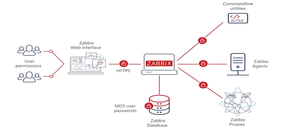

# Zabbix

[Zabbix 7.0 Manual](https://www.zabbix.com/documentation/7.0/en/manual)

## Zabbix 监控系统原理介绍

Zabbix 是一个基于 Web 界面的企业级开源监控解决方案，它能监控各种网络参数，保证服务器系统的安全运营；并提供灵活的通知机制以让系统管理员快速定位并解决存在的问题。

Zabbix 在服务器和网络设备监控方向深耕多年，其用户产品体验和社区生态都非常完善，是目前国内外企业 IT 运维团队的首选监控工具之一。由于 Zabbix 的设计是资产管理式的设计，所以无法应对 Kubernetes 这种动态环境的监控，但是在传统的服务器、网络设备、数据库等监控方向，Zabbix 仍然是一个非常好的选择。

Zabbix 的架构通常包括以下组件：

- Zabbix Server：核心组件，负责数据接收、处理和存储。它从代理和直接监控的设备收集数据，并执行报警逻辑。
- Zabbix Agent：安装在被监控主机上的代理，负责收集主机的性能和状态数据，并将其发送到 Zabbix Server。
- 数据库：用于存储 Zabbix 收集到的所有监控数据、配置和报警信息。支持 MySQL、PostgreSQL、SQLite 等数据库。
- Web 界面：用于用户与 Zabbix 服务器交互的界面，用户可以通过它查看监控数据、配置监控项和设置告警。
- Zabbix Proxy：可选组件，通常用于分布式监控。它可以在网络边缘收集数据，然后将数据发送到 Zabbix Server，适合大规模和复杂环境。

Zabbix工作原理

Agentd安装在被监控的主机上，Agent负责定期收集客户端本地各项数据，并发送至Zabbix Server端，Zabbix Server收到数据，将数据存储到数据库中，用户基于Zabbix WEB可以看到数据在前端展现图像。当Zabbix监控某个具体的项目，改项目会设置一个触发器阈值，当被监控的指标超过该触发器设定的阈值，会进行一些必要的动作，动作包括：发送信息（邮件、微信、短信）、发送命令（SHELL 命令、Reboot、Restart、Install等）。

## Zabbix 监控数据采集

Zabbix 支持多种数据收集方式，包括：

- PUSH：Zabbix Agent 主动向 Zabbix Server 发送数据。
- PULL：Zabbix Server 主动请求 Zabbix Agent 提供数据。
- 无代理监控：Zabbix 可以通过 SNMP、IPMI、JMX 等协议直接从设备收集数据，无需安装代理。本质可以看到是一种 PULL 方式。

监控领域，关于数据采集有两种典型方式，一个是 PULL，一个是 PUSH。

- PUSH：Agent 主动推送数据到 Server，Server 被动接收数据。对网络 ACL 友好，很多公司会有一些特殊的的网络隔离区，这些隔离区可以调用外部的服务，但是外部的服务无法调用隔离区的服务，这种情况下，PUSH 的方式就比较适合。
- PULL：Server 主动拉取 Agent 的数据。在一些调试的场景下，由于操作是同步完成的体验更好。PULL 的方式需要知道 Agent 的 IP 地址，Zabbix 可以采用这种方式，是因为 Zabbix 面向的场景相对老一些，主要是面向固定的服务器、网络设备，但是如果是面向 Kubernetes 这种动态环境，PULL 的方式就不太适合了。

## Zabbix Server

Zabbix Server 是 Zabbix 监控系统最核心的组件，负责数据的接收、处理、存储和管理。它在整个 Zabbix 监控架构中发挥着至关重要的作用。以下是对 Zabbix Server 的详细介绍：

- 数据接收：Zabbix Server 从 Zabbix Agent、Zabbix Proxy 和直接监控的设备（如 SNMP 设备）接收监控数据。
- 数据存储：将收集到的数据存储在关系型数据库中（如 MySQL、PostgreSQL、SQLite 等），便于后续查询和分析。
- 数据处理：根据定义的监控项和触发器，对收集的数据进行处理，如计算趋势、生成告警等。
- 告警管理：根据触发器的条件生成告警，并通过配置的通知方式（如电子邮件、短信、Webhook 等）发送给相关人员。

即：Zabbix Server 负责几乎所有核心逻辑，页面上的配置是通过 PHP 的 WEB 写入 DB，然后 Zabbix Server 读取 DB，然后执行监控逻辑。如果是通过 JMX、SNMP 等方式，Zabbix Server 自己就搞定了，如果要采集目标机器的 CPU、内存等指标，则需要 Zabbix agent 配合。

## Zabbix Agent

Zabbix agent 核心作用就是采集数据，然后发送给 Zabbix Server。但是 Zabbix agent 不可能所有数据，所以 Zabbix agent 支持扩展机制，扩展机制就是一堆脚本，整体感觉，不如 Prometheus 的 exporter 机制更加规整和灵活。

Zabbix agent 有两个版本，一个是 Zabbix agent，一个是 Zabbix agent 2。Zabbix agent 2 是一个全新的 agent，agent 2 主要采用 Go 语言编写，老的 agent 是 C 编写，老的 agent 相对来讲更稳定，但是未来主力要发展的应该还是 agent 2。

## Zabbix Proxy

Zabbix Proxy 不是必须的，不过在一些场景下有其重要性，Zabbix Proxy 主要解决如下问题场景：

1. 分布式监控 地理分布：在大型企业或多地点的环境中，Zabbix Proxy 可以部署在各个地理位置，收集本地的监控数据并将其发送到 Zabbix Server。这种方式减少了跨网络的延迟，提高了数据收集的效率。

2. 网络带宽管理 减少带宽占用：通过在本地收集数据并缓冲，Zabbix Proxy 可以减少对 Zabbix Server 的直接网络请求，减少带宽使用。它可以定期将收集的数据批量发送到 Zabbix Server，而不是实时发送。

3. 安全性 防火墙和NAT：在某些情况下，Zabbix Agent 可能无法直接与 Zabbix Server 进行通信（例如，出于安全原因被防火墙阻止或在 NAT 后面）。Zabbix Proxy 可以在允许的网络环境中运行，作为中介，收集数据并安全地将其转发到 Zabbix Server。

4. 故障容错 数据缓冲：如果 Zabbix Server 临时不可用，Zabbix Proxy 可以在本地缓存数据，待服务器恢复后再发送。这确保了数据不会因为服务器的短暂故障而丢失。

5. 监控负载分担 降低 Zabbix Server 负载：通过将监控数据的收集和预处理分散到多个 Zabbix Proxy，Zabbix Server 的负载可以显著降低。这对于高密度监控环境尤其重要，能提升整体性能。

## Zabbix 数据存储

Zabbix 作为一款监控系统，主要有两类数据要存，一类是配置类数据，使用 RDBMS 存储，另一类是监控时序数据，还是使用 RDBMS 存储。时序数据通常量很大，使用 RDBMS 并不太合适，新的社区方案，一般都是通过专门的时序库来存储时序数据。

不过后来 Zabbix 可以使用 TimeScaleDB 存储时序数据，但是 TimeScaleDB 还是构建在 PG 之上的，比 VictoriaMetrics 之类的还是差点意思。所以很多 Zabbix 的用户，一般采集频率都设置的相对大一些，比如 1m 采集一次，而 Prometheus 生态一般是 15s 采集一次。

## 总结

Zabbix 是一个功能强大的监控系统，具有丰富的功能和灵活的配置选项，适用于各种规模的 IT 环境。通过 Zabbix，用户可以监控服务器、网络设备、数据库、应用程序等各种资源，并实时了解其性能和状态。同时，Zabbix 还提供了强大的告警功能，可以帮助用户及时发现和解决问题，确保系统的稳定运行。
