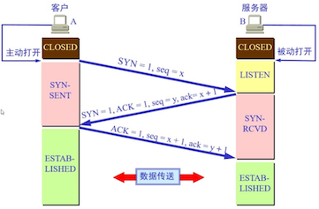
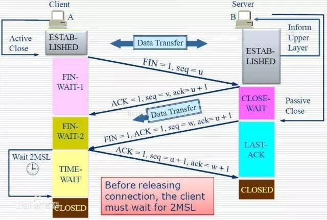

# TCP/IP Notes

[The TCP/IP Guide](http://www.tcpipguide.com/free/index.htm)

## 三次握手



1. 由客户端向服务器端发起TCP连接请求。Client发送：同步序列编号SYN置为1，发送序号Seq为一个随机数，这里假设为X，确认序号ACK置为0；
2. 服务器端接收到连接请求。Server响应：同步序列编号SYN置为1，并将确认序号ACK置为X+1，然后生成一个随机数Y作为发送序号Seq（因为所确认的数据报的确认序号未初始化）；
3. 客户端对接收到的确认进行确认。Client发送：将确认序号ACK置为Y+1，然后将发送序号Seq置为X+1（即为接收到的数据报的确认序号）；

三次握手的本质是确认通信双方**收发**数据的能力

1. Server 确认 Client 的发送能力和 Server 的接收能力
2. Client 确认 Client 和 Server 的收发能力都可以
3. Server 确认 Client 的接收能力和 Server 的发送能力

为什么是三次握手而不是两次？对于step3的作用，假设一种情况，客户端A向服务器B发送一个连接请求数据报，然后这个数据报在网络中滞留导致其迟到了，虽然迟到了，但是服务器仍然会接收并发回一个确认数据报。但是A却因为久久收不到B的确认而将发送的请求连接置为失效，等到一段时间后，接到B发送过来的确认，A认为自己现在没有发送连接，而B却一直以为连接成功了，于是一直在等待A的动作，而A将不会有任何的动作了。这会导致服务器资源白白浪费掉了，因此，两次握手是不行的，因此需要再加上一次，对B发过来的确认再进行一次确认，即确认这次连接是有效的，从而建立连接。

对于双方，发送序号的初始化为何值有的系统中是显式的初始化序号是0，但是这种已知的初始化值是非常危险的，因为这会使得一些黑客钻漏洞，发送一些数据报来破坏连接。因此，初始化序号因为取随机数会更好一些，并且是越随机越安全。

## 四次挥手

为什么断开链接需要四次？

因为 TCP 是全双工，需要双方都明确的停止发送数据。



1. 主机A向主机B发起断开连接请求，之后主机A进入FIN-WAIT-1状态；
2. 主机B收到主机A的请求后，向主机A发回确认，然后进入CLOSE-WAIT状态；
3. 主机A收到B的确认之后，进入FIN-WAIT-2状态，此时便是半关闭状态，即主机A失去发送能力，但是主机B却还能向A发送数据，并且A可以接收数据。此时主机B占主导位置了，如果需要继续关闭则需要主机B来操作了；
4. 主机B向A发出断开连接请求，然后进入LAST-ACK状态；
5. 主机A接收到请求后发送确认，进入TIME-WAIT状态，等待2MSL之后进入CLOSED状态，而主机B则在接受到确认后进入CLOSED状态；

为何主机A在发送了最后的确认后没有进入CLOSED状态，反而进入了一个等待2MSL的TIME-WAIT主要作用有两个：

1. 确保主机A最后发送的确认能够到达主机B。如果处于LAST-ACK状态的主机B一直收不到来自主机A的确认，它会重传断开连接请求，然后主机A就可以有足够的时间去再次发送确认。但是这也只能尽最大力量来确保能够正常断开，如果主机A的确认总是在网络中滞留失效，从而超过了2MSL，最后也无法正常断开；
2. 如果主机A在发送了确认之后立即进入CLOSED状态。假设之后主机A再次向主机B发送一条连接请求(Q: 只能建立这一条 TCP 连接?)，而这条连接请求比之前的确认报文更早地到达主机B，则会使得主机B以为这条连接请求是在旧的连接中A发出的报文，并不看成是一条新的连接请求了，即使得这个连接请求失效了，增加2MSL的时间可以使得这个失效的连接请求报文作废，这样才不影响下次新的连接请求中出现失效的连接请求。

为什么断开连接请求报文只有三个，而不是四个因为在TCP连接过程中，确认的发送有一个延时（即经受延时的确认），一端在发送确认的时候将等待一段时间，如果自己在这段事件内也有数据要发送，就跟确认一起发送，如果没有，则确认单独发送。而我们的抓包实验中，由服务器端先断开连接，之后客户端在确认的延迟时间内，也有请求断开连接需要发送，于是就与上次确认一起发送，因此就只有三个数据报了

### TIME_WAIT 主动关闭 & CLOSE_WAIT 被动关闭

`ss -s` or `netstat -an|awk '/tcp/ {print $6}'|sort|uniq -c`

or `netstat -n | awk '/^tcp/ {++S[$NF]} END {for(a in S) print a, S[a]}'`

常用的三个状态是：ESTABLISHED 表示正在通信，TIME_WAIT 表示主动关闭，CLOSE_WAIT 表示被动关闭

[再叙TIME_WAIT](http://huoding.com/2013/12/31/316)

服务器保持了大量TIME_WAIT状态(主动关闭, 基准数値是多少?)

表示请求的客户端主动关闭socket而形成的状态。等待2MSL时间，约4分钟。主要是防止最后一个ACK丢失。由于TIME_WAIT的时间会非常长，因此服务端应尽量减少主动关闭连接。
HTTP关闭连接的不是客户端，而是服务器，所以web服务器也是会出现大量的TIME_WAIT的情况的

解决思路: 让服务器快速回收和重用那些TIME_WAIT的资源, 对/etc/sysctl.conf文件进行修改, 改完之后执行`/sbin/sysctl -p`让参数生效

服务器保持了大量CLOSE_WAIT状态(被动关闭, 基准数値是多少?)

如果一直保持在CLOSE_WAIT状态，表示服务端被动关闭socket。说明在客户端关闭连接之后服务器程序自己没有进一步发出ack信号。换句话说，就是在客户端连接关闭之后，程序没有关闭连接，这个资源就一直被程序占着。

解决思路: 检查代码是否没有关闭连接. 比如HttpClient未释放连接

### TCP连接状态

```bash
# netstat -an|awk '/tcp/ {print $6}'|sort|uniq -c` or `ss -s
     16 CLOSING
    130 ESTABLISHED
    298 FIN_WAIT1
     13 FIN_WAIT2
      9 LAST_ACK
      7 LISTEN
    103 SYN_RECV
   5204 TIME_WAIT
```

状态：描述

* CLOSED：无连接是活动的或正在进行
* LISTEN：服务器在等待进入呼叫
* SYN_RECV：一个连接请求已经到达，等待确认
* SYN_SENT：应用已经开始，打开一个连接
* ESTABLISHED：正常数据传输状态
* FIN_WAIT1：应用说它已经完成
* FIN_WAIT2：另一边已同意释放
* ITMED_WAIT：等待所有分组死掉
* CLOSING：两边同时尝试关闭
* TIME_WAIT：另一边已初始化一个释放
* LAST_ACK：等待所有分组死掉

## 参考

[聊聊 tcpdump 与 Wireshark 抓包分析 - 简书](https://www.jianshu.com/p/8d9accf1d2f1)
