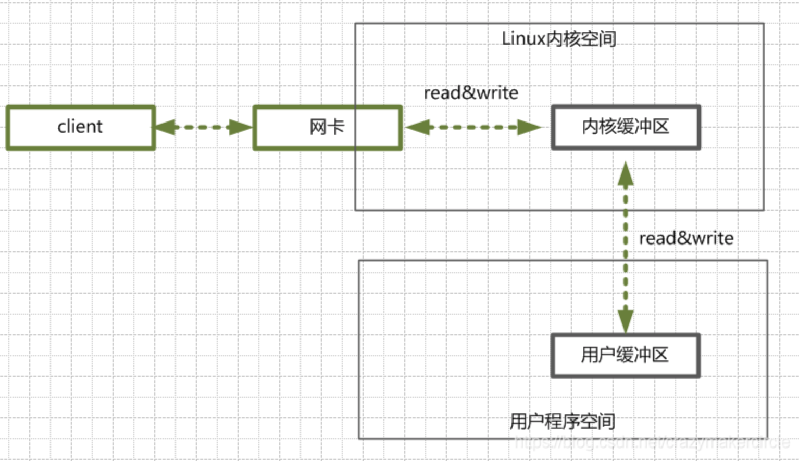
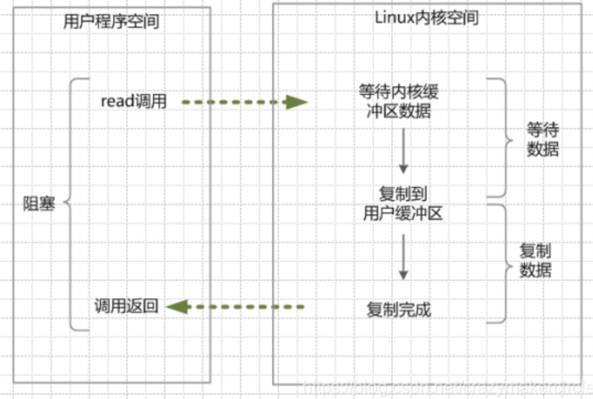
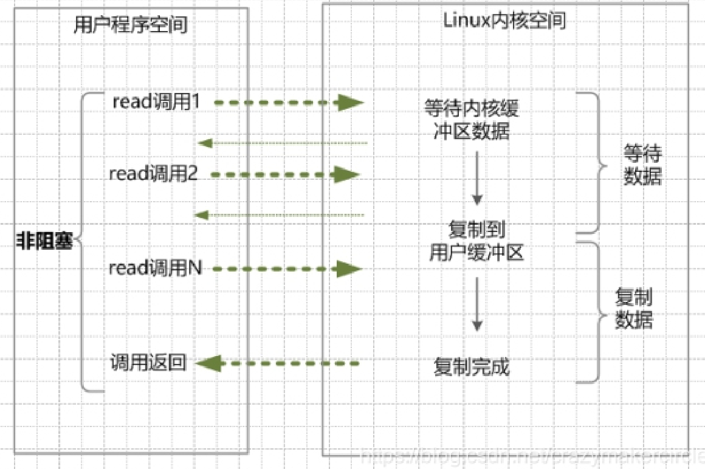
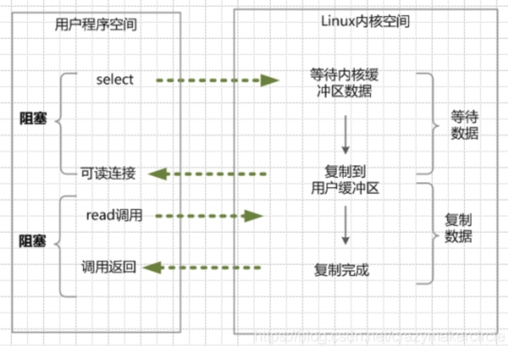
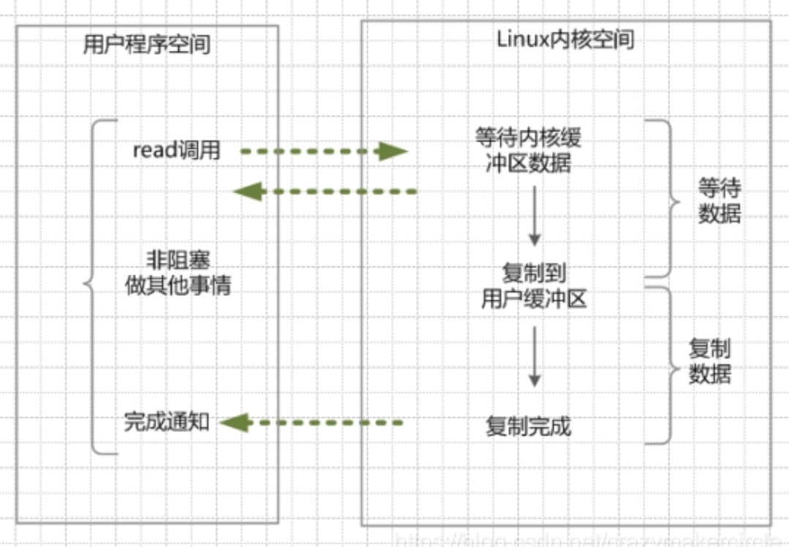

# I/O

[10 分钟看懂 NIO 底层原理](https://www.cnblogs.com/crazymakercircle/p/10225159.html)

## Java IO读写原理

用户程序进行IO的读写，基本上会用到read&write两大系统调用。可能不同操作系统，名称不完全一样，但是功能是一样的。

先强调一个基础知识：read系统调用，并不是把数据直接从物理设备，读数据到内存。write系统调用，也不是直接把数据，写入到物理设备。

read系统调用，是把数据从内核缓冲区复制到进程缓冲区；而write系统调用，是把数据从进程缓冲区复制到内核缓冲区。这个两个系统调用，都不负责数据在内核缓冲区和磁盘之间的交换。底层的读写交换，是由操作系统kernel内核完成的。

### 内核缓冲与进程缓冲区

缓冲区的目的，是为了减少频繁的系统IO调用。系统调用需要保存之前的进程数据和状态等信息，而结束调用之后回来还需要恢复之前的信息，为了减少这种损耗时间、也损耗性能的系统调用，于是出现了缓冲区。

有了缓冲区，操作系统使用read函数把数据从内核缓冲区复制到进程缓冲区，write把数据从进程缓冲区复制到内核缓冲区中。等待缓冲区达到一定数量的时候，再进行IO的调用，提升性能。至于什么时候读取和存储则由内核来决定，用户程序不需要关心。

在linux系统中，系统内核也有个缓冲区叫做内核缓冲区。每个进程有自己独立的缓冲区，叫做进程缓冲区。

所以，用户程序的IO读写程序，大多数情况下，并没有进行实际的IO操作，而是在读写自己的进程缓冲区。

### java IO读写的底层流程

1. 客户端请求
    Linux通过网卡，读取客户断的请求数据，将数据读取到内核缓冲区。
2. 获取请求数据
    服务器从内核缓冲区读取数据到Java进程缓冲区。

服务端：

1. 服务器端业务处理
    Java服务端在自己的用户空间中，处理客户端的请求。
2. 服务器端返回数据
    Java服务端已构建好的响应，从用户缓冲区写入系统缓冲区。
3. 发送给客户端
    Linux内核通过网络 I/O ，将内核缓冲区中的数据，写入网卡，网卡通过底层的通讯协议，会将数据发送给目标客户端。

## 四种主要的IO模型

常见的IO模型有四种：

1. 同步阻塞IO（Blocking IO）

    首先，解释一下这里的**阻塞与非阻塞**：

    * 阻塞IO，指的是需要内核IO操作彻底完成后，才返回到用户空间，执行用户的操作。阻塞指的是用户空间程序的执行状态，用户空间程序需等到IO操作彻底完成。传统的IO模型都是同步阻塞IO。在java中，默认创建的socket都是阻塞的。

    其次，解释一下**同步与异步**：
    * 同步IO，是一种用户空间与内核空间的调用发起方式。同步IO是指用户空间线程是主动发起IO请求的一方，内核空间是被动接受方。异步IO则反过来，是指内核kernel是主动发起IO请求的一方，用户线程是被动接受方。

2. 同步非阻塞IO（Non-blocking IO）
    非阻塞IO，指的是用户程序不需要等待内核IO操作完成后，内核立即返回给用户一个状态值，用户空间无需等到内核的IO操作彻底完成，可以立即返回用户空间，执行用户的操作，处于非阻塞的状态。
    简单的说：阻塞是指用户空间（调用线程）一直在等待，而且别的事情什么都不做；非阻塞是指用户空间（调用线程）拿到状态就返回，IO操作可以干就干，不可以干，就去干别的事情。
    非阻塞IO要求socket被设置为NONBLOCK。

    强调一下，这里所说的NIO（同步非阻塞IO）模型，并非Java的NIO（New IO）库。

3. IO多路复用（IO Multiplexing）
    即经典的Reactor设计模式，有时也称为异步阻塞IO，Java中的Selector和Linux中的epoll都是这种模型。

4. 异步IO（Asynchronous IO）
    异步IO，指的是用户空间与内核空间的调用方式反过来。用户空间线程是变成被动接受的，内核空间是主动调用者。

    这一点，有点类似于Java中比较典型的模式是回调模式，用户空间线程向内核空间注册各种IO事件的回调函数，由内核去主动调用。

## 同步阻塞IO（Blocking IO）

发起一个blocking socket的read读操作系统调用，流程大概是这样：

1. 当用户线程调用了read系统调用，内核（kernel）就开始了IO的第一个阶段：准备数据。很多时候，数据在一开始还没有到达（比如，还没有收到一个完整的Socket数据包），这个时候kernel就要等待足够的数据到来。
2. 当kernel一直等到数据准备好了，它就会将数据从kernel内核缓冲区，拷贝到用户缓冲区（用户内存），然后kernel返回结果。
3. 从开始IO读的read系统调用开始，用户线程就进入阻塞状态。一直到kernel返回结果后，用户线程才解除block的状态，重新运行起来。

所以，blocking IO的特点就是在内核进行IO执行的两个阶段，用户线程都被block了。

### BIO的优点

程序简单，在阻塞等待数据期间，用户线程挂起。用户线程基本不会占用 CPU 资源。

### BIO的缺点

一般情况下，会为每个连接配套一条独立的线程，或者说一条线程维护一个连接成功的IO流的读写。在并发量小的情况下，这个没有什么问题。但是，当在高并发的场景下，需要大量的线程来维护大量的网络连接，内存、线程切换开销会非常巨大。因此，基本上，BIO模型在高并发场景下是不可用的。

## 同步非阻塞NIO（None Blocking IO）

在linux系统下，可以通过设置socket使其变为non-blocking。NIO 模型中应用程序在一旦开始IO系统调用，会出现以下两种情况：

1. 在内核缓冲区没有数据的情况下，系统调用会立即返回，返回一个调用失败的信息。
2. 在内核缓冲区有数据的情况下，是阻塞的，直到数据从内核缓冲复制到用户进程缓冲。复制完成后，系统调用返回成功，应用进程开始处理用户空间的缓存数据。

举个栗子。发起一个non-blocking socket的read读操作系统调用，流程是这个样子：

1. 在内核数据没有准备好的阶段，用户线程发起IO请求时，立即返回。用户线程需要不断地发起IO系统调用。
2. 内核数据到达后，用户线程发起系统调用，用户线程阻塞。内核开始复制数据。它就会将数据从kernel内核缓冲区，拷贝到用户缓冲区（用户内存），然后kernel返回结果。
3. 用户线程才解除block的状态，重新运行起来。经过多次的尝试，用户线程终于真正读取到数据，继续执行。

### NIO的特点

应用程序的线程需要不断的进行 I/O 系统调用，轮询数据是否已经准备好，如果没有准备好，继续轮询，直到完成系统调用为止。

### NIO的优点

每次发起的 IO 系统调用，在内核的等待数据过程中可以立即返回。用户线程不会阻塞，实时性较好。

### NIO的缺点

需要不断的重复发起IO系统调用，这种不断的轮询，将会不断地询问内核，这将占用大量的 CPU 时间，系统资源利用率较低。

总之，NIO模型在高并发场景下，也是不可用的。一般 Web 服务器不使用这种 IO 模型。一般很少直接使用这种模型，而是在其他IO模型中使用非阻塞IO这一特性。java的实际开发中，也不会涉及这种IO模型。

再次说明，Java NIO（New IO） 不是IO模型中的NIO模型，而是另外的一种模型，叫做IO多路复用模型（ IO multiplexing ）。

## IO多路复用模型(I/O multiplexing）

如何避免同步非阻塞NIO模型中轮询等待的问题呢？这就是IO多路复用模型。

IO多路复用模型，就是通过一种新的系统调用，一个进程可以监视多个文件描述符，一旦某个描述符就绪（一般是内核缓冲区可读/可写），内核kernel能够通知程序进行相应的IO系统调用。

目前支持IO多路复用的系统调用，有 select，epoll等等。select系统调用，是目前几乎在所有的操作系统上都有支持，具有良好跨平台特性。epoll是在linux 2.6内核中提出的，是select系统调用的linux增强版本。

IO多路复用模型的基本原理就是select/epoll系统调用，单个线程不断的轮询select/epoll系统调用所负责的成百上千的socket连接，当某个或者某些socket网络连接有数据到达了，就返回这些可以读写的连接。因此，好处也就显而易见了——通过一次select/epoll系统调用，就查询到到可以读写的一个甚至是成百上千的网络连接。

举个栗子。发起一个多路复用IO的的read读操作系统调用，流程是这个样子：

在这种模式中，首先不是进行read系统调动，而是进行select/epoll系统调用。当然，这里有一个前提，需要将目标网络连接，提前注册到select/epoll的可查询socket列表中。然后，才可以开启整个的IO多路复用模型的读流程。

1. 进行select/epoll系统调用，查询可以读的连接。kernel会查询所有select的可查询socket列表，当任何一个socket中的数据准备好了，select就会返回。
当用户进程调用了select，那么整个线程会被block（阻塞掉）。
2. 用户线程获得了目标连接后，发起read系统调用，用户线程阻塞。内核开始复制数据。它就会将数据从kernel内核缓冲区，拷贝到用户缓冲区（用户内存），然后kernel返回结果。
3. 用户线程才解除block的状态，用户线程终于真正读取到数据，继续执行。

### 多路复用IO的特点

IO多路复用模型，建立在操作系统kernel内核能够提供的多路分离系统调用select/epoll基础之上的。多路复用IO需要用到两个系统调用（system call）， 一个select/epoll查询调用，一个是IO的读取调用。
和NIO模型相似，多路复用IO需要轮询。负责select/epoll查询调用的线程，需要不断的进行select/epoll轮询，查找出可以进行IO操作的连接。
另外，多路复用IO模型与前面的NIO模型，是有关系的。对于每一个可以查询的socket，一般都设置成为non-blocking模型。只是这一点，对于用户程序是透明的（不感知）。

### 多路复用IO的优点

用select/epoll的优势在于，它可以同时处理成千上万个连接（connection）。与一条线程维护一个连接相比，I/O多路复用技术的最大优势是：系统不必创建线程，也不必维护这些线程，从而大大减小了系统的开销。

Java的NIO（new IO）技术，使用的就是IO多路复用模型。在linux系统上，使用的是epoll系统调用。

### 多路复用IO的缺点

本质上，select/epoll系统调用，属于同步IO，也是阻塞IO。都需要在读写事件就绪后，自己负责进行读写，也就是说这个读写过程是阻塞的。
如何充分的解除线程的阻塞呢？那就是异步IO模型。

## 异步IO模型（asynchronous IO）

如何进一步提升效率，解除最后一点阻塞呢？这就是异步IO模型，全称asynchronous I/O，简称为AIO。

AIO的基本流程是：用户线程通过系统调用，告知kernel内核启动某个IO操作，用户线程返回。kernel内核在整个IO操作（包括数据准备、数据复制）完成后，通知用户程序，用户执行后续的业务操作。

kernel的数据准备是将数据从网络物理设备（网卡）读取到内核缓冲区；kernel的数据复制是将数据从内核缓冲区拷贝到用户程序空间的缓冲区。

1. 当用户线程调用了read系统调用，立刻就可以开始去做其它的事，用户线程不阻塞。
2. 内核（kernel）就开始了IO的第一个阶段：准备数据。当kernel一直等到数据准备好了，它就会将数据从kernel内核缓冲区，拷贝到用户缓冲区（用户内存）。
3. kernel会给用户线程发送一个信号（signal），或者回调用户线程注册的回调接口，告诉用户线程read操作完成了。
4. 用户线程读取用户缓冲区的数据，完成后续的业务操作。

### 异步IO模型的特点

在内核kernel的等待数据和复制数据的两个阶段，用户线程都不是block(阻塞)的。用户线程需要接受kernel的IO操作完成的事件，或者说注册IO操作完成的回调函数，到操作系统的内核。所以说，异步IO有的时候，也叫做信号驱动 IO 。

### 异步IO模型缺点

需要完成事件的注册与传递，这里边需要底层操作系统提供大量的支持，去做大量的工作。

目前来说， Windows 系统下通过 IOCP 实现了真正的异步 I/O。但是，就目前的业界形式来说，Windows 系统，很少作为百万级以上或者说高并发应用的服务器操作系统来使用。

而在 Linux 系统下，异步IO模型在2.6版本才引入，目前并不完善。所以，这也是在 Linux 下，实现高并发网络编程时都是以 IO 复用模型模式为主。

### 小结一下

四种IO模型，理论上越往后，阻塞越少，效率也是最优。在这四种 I/O 模型中，前三种属于同步 I/O，因为其中真正的 I/O 操作将阻塞线程。只有最后一种，才是真正的异步 I/O 模型，可惜目前Linux 操作系统尚欠完善。
