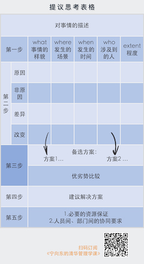
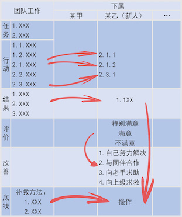

# 宁向东的管理学课

列表替换 (\d)\.\n 替换为 $1.

## 总目录

01 | 导论(6讲)
我们每个人都困在一个“局”里，管理学的目标，就是让你突破自我，破局而出。
02 | 人与行为(25讲)
首先建立“尊重人性”的管理文化，才有资格谈管理。
03 | 领导力(24讲)
企业环境的变化使得领导力不再是领导的专属，它是每个人都必备的能力。
04 | 团队(25讲)
领导者要学会依靠骨干来带领团队，驱动团队做事情。
05 | 指导下属(18讲)
聪明的领导者用自己的行为影响下属的行为，带好队伍。
06 | 组织(18讲)
领导与团队构成了组织，好的组织架构会平衡专业化和协同的矛盾。
07 | 文化与沟通(25讲)
看组织文化，要看员工的心、企业的智、老板的行，它们成为组织的推进器。
08 | 客户(25讲)
前面讲了管理学中的“人”，讲了职场，后面的内容讲“竞争”，讲商场，客户是这两者的接触点，承前启后。
09 | 竞争战略(24讲)
商场竞争，你需要一种叫做“insight”的东西，在里面把全局看明白。
10 | 计划与变化(24讲)
有了战略，你还需要计划，把愿景转化为每一天的具体行动。
11 | 运作(16讲)
如何让你的每一步行动，都始终朝向目标前进。
12 | 业绩(18讲)
所有管理工作最后的目的，就是达到理想的业绩目标。业绩是课程的“课眼”，如果你希望“倒序学习”，可以从这里开始。
13 | 激励(24讲)
管理的闭环，还需要了解人类的动机，对症下药，激发潜能。
14 | 控制(18讲)
管理的闭环可能只是假象，你需要不断防止失控，拒绝僵化。
15 | 转型变革(25讲)

### 章节目录

#### 01 | 导论(6讲)

我们每个人都困在一个“局”里，管理学的目标，就是让你突破自我，破局而出。
001讲：管理学｜破局而出的智慧
002讲：资源关系｜到底什么是“局”
003讲：科学管理｜伟大的效率破局
004讲：识别机会窗口｜借势破局
005讲：涟漪效应｜破不了的局
问答｜领导接到告状信该怎么处理？

#### 02 | 人与行为(25讲)

首先建立“尊重人性”的管理文化，才有资格谈管理。
006讲：人际关系理论｜你真的知道推搡员工的后果吗？
007讲：认知不协调｜改变他人态度的秘诀
008讲：阈下意识｜识别商场上的圈套
009讲：冲动基因｜为什么会有人选择冒险
010讲：理性注入｜从根本上管理慌张
问答｜打开人性与行为机制的黑箱
011讲：MBTI测试｜认识自己是一切管理的前提
012讲：人格特质｜你有却不自知的优势
013讲：达克效应｜自视甚高与倾家荡产
014讲：情绪｜第一生产力
015讲：认知能量｜减少心力的流失
问答｜诚惶诚恐，保持敬畏
016讲：状态自尊｜管理他人的切入点
017讲：愿望与能力｜了解他人的两条线索
018讲：双因素理论｜如何管理80后、90后
019讲：窄化效应｜离职率居高不下的原因
020讲：经验分享｜哈佛课间三十分钟
问答｜书读百遍，其义自见
021讲：格局修炼｜当骨干前来辞职
022讲：互惠合作｜离职员工的关系网
023讲：公平感｜领导者的内功
024讲：管理基准｜幸福感？进取心？
025讲：导论2.0｜一键了解模块核心知识，跟上不掉队
荐文：“人”思维的优越性到底体现在哪？
加餐：打开黑箱 | 关于行为学的知识清单

#### 03 | 领导力(24讲)
企业环境的变化使得领导力不再是领导的专属，它是每个人都必备的能力。
026讲：权力基础｜有了权力不一定有领导力
027讲：超越岗位｜深耕领导力的途径
028讲：领导特质｜凭什么你来当“头”
029讲：领导力修炼｜演一百遍，演的就是你
030讲：有效追随｜一个提高影响力的极简工具
复盘｜再看管理者、领导者、追随者
031讲：硬权力领导｜当重大机遇降临时
032讲：能力型领导｜防止被推下山崖
033讲：情感型领导｜选亲还是选贤
034讲：团队型领导｜从阿里的老师说起
035讲：战略型领导｜致敬早年的乔布斯
复盘｜领导模式的优劣
036讲：权变理论 | 学做领导的极简指南
037讲：领导模式实现 | 三步走
038讲：创业领导力 | 你快乐，别人就会帮你
039讲：女性领导力 | 身段柔软的力量
040讲：中层领导力 | “画圆”的艺术
复盘 | 读书有时就像破案
041讲：领导争锋 | 为什么合伙制不长久
042讲：领导权配置 | 一个人说了算好不好？
043讲：谋划力 | 真正的舞台在后面
044讲：备份领导力 | 内部的外部人
045讲：模块复盘 | 一键系统打造领导力
荐文 | 哈佛的两个老物件

#### 04 | 团队(25讲)

领导者要学会依靠骨干来带领团队，驱动团队做事情。
046讲：任务、锦标 | 我们为什么需要团队？
047讲：团队成员 | 三种人绝对不能要
048讲：团队结构 | “猪队友”的思维方式
049讲：协同力量 | 建设团队的极简工具
加餐 | 人人都该掌握的管理学思维
050讲：工作特性 | 把员工看作资产
复盘 | 组建有效团队的逻辑
051讲：组织承诺 | 四种共同体
052讲：团队默契 | 心相通的办法
053讲：团队沟通 | 交互记忆与世界咖啡馆
054讲：关注结果 | 团队的任务是共赢
055讲：团队边界 | 兼顾“双重角色”
复盘 | 把团队成员还原成生活中的普通人
056讲：信任短缺 | 团队协作的杀手
057讲：冲突识别 | 研判情势最重要
058讲：冲突管理 | 一个实用的极简模型
059讲：建设性冲突 | 人人都用得上的管理工具
060讲：搭便车 | 团队建设的大难事
复盘 | 别让冲突由“建设”变“失能”
061讲：公司政治 | 争夺资源控制权
062讲：派系的逻辑 | 斗争与制衡
063讲：晋升通道 | 良禽择木“爬梯”
064讲：道德领导 | 正大光明的力量
065讲：模块复盘 | 快速了解团队核心知识点
最基础的管理工具

#### 05 | 指导下属(18讲)

聪明的领导者用自己的行为影响下属的行为，带好队伍。
066讲：下属力第一步 | 领导？行业？选什么？怎么选？
067讲：超预期供应 | 好下属行胜于言
068讲：学习力 | 发展前途的分水岭
069讲：业绩导向 | 让自己立住的数字指标
070讲：交出结果 | 给人打工请做好这四步
下属力重要知识点复盘
071讲：训练下属 | 从提议管理开始
072讲：专有信息 | 什么岗位最利于你发展
073讲：有效授权 | 从放手到放心
074讲：LMX理论 | 领导的人际交换奥秘
075讲：另类关系 | 上下级恋情可行么？
复盘 | 开掉员工的正确方法
076讲：影响行为 | 给脸色的领导最没用
077讲：前馈管理 | 让下属听懂你的话
078讲：同理心 | 最重要的指导术
079讲：批评下属 | 如何带人，不伤人
080讲：模块复盘 | 下属是最值钱的投资
复盘 | 学习就像打江山

#### 06 | 组织(18讲)

领导与团队构成了组织，好的组织架构会平衡专业化和协同的矛盾。
081讲：组织的细胞 | 什么是好工作
082讲：组织类型 | 为什么销售不嫌事大
083讲：矩阵组织 | 一仆二主，对谁负责
084讲：管理幅度 | 一个人能管几个人
085讲：组织互赖 | 怎么看组织的水平
复盘 | 组织的基本逻辑
086讲：组织有效性 | 好组织是什么样的？
087讲：组织演化 | 百年老店，道道难关
088讲：组织能力 | 对手就是学不会
089讲：组织边界 | 文化也在起作用
090讲：组织变革 | 做企业就是不归路
复盘 | “多一点”的学问
091讲：流程再造 | 跌落神坛的好理论
092讲：功能聚合 | 看看你的办公室合理么？
093讲：资源聚合 | 挖人都不用搬家
094讲：网络聚合 | 组织怎么就变轻了
095讲：模块总结 | 百年组织演变
荐文 | 你敢用青春赌明天么？

#### 07 | 文化与沟通(25讲)

看组织文化，要看员工的心、企业的智、老板的行，它们成为组织的推进器。
096讲：企业文化 | 员工的心、企业的智、老板的行
097讲：仆人领导力 | 感召从何而来？
098讲：关系文化 | 落地最软，也最硬
099讲：文化载体 | 让公司里充满故事
加餐：如何学习我们的专栏
100讲：文化困境 | 企业还可以这样死
企业文化复盘 | 学会苦心孤诣
101讲：人际沟通 | 有效交流的逻辑
102讲：沟通设计 | 交流需考虑的四要素
103讲：乔哈里窗 | 好东西和谁分享？
104讲：有效沟通 | 记住五个词
105讲：沟通技术 | 如何确定讲话姿态
有效沟通的18条清单
106讲：谈判的本质 | 究竟谈什么
107讲：谈判核心 | 你其实并不重要
108讲：谈判技巧 | 讲感情，不讲理性
109讲：人性谈判 | 一手烂牌，不要放弃
110讲：强硬策略 | 谈判斗狠的十招
高效谈判的清单 | 复盘
111讲：会议设计 | 有些会议，注定失败
112讲：会议主持 | 出人头地的试金石
113讲：会议发言 | 四维讲话技术
114讲：虚拟会议 | 目标10倍速
115讲：会议改善 | 给你三个榜样
复盘 | 高效会议的八原则

#### 08 | 客户(25讲)

前面讲了管理学中的“人”，讲了职场，后面的内容讲“竞争”，讲商场，客户是这两者的接触点，承前启后。
116讲：购买动机 | 怎样融入客户
117讲：关键要素 | 商业的核心法则
118讲：客制化 | 商业世界发展的前方
119讲：数字驱动 | 新零售中的新职业
120讲：购后管理 | 忠诚度从何而来
复盘 | 理解客户的八个要点
121讲：客户接触点 | 未来的店长很吃香
122讲：客户营销 | 从4P到4C
123讲：客户分类 | 有效激活的前提
124讲：客户转化 | 聪明人就会愿意尝试
125讲：客户与品牌 | 圈粉的路径
复盘 | 7条客户策略
126讲：成本 | 财务、经营的基础
127讲：成本结构 | 其实顺丰最可怕
128讲：作业成本法 | 你真的赚钱了么？
129讲：穿透成本 | 管理领域的革命
130讲：甄别管理 | 客户不都是上帝
复盘 | 关于成本的6点知识
加餐 | 揭开成本和商业的秘密
131讲：定价方法 | 星巴克凭什么那么贵
132讲：差异定价 | 各种套路的组合拳
133讲：保留价格 | 商家的花花肠子
134讲：补贴与盈利 | 为什么会免费？
135讲：模块复盘 | 下半程我们出发了！
荐文 | 学会拒绝

#### 09 | 竞争战略(24讲)

商场竞争，你需要一种叫做“insight”的东西，在里面把全局看明白。
136讲：塑造愿景 | 每个人都该想的事
137讲：战略架构 | 从麻将到SWOT分析
138讲：外部分析 | 如何抓住技术趋势
139讲：五力分析 | 威胁来自哪里
140讲：战略集团 | 如何看清对手
复盘 | 追问：管理的技术
141讲：资源能力 | 什么是你的本钱
142讲：核心能力 | 风浪后还能活下来
143讲：组织能力 | 日本制造凭什么崛起
144讲：VRIO模型 | 发现自己的本钱
145讲：再说SWOT | 一个“没用”的工具
关于客户，请问自己这些问题
146讲：差异化策略 | 马桶盖也可以不一样
147讲：蓝海战略 | 如何让你与众不同
148讲：四步帮你找到自己的蓝海创意
149讲：成本领导者 | 不是“低成本”
150讲：聚焦策略 | 房地产还是朝阳产业么？
复盘 | 为什么居家养老是蓝海产业
151讲：问题导向 | 如何得到一个好战略
152讲： 三点建议帮助你打造决断力
153讲：公司战略 | 你要不要多元化发展
154讲：核心扩张 | 追求盈利性成长
155讲：模块复盘 | 战略其实并不远
荐文 | 洋人旅粤指南

#### 10 | 计划与变化(24讲)

有了战略，你还需要计划，把愿景转化为每一天的具体行动。
156讲：七行表单 | 好计划从今天开始
157讲：三轮模型 | 企业的底层逻辑
158讲：把预算观念变成家风
159讲：经营底线 | 你要掌握的两个公式
160讲：创新者的计划 | 微软去哪了
复盘 | 没计划性就没有前途
161讲：平衡计分卡 | 学会看长远
162讲：因果关系 | 战略的沙盘推演
163讲：战略地图的标准模板
164讲：计划仪表 | 锁定每个人的行动
165讲：软性指标 | 搞定无法衡量的服务
学术立交桥 | 《执行的收益》推荐序
166讲：计划与变化 | 四步法看危机
167讲：危机分类模型 | 预警黑天鹅
168讲：蛛网逻辑 | 防止错误被放大
169讲：序贯博弈 | 如何防止连锁危机
170讲：泰山摆模型 | 如何摆脱“自欺”
复盘 | 说说你遇到的博弈
171讲：为什么分析“失败”更重要
172讲：如何分析一次失败的逻辑
173讲：我们该如何包容失败
174讲：断舍离 | 在“未来场景”建立“需要视角”
175讲：模块复盘 | 如何把未来写入你的计划书
加餐 | 博弈论基础

#### 11 | 运作(16讲)

如何让你的每一步行动，都始终朝向目标前进。
176讲：目标管理 | 为什么节日加班不是好兆头
177讲：人际目标 | 请重视那些“弱连接”
178讲：时间管理 | 如何过好一个假日
179讲：跟着电影学管理 | 《天才闪光》
180讲：跟着电影学管理 | 《穿普拉达的女魔头》
181讲：跟着电影学管理 | 《兵临城下》
182讲：跟着电影学管理 | 《反抗军》
183讲：跟着电影学管理 | 《否认》
184讲：跟着电影学管理 | 《利益风暴》
185讲：跟着电影学管理 | 《潜伏》
186讲：标杆管理 | 最实用的工具
187讲：对标核心 | 对什么？和谁对？
188讲：雷达图 | 发现差距的好工具
189讲：竞争标杆 | 万科地产之路的启示
190讲：跨行业对标 | 让你超越边界超车
复盘 | 对标管理就是边学边猜

#### 12 | 业绩(18讲)

所有管理工作最后的目的，就是达到理想的业绩目标。业绩是课程的“课眼”，如果你希望“倒序学习”，可以从这里开始。
191讲：投资回报 | 什么是业绩制定的基础
192讲：业绩分解 | 毛利与费用
193讲：四个指标看懂资产周转率
194讲：财务杠杆 | 如何评估企业风险水平
195讲：业绩反思 | 企业只有一种发展模式么？
复盘 | 如何创造业绩指标
196讲：鱼骨图 | 整合业绩体系的工具
197讲：KPI体系 | 组织身上的业绩外衣
198讲：部门业绩 | 识别公司的四种中心
199讲：目标管理 | 只知道有“SMART”还不够
200讲：业绩性质 | 谁的工作卓尔不群
复盘 | 每天用功的你，请不要焦虑
201讲：业绩规划 | 基层管理者摆人头的方法
202讲：评估公平 | 四种隐藏的心理偏见
203讲：评估担责 | 不是评价，而是带人
204讲：业绩反馈 | 领导者就像导航仪
205讲：模块复盘 | 整个课程的“课眼”
荐文 | 得意时不嚣张，失意时便从容

#### 13 | 激励(24讲)

管理的闭环，还需要了解人类的动机，对症下药，激发潜能。
206讲：动机理论 | 是什么在激励着你
207讲：超级门槛 | 目标设定理论
208讲：承诺升级 | 最强大的激励
209讲：工作特性 | 责任也能产生激励
210讲：工作再设计 | 省钱的激励方式
复盘 | 激励的心理学视角
211讲：物质激励 | 为什么要给够钱？
212讲：激励性报酬 | 什么岗位的报酬要给高
213讲：报酬结构 | 观察业绩是关键
214讲：报酬设计 | 出租车为什么有起步价？
215讲：长期激励 | 经理人有“隐蔽行动”怎么办
复盘 | 激励的经济学原理
216讲：递延法则 | 长期激励的核心逻辑
217讲：什么是“股票认购期权”
218讲：复合激励 | 报酬是个组合拳
219讲：报酬封顶 | 为什么第二名的奖金要少很多
220讲：总结长期激励性报酬的三种形式
复盘 | 比尔·盖茨的工资其实很低
221讲： 激励相容 | 财散人聚，财聚人散
222讲：晋升激励 | 为什么有人愿意当小喽啰
223讲：享乐编辑 | 负向激励的逻辑
224讲：从给保姆的激励看企业的人性面
225讲：模块复盘 | 激励就这四句话
荐文 | 你的努力，我都能看到

#### 14 | 控制(18讲)

管理的闭环可能只是假象，你需要不断防止失控，拒绝僵化。
226讲：控制公司与控制水温，道理是一样的
227讲：控权先控人 | 中国式控制
228讲：控制尺度的两个维度 | 时间与方式
229讲：控制本质 | 谁说弱者没有掌控力
230讲：内部控制 | Facebook数据泄露的背后
复盘 | 推荐你这样复习这门课
231讲：西蒙斯架构 | 四种杠杆手段
232讲：信仰控制 | 帮助别人塑造理念
233讲：边界控制 | 员工行为守则的价值
234讲：指标控制 | 为什么要定红线
235讲：交互控制 | 压力管理下的助推
复盘 | 四种控制体系缺一不可吗？
236讲：控制境界 | 英雄与概率
237讲：督察制度 | 人后有人的逻辑
238讲：打小报告也是一种控制
239讲：时间控制 | 被埋没的大师的智慧
240讲：模块复盘 | 防止失控，拒绝僵化
荐文 | 不走捷径，就是捷径

#### 15 | 转型变革(25讲)

学习和使用管理学知识，本质是诱发变革，把知识应用到变革中去，才算真正有收获。
241讲：解除抗拒 | 变革的底层逻辑
242讲：变革时刻 | 杏仁核与前额叶之战
243讲：即战力法则 | 跳槽的学问
244讲：职业规划 | 个人变革的坐标
245讲：认知变革 | K12教育引发的思考
复盘 | 个人变革与组织变革
246讲：变革八步（上） | 不盲目崇拜经典
247讲：变革八步 （中）| 巧设变革愿景
248讲：变革八步（下） | 改造文化基因
249讲：破坏性创新 | 为何大企业会倒掉
250讲：创新者如何对产业发起进攻
荐文 | 人生的四个“一”
251讲：自我力 | 认清自我，立身之本
252讲：透视力 | 看到全貌、看清局部
253讲：架构力 | 最高境界的竞争力
254讲：创业力 | 选对的事，做对的人
255讲：逆转力 | 不屈服，就不会垮掉
复盘：课程结束后的安排
256讲：火热的心 | 愿景、团队与文化
257讲：冷静的脑 | 在趋势中找到机会
258讲：稳准的手 | 让战略变成执行力
259讲：灵巧的步 | 学习、迭代与转型
260讲：最后一课 | 为你选一位伟大导师
加餐 | 直播大课复盘
2018诺奖解读 | 知识和环境，都是力量

## 02 | 人与行为

### 025讲：导论2.0｜一键了解模块核心知识，跟上不掉队

[得到课程](https://www.dedao.cn/share/packet?packetId=QVY2pG4RWN6E5QLgU5oESbPzLn6MKy5O&uid=HFi2kQCEwSNJUGwA_6_b3A)

### 028讲：领导特质｜凭什么你来当“头”

领导人特质：自信乐观、诚实正直、自我驱动、勇于担责

也许你在直觉上，觉得“勇于担责”，就是敢于承担责任，有事就自己扛起来，表现出一种应有的担当。我跟你讲，这种想法不全对。因为，简单地把责任扛到自己的肩头，这是一种悲剧性的 “ 担责观 ” 。
你还记得《人民的名义》里达康书记说过的吗？“现在不是讨论责任的时候，我们先想想怎么解决问题。”其实，不仅达康书记这样讲过，很多有大智慧的领导都在电视屏幕上这么说过。

3、什么是真正的“勇于担责”

1. 就是绝不轻易承诺，但一旦承诺了，就要全力以赴，对事情的最后结果承担责任。担责不是简单地把责任扛到自己肩上，而是扛那个结果。
2. 当事情出现了事先没有预料的因素的时候，结果超出了自己可以掌控的范围的时候，首先想到的是如何尽最大的努力，把事情善后。
3. 从心底里不要有“我已经尽力了”、“我命不好”之类的念头，即使有，也要把它压在心里。这样，才能冷静地分析客观原因，诚实地作出解释，而不是简单地把责任推给其他人，推给命运，也不要简单地推给自己。

这就是“勇于担责”的三层意思，希望对你有启示。

达康书记一般是怎么说话的。他一般都是用这个句式，希望你学会使用。对于上级，他这么说：“沙书记，这件事我有责任，我认为下一步我们应该……”；对于下级，则是：“现在不是谈责任的时候，现在到底什么情况，你们都采取了什么办法？”我和你讲，学会了这一套，你的境界就提高了一步，比你每次都傻乎乎地把责任扛到自己的肩头，或者把责任推卸掉，不知要高出几个境界。

4、关于“领导担责”的清单

1. 选择具有“担责”意识的人担任骨干，学会信赖他们。
2. 勇于担责，是指领导者要深入到运营层面。
3. 当任何问题出现之后，告诉大家第一反应不是要推卸责任，而是正视问题。
4. 承担责任的最好办法，就是全盘接受所出现的问题，尽快摸清情况，建立下一个目标。
5. 在达成新目标的过程中，要通过分清轻重缓急，解决和消化原有问题所遗留下来的尾巴。对于暂时无法解决的问题，要坦诚说明，给出时间表。对于老大难问题，要懂得借用资源，合力突击，包括借用上级的资源。

## 03 | 领导力

### 036讲：权变理论 | 学做领导的极简指南

[Evernote 链接](https://www.evernote.com/u/0/client/web#/notebook/250a0412-56a7-42eb-9d75-fd7fa9248867/note/f5b3b441-b6bd-417f-934b-dc50cbb7bce9)

“权变（contingency）”。权变，说得简单点就是见机行事，要懂得因时因地、有所区分地解决问题。用专业一点的术语来说，权变领导，就是要在领导行为、追随者特征和环境之间寻找一个平衡点，以达到有效影响他人、完成组织任务的目的。

#### 1.画像

为下属画像，洞察他们的动机和需要，就是要在合适的地方给他们安一个拉手。

用你最熟悉的四象限图示来为下属画像。

我们要领导别人，关键是要形成影响力，让追随者，或者下属完成任务，所以，我们可以根据工作任务的性质把下属画在一个[四象限坐标](https://piccdn3.umiwi.com/img/201707/31/201707310228192512995095.jpg)里。比如，今天我们采用的：

* 横轴，是“工作结果是否容易判断”这样一个维度，我们将之简称“结果轴”；
* 纵轴，我们可以选择工作过程是否需要给予格外的关注和激励，我们简称“过程轴”。

于是，我们就可以得出下面的四个象限。

  需关注 不易判断  | 需关注 易判断
----------------|--------------
 不需关注 不易判断 | 不需关注 易判断

第一象限，需关注 易判断。显然，在知识劳动时代，处于这个象限的下属特别多。需要给予特别的关注、指导，你必须要想办法去激励他们，让他们有信心努力完成工作。
第四象限，不需关注 易判断。这是简单劳动时代的情形。只要你明确目标、物质激励充分就可以了

第二象限。位于这一象限的下属，他们的工作结果很难作出判断，就像三个抬水的和尚，你很难判断是谁在出力，而且在他们完成工作的过程中，你可能既需要关注，又需要赋能，而且可能还需要及时回馈、鼓励。如果你的绝大多数下属都在这个象限里，领导者的工作难度是相当大的。以上就是下属分析的第一步。

> 今天的四象限里边三个象限状态就好比三种病,需要用八种药去治疗,根据不同的体质,对症下药。
> 四种人,八种药。选择不同的药,治最多人的病

复习 030讲：有效追随 | 一个提高影响力的极简工具

#### 2.展现

我们就要结合下属的特点，思考如何展现自己的领导力，形成领导风格。因为你的任务，就是把下属带到自己的身边，完成组织的目标。

展现领导力的途径，主要有三条渠道。

1. **以我为主，直接展现**。比如，有的人业务能力功底扎实，快速学习的能力超强，什么东西一听就会，而且判断力精准。这种人最容易在工作的过程中展现出领导力。对于这种人，他的魅力全在于工作过程之中，只要他把自己的精力投入在业务活动中，就很容易影响他人。这种人展现领导力的策略有两条：
   1. 全身心地投入工作，通过工作过程中的外在表现展现出领导力；
   2. 不断超越竞争对手，用业绩来展现影响力。
2. 是通过关系来展现影响力，也可以用八个字来描述：**建立关系，追求共赢**。有人业务能力不行，但是他很善于团结人，很善于帮助他人实现愿望。这一类人就比较适合通过关系来形成自己的影响力。这时展现领导力的策略有四条：
   1. 善于发现人才，通过为他人提供机会来形成影响关系；
   2. 善于与下属建立亲密的合作关系，乐于分享成绩，勇于承担责任，以诚待人，共同面对困难；
   3. 成为下属的支持者，通过协助、指导、整合各种资源来帮助下属；
   4. 善于利用他人之间的关系，促进形成不同类型的小团体，整合人际资源。
3. 是利用工具来展现影响力。像授权分权、强化激励，都属于工具。也就是说，这一类人影响他人的策略从大类上就是两种：
   1. 用分权的办法，激发人的上进心和责任心，通过创造他人的成就感来展现领导力；
   2. 用物质激励来激发人的行动力。所谓大秤分金，就是这个意思。

这八种影响力策略，你不可能全部采用，而且策略越少，你的领导风格越鲜明，所以，我们的原则是用最少的策略，去影响最多的人。

我总结了一种画连线的方法，请看[原文图片](https://piccdn3.umiwi.com/img/201707/31/201707310253182317899354.jpg)。

#### 3.排序

接下来是第三步，请你按照重要性依次排列出你选择的领导力展现策略，这是形成你独特管理风格的基础，整合使用这些策略，就可以影响最多的人。

#### 4.识别

第四步，你要识别这些领导策略，哪些是你性格特质中固有的内容。你还要知道哪些策略与你自身的性格特质并不相容。你性格特质中没有的东西，可能就需要为自己的领导力表演写一个脚本，还记得我说过的“演一百遍，就是在演你自己”吗？

复习 029讲：领导力修炼 | 演一百遍，演的就是你

#### 5.细化

第五步，将自己的领导策略细化到具体的领导行为上，然后反问自己：在你的工作场景中，你是不是实施了这些行为？这些行为是不是已经内化于心，形成领导定式了？

#### 6.落地

第六步，给自己编一个领导力实践的落地计划。

[领导力模型的表格](https://piccdn3.umiwi.com/img/201707/30/201707301927042475052263.jpg)

1. 权威型领导风格
特质 拥有远大愿景和目标,给员工创新的自由。
如何获得共鸣 使人们朝共同的梦想前进。
适用情境 组织正在摸索新的发展方向。
不适用情境 与比他有经验的专家工作时,可能会被认为架子太大。

2. 教练型领导风格
特质 擅长授权,帮员工找出自身的优缺点。
如何获得共鸣 将个人需求和团队目标结合。
适用情境 员工自发性地希望进步。
不适用情境 员工无论如何都抗拒学习和改变。

3. 联系型领导风格
特质 以员工为中心,善于建立部署的归属感。
如何获得共鸣 善用社交手法,重视员工个人情感。
适用情境 团队出现裂痕、需要加强连接时。
不适用情境 员工需要清楚的工作指示,来完成任务时。

4. 民主型领导风格
特质 懂得集思广益,做出周延的组织经营决策。
如何获得共鸣 重视个人付出，取得员工信任。
适用情境 公司需要获取员工支持和建立共识时。
不适用情境 员工能力、信息不足，无法提供有效建议时。

5. 领先型领导风格
特质 设下高标准，要求所有人要做得更快更好。
如何获得共鸣 设定具挑战性及令人兴奋的目标。
适用情境 从工作动机强和有能力的团队,快速取得成果。
不适用情境 成员不懂自动自发,需要外人指点时。

6. 高压型领导风格
特质 逼迫员工照着他的意思做,态度凶恶。
如何获得共鸣 在紧急情况下（像是公司重整），能够给予清楚方向。
适用情境 危机中，开始重整组织时。
不适用情境 大部分的日常工作时。

### 045讲：模块复盘 | 一键系统打造领导力

[Evernote 链接](https://www.evernote.com/u/0/client/web#/notebook/250a0412-56a7-42eb-9d75-fd7fa9248867/note/751978e8-be35-4ac1-8eec-46b05ba1daed)

#### 1.超越岗位权利

当你成为了一个管理者之后，你具备了根据组织规章所拥有的岗位权力，你有了指派下属工作、表扬和激励下属，批评和惩罚下属的权力，但这些都是伴随着管理岗位而来的权力，是比较低级的权力。

领导者，不是靠岗位权力生存和工作的，他要走进下属的内心，要利用影响力把下属发展成为追随者。

每个人都需要通过塑造自己的领导模式，来领导追随者和下属，达成组织的愿景，实现组织的目标。

026讲：权力基础｜有了权力不一定有领导力
027讲：超越岗位｜深耕领导力的途径
030讲：有效追随｜一个提高影响力的极简工具

#### 2.不同的领导模式

领导者建构影响力的方式，是多种多样的，从大权独揽、乾纲独断，到员工主动、合作共治，类型特别多。给大家介绍了五种基本模型，从集权到分权，形成了一个谱系。

我介绍了五种领导模式，有我的分类方法。第36讲附录中是另外一个学者的概括，也有他的分类方法。可见，领导模式是多种多样的，不存在唯一最优的领导模式，好的领导者要学会根据实际需要确立自己的领导模式。

031讲：硬权力领导｜当重大机遇降临时
032讲：能力型领导｜防止被推下山崖
033讲：情感型领导｜选亲还是选贤
034讲：团队型领导｜从阿里的老师说起
035讲：战略型领导｜致敬早年的乔布斯

#### 3.根据情况选择领导模式

在领导模式上，权变思维的核心，就是要从追随者特征和领导情境这两个方面做文章，寻找一个恰当的实现方式。

首先，需要考虑追随者特征。对追随者和下属的分析，对于领导者是躲不过去的必修课。我给大家介绍了管理学家凯利的“追随者表格”。其实，这个表格还可以通过其它的维度来画。但是，不管你怎样对下属分类，核心要点是**要抓住下属的动机、愿望和内心**，通过有效的方式，带动最多的下属。

权变思考，第二个需要考虑的，是领导的情境。因为环境不同，领导模式的使用都应该不同。打个不太恰当的比喻，就是要见人说人话，见鬼说鬼话。有时候，我们说：大领导都平易近人，真是这样吗？不见得。达康书记骂人，那是骂孙连城，但是，对待普通百姓，他则会堆起笑容。这就是权变管理。

036讲：权变理论 | 学做领导的极简指南

#### 4.不同情境下领导力的打造

1. 创业的情境。
2. 身份的情境。我选择了领导者为女性的例子，
3. 管理层级的情境。我选择了中层领导者作为分析对象。对于中层管理者，人际性能力最重要，当然，概念性能力和技术性能力也重要。

#### 5.善于把自己“演”成领导者

好的领导者，要结合下属、追随者的特征，结合管理的情境，去设计自己的领导模式。有些是你特质中具有的，你要注意发挥； **而对于那些你的特质中没有的东西，你要注意学习，注意表演**。

成为一个优秀领导者的秘诀，就是练习。当你演了一百遍之后，你演的就是你自己。

#### 6.领导权的配置与继承

领导者一定要勇于担责；但担责不是简单地揽下问题，那是悲剧式的担责，担责是指对结果负责，而且是不断获得好结果的过程。对勇于担责，领导者要敢于说了算，重大事项要敢于坚持原则，敢于拍板。而为了防止决策失误，要善于搜集信息，利用他人的智慧，要根据情况建立你能够承受住成本的顾问队伍。

#### 徐中博士推荐的15部领导力著作

《领导力》《领导梯队》《领导力教练》等长期位居领导力书籍前茅

* 《领导力》（第五版），库泽斯，波斯纳
* 《领导梯队》，拉姆·查兰
* 《领导力教练》，马歇尔·戈德史密斯
* 《领导者》（策划），沃伦·本尼斯
* 《成为领导者》，沃伦·本尼斯
* 《七个天才团队的故事》，沃伦·本尼斯
* 《经营梦想》，沃伦·本尼斯
* 《高管路径》，拉姆·查兰
* 《成功领导者的八项核心能力》，拉姆·查兰
* 《执行》（审校），拉姆·查兰
* 《高绩效教练》，约翰·惠特默

## 04 | 团队

### 065讲：模块复盘 | 快速了解团队核心知识点

#### 领导建团队

团队，是领导者借以实现组织目标的工具。我个人觉得，领导者的素质或能力大致分为两条线索。第一就是建立愿景、明确目标的能力，这是一个关键的业务能力。没有这个能力，人再好，也没有用。第二个，就是在业务好的同时，人也必须好。人好，不是傻好，不是没有原则，也不是没有手段。是要做到“诚实正直，道德领导”。这里面的领导，虽然是道德的，但它毕竟还是领导力，是影响力，是控制力。

团队就是一群成员为了一个目标去坚持不懈地努力，成员之间有协同配合的关系，要有协同效应。为了使得团队不迷失，团队有协同力，有战斗力，一定要时时刻刻地知道：团队的任务是什么，目标在哪里。

选择团队成员，是领导者组建团队时最重要的工作。尽量要回避的三种人：性格不健全、态度不认真和做事不职业的人。要注意结构的搭配，一定要把骨干和辅助人员的比例和结构摆好。然后，领导者要学会依靠骨干来带领团队，来驱动整个团队。

#### 诚信是根本

领导者能力的第二条线索，是要诚实正直。只有诚实正直，才能够建立起团队内部的真正信任，才会有真正的、持久的团队建设。现在，每个组织都进行各种形式的团建活动，不过，我觉得关键的东西就是两条：第一，是在行为层次上让大家协同一致；第二，是希望争取在团队内部做到“心相通”，形成团队默契。这是一切团建活动的根本。

在这个模块，我和你分享了四个共同体的概念，依次是“职业共同体”“利益共同体”“事业共同体”和“命运共同体”。对于绝大多数的团队，领导者要善于把愿景变成目标，或者最理想的，是让骨干们深度参与到目标制定和目标落实的过程中来，让员工看到自己每天完成的目标，是和一个伟大的事业联系在一起的，这就是“自我实现”的感觉。赋予工作意义感，是打造事业共同体的核心。让更多的团队成员加入到事业共同体之中，是每一个领导者努力的方向。

#### 冲突会识别

对于领导者来说，识别冲突的性质是个非常重要的基本功，一定要学会区分“建设性冲突”和“失能性冲突”。领导者的任务就是要善于利用 “ 建设性冲突 ” ，防止因事而起的冲突成为人际上的矛盾，成为 “ 失能性冲突 ” 。保持健康的、建设性的冲突，会有利于团队沟通的效率，有利于团队任务的实现。

#### 工具要会用

这个模块，我一如既往地为你提供了一些团队建设的极简工具。这些工具主要有以下两类。

1. 团队建设的规划模型。即首先画出“团队现状曲线”。然后，根据“团队任务”作出“理想团队”的规划，进而分析如何进行团队发展和团队建设。这个工具，也许有助于你罗列出团队建设的主要方面，思考怎样建设出理想团队。
2. 关于团队冲突的内容，包括冲突识别的二维坐标图示，以及冲突解决策略的Thomas-Kilmann模型。有这两个模型在你心里，作为领导者，当你遇到问题的时候，就不会立刻火冒三丈，会懂得让子弹飞一会儿。也就是说，遇到事情，首先冷静地研判冲突的性质，然后在头脑中形成解决冲突的策略：是选择回避、迁就，和妥协，还是选择主动出击；出击之后，是选择以我为主的“一锤定音”，还是寻求“协作解决”。这就是管理的智慧。

### 066讲：下属力第一步 | 领导？行业？选什么？怎么选？

[Evernote 链接](https://www.evernote.com/u/0/client/web#/notebook/250a0412-56a7-42eb-9d75-fd7fa9248867/note/8e0979dc-69dd-4d5a-9218-ed2c06038e25)

#### 1.选择领导

下属好不好，主要的原因肯定来自于下属，但肯定也和职业、和老板有关，选择一个好职业，选择一个好老板，形成一个良性的互动，非常重要。

找到一个愿意帮助自己成长的老板，就是极为重要的事情。我觉得，这是展现下属力的第一步。

#### 2.就业与跳槽决策图

选择领导很重要，其实，选择行业也非常重要。

以后大家遇到两个维度的问题，要直接联想到一个管理工具：四象限图。用行业做横轴，用领导做纵轴，你就会画出一个二维的“四象限图”，就是我常向学生们推荐的所谓“就业与跳槽决策图”。

  行业不好 领导好  | 行业好 领导好
----------------|--------------
 行业不好 领导不好 | 行业不好 领导不好

* 第一象限，则行业好，领导好。在这一象限之中，人很自然就会倾情投入，工作有乐趣，有成就感。这是最理想的工作或职业。
* 第二象限，行业差，但领导好。在这个象限里的岗位，领导对自己不错，但是行业和公司未来发展前景不良，这个工作的意义感，完全是靠个人关系来维系，开溜是迟早的事。
* 第四象限，行业好，但领导不好。在这样的组织里面，通过岗位工作可以学到东西，便于自己未来的职业成长，可是，领导者并不能给予自己必要的关注和尊重，这时就先干着，锻炼自己，有头脑的人这时就会骑驴找马，随时准备开溜。
* 第三象限，行业差，领导也差。这个象限的情况，没什么好讲的，绝大多数人都会立马走人。

只要从左下方向右上方移动，都是会改善你的工作环境的；而真正的难点，是左上一点和右下一点之间的权衡。

2X2矩阵最有价值的地方，就是追问。你一定要学会追问出：为什么某一件事情，是画在某一个象限中，呈现为某一个特定的点。它真的应该在那里吗？这就需要画一个评分表。

#### 3.领导评价表

关于什么样的领导是一个好领导，没有一定之规。有人看重领导对于自己是否友善，有人看重领导的自身素质。下面，我试着给你一个表，只供你参考，不希望你照搬。我假设领导素质和领导与你的关系各占50%。

岩田松雄写的《领导的品格》用 “ 至诚不悖，言行不耻，气力无缺，努力无憾，互勿懈怠 ” 这样五句话来描述好领导。除了这五条，我觉得你还可以加上两条来评价领导：第一，就是领导是不是愿意给你机会，并且有效地指导你；第二，就是在出现麻烦的时候，领导是不是愿意保护你。什么是好的领导关系？不是酒肉朋友，不是利用你的善良，花言巧语，而是**愿意给你机会，帮助你成事，在人前帮你遮风挡雨的领导**。这个得分就定义了该领导在四象限中纵向的位置。

| 评价因素    | 评分 | 权重 | 得分 |
|------------|-----|---|---|
| 是否诚实正直 |     | 10% |   |
| 是否举止端正 |     | 10% |   |
| 是否精神饱满 |     | 10% |   |
| 是否努力无憾 |     | 10% |   |
| 是否坚韧不拔 |     | 10% |   |
| 是否关心使用 |     | 30% |   |
| 是否全力保护 |     | 20% |   |
| 合计        |     |     |   |

领导评价表范例

#### 4.如何选行业

选行业、选单位，我觉得你也可以参考这两点。

1. 要看一个单位所在的工作领域，它们做的事，是不是符合人类未来发展需要，是不是人们离不开的。只有在人们离不开的行业里，你才会找到未来事业发展的机会和希望。所以，选行业，实际上就是选未来，选那些能够让你受益多年的工作历练。
2. 要看某个特定单位在行业中的地位，是不是像京沪高铁那样，处于领先的位置。一句话，越是在行业里面地位靠前的单位，越能给人带来挑战和增值的机会。行业评价表，会决定一个工作在四象限图中横向的位置。

定义好了一个点，接下来就是选择了。具体的选择，不用我讲，画出来，你自己就会。我要讲两个误区。

1. **千万不要以为领导比行业重要**。我个人觉得，二、三象限里的很多单位，除非是特殊岗位，总体来说是没有前途的。**职场上的成功人士，很多都是在一、四象限呈现出锯齿状的成长**。你如果有时间，课后可以看一下图示。
2. 当然，总是位于第一象限，是最理想的，但是，处于第四象限，领导不好，也并不应该简单地成为你离开的理由。这就是要防止的第二个误区。处于第四象限，还要不断成长，关键靠忍功。

## 05 | 指导下属

### 071讲：训练下属 | 从提议管理开始

Micheal Jensen曾经把企业的决策问题分为四个环节：提议、批准、执行和监督。在他看来，提议的环节，是所有企业行动的第一步，**一定要把提议权交给下属**。这和华为的任正非先生所讲的：要让听到一线炮火的人指挥战斗，其实是一样的。

领导者如果不能保证下属在工作中的存在感、参与感和全局感，队伍是带不好的。

#### 工具：提议思考表格

[得到课程](https://www.dedao.cn/share/packet?packetId=XPDp0L7W8zbVrpMqt3PKCdVzg43MvOyY&uid=HFi2kQCEwSNJUGwA_6_b3A)

1. 每次会议一定有一个主题，会针对一件事情
   1. 要理清如下一些内容：发生了什么？在什么地方发生？什么时间发生？涉及到哪些人？包括哪些外部人，哪些内部人，还有哪些貌似无关，但实际上相关的人？哪些人是导致这件事情出现，和解决这个事情的关键人物？这个事情对于我们完成业绩目标有多重要？目前发展到什么程度？最坏会达到什么程度？
   2. 问这些问题的目的，是要尽可能对一件事情从整体到局部，从原因到结果，从现在到未来，有一个更清晰的把握。分别代表了空间、时间和因果的维度
2. 从对事情的判断，推进到对事情背后的原因的认识
   1. 使用KT分析套路中最关键的部分，就是用：原因、非原因、差异，和改变这四个步骤来去深入分析
3. 如何选择备选方案，用来解决问题
   1. 民主过头了，就会造成行动的僵局。所以，领导者要懂得讨论要适可而止。
4. 当领导有时候适可而止了，你如果是下属，一定要意识到这有可能是领导有难处了。有些事情可以私下里建议。
5. 所有的会议都应该有结果，所有的提议都应该得到回应。领导者可以现场，也可以在经过论证之后，提出解决方案，这是最好的回应

### 072讲：专有信息 | 什么岗位最利于你发展

[Evernote 链接](https://www.evernote.com/shard/s45/sh/814265ee-062b-45c7-a77c-4faa3fed1477/i4eXnU092BNyUs4NSn1IF2IHXXLwZI_A6poUqkxglsnF8SDVVGcs-_tF8g)

两个人交换的信息有两种。

* 一种是通用信息，比如，价格、重量，这些信息，一句话就传递过来了，会说得很清楚。
* 另外一种信息叫“专有信息”，却很难说清楚，如果要把这些信息传递出来，可能还要发生很多成本。

在一个组织里面，当下属拥有较多无法传递的“专有信息”的时候，高高在上的领导是不可能作出好决策的。或者说，由上级来作决策这件事本身就是不科学的。唯一的办法，就是把决策权交给下属，这就意味着分权。

分权是必要的，关键是要解决好分权之后的激励和监督问题。

专有信息没有办法传递，就算是传递上来通用信息，有时也不一定能够被决策层深刻理解，所以，必须要分权，把权利给有信息的下属或者下层组织。请你注意，我这时用的是“权利”两个字。伴随着分权，一定要分利，这样才会有效。

今天的课，对你的意义有两条：第一，你可以由此知道公司里面发生的变革是怎么回事，你会从信息的角度来看待管理问题。第二，也许有助于作为下属的你，善于选择岗位，取得更好的表现，让自己成长得更快。

平时遇到事情，别急着找领导汇报，别急着“嘚瑟”，在去找领导之前，一定要想好三个问题。今天，我请你也记住这三个问题：

1. 为什么会出现这个事情？
2. 这个事情该如何解决，有几种解决问题的办法？
3. 在不同的解决方法里面，你认为哪一种好，为什么？

我对这位同学说，只有想好这三件事情，你再去找领导报告；如果没想好，除非火烧眉毛的事，先别急着和领导说。我说，这是职场生存之道。

为什么我要给学生这样的建议？道理很简单：当你和领导讲完事情之后，你的汇报价值已经消失了，这时，你和领导之间在信息上已经对称了，你的价值也就清了零。领导此时应该已经不再关心发生了什么，对他来说，更重要的是如何解决。所以，我对这位学生嘱咐说，报告问题，是个“人人”都会的事情，所以，仅仅会去报告，并不能显现出你的能力。你的能力应该显示出如何利用信息，提出解决问题的办法。

> 哪个岗位的专有信息多？选那个专有信息比较多的岗位。为什么呢？因为专有信息多，决策权自然就会比较大，下属表演的空间也会大。如果你能够认真努力，交出业绩，你进一步向上晋升的机会也会大。这就是逻辑。

### 073讲：有效授权 | 从放手到放心

有两个阶梯，是最妨碍人们晋升的。一个是从业务能手，成为合格的主管、合格的领导者；一个是从副职成为正职。后者，在讲领导力模块的时候，我们讲过：副职永远可以找正职请示，永远可以把决策的责任推给正职，而正职则只能找人商量，拍板的事情是无论如何躲不过去的。如果拍板的负担过重，就会把一把手累死。

如何从业务能手，成长为合格的管理者呢？如何学会放权，从不放心下属，到逐渐学会放权和放心呢？需要借助于管理工具，一个六栏的工作规划表格

#### 管理工具：工作规划表格

最左边的一栏，是领导者自己的工作规划栏。我们很多领导者之所以没有办法有效地指挥下属，就是因为自己的工作也是缺少计划的。

最笨的，但也许也是最聪明的带队伍的方法，就是首先为自己的工作建立一个团队工作规划路径，体现为图表中的工作规划栏。

右边与团队工作规划栏相平行的，可能就是每一个成员，每一个下属的工作计划栏。下属的工作计划，毫无疑问是整体工作的一部分，这样，你才可以让他们有整体感，更容易调度他们的参与感和工作针对性。虽然下属只是谋一隅，但是，你要让他们尽可能建立起谋全局的视角。这样做，有三个好处:

1. 可以有效地在整体最优的角度上，对工作进行提议；
2. 有助于和其他成员达到协同；
3. 在你和下属之间、团队中有经验的成员与新手之间形成多维度的指导关系。

#### 工具背后的逻辑

第一栏是工作任务，然后是第二栏行动计划，第三栏行动结果。这几栏是从任务计划到行动环节，从行动产生结果。与团队工作栏平行的是，下属的工作栏，每一行都有下属工作的对应栏目。

##### 评价

这个表格的核心是第四栏，就是当下属的工作结果出来之后，你如何评价下属的工作结果。如果是特别满意和基本满意，就应该对下属提出即时的反馈，表示赞赏。我个人认为，如果是新人，或者是新工作，作为上级，只要 “基本满意” 就应该表示鼓励。这对于那些完美主义的领导者，尤其需要注意。

对于总是令自己感到基本满意的下属，要把工作重点放在过程之前和过程之后。过程之前，在分解工作计划时，要多激发下属的参与，就是我们周一的“提议管理”环节。一旦计划拟定之后，就应该多放手给下属去做，特别是能够全权放手，一定要给下属足够的信任感。你要知道，下属有没有全权得到授权的信任感，工作起来的态度是完全不一样的。在过程之后的复盘，也非常重要。有些事情，领导者懂得在复盘之后说，在相对轻松的环境下共同探讨改善之道。

如果出现下属工作结果并不令人满意的情况，就引出了改善计划栏和底线补救栏。这是工作表格的最后两栏。这时，首先一定让每一个下属知道，他们的工作成果不能达到标准，不能令人满意，会影响到谁，下属与谁合作更能有助于解决这个问题。最理想的情况，是要努力培养下属的求助思维，要让他学会在关键时刻找到合适的人选，直接向相关的人员求助，同时把这个情况及时向你报备。我建议，如果不是特别要紧的事情，你要学会能够忍住自己，不插手后续工作。当然，在这种情况下，不出手并不意味着你可以放任这件事情，而是要学会用一只眼睛瞄着这个事情。

相反，如果这件事情很紧要，而你又有着极强的专业能力，你不妨及时出手，帮助下属达成目标。这里，我需要强调：放权不插手，和及时亲自动手，并不是非此即彼的二元选择，这里，领导者需要用一种权变思维。不过，有一点是需要提醒你的，无论出手，还是不出手，都要让你的选择在团队中达到最好的影响力和后续效果。

##### 改善

需要强调，在下属工作栏里，改善计划这一栏有四个选项：第一是自己想办法、独立解决问题；第二，与同伴协作，合作解决问题；第三，向熟手、高手求助，解决问题；第四，向领导求助，请求其他人帮助、换人解决问题。下属能够懂得根据具体问题恰当地选择某一个选项，是下属力提升的一个方面。

六栏表格的最后一栏，是团队工作和下属工作的底线在哪里，对此应该有什么补救措施。

#### 总结

总结一下，今天的课程中，我们讨论的核心内容是有效授权，这是极为重要的，是管理者必须要练好的基本功，**如果你不想掉入人力资源公司所研究出的两个“晋升陷阱”中，你就必须要学会向下属放权。而且放权要彻底，努力通过一些管理方法做到“放手又放心”**。

### 079讲：批评下属 | 如何带人，不伤人

[得到课程](https://www.dedao.cn/share/packet?packetId=1vKY6VMJ7zVJk72Bh1kphX3zkQX9jG4m&uid=HFi2kQCEwSNJUGwA_6_b3A)

#### 三个要点

1. 批评人，不是为了得罪一个人，或者要赶走一个人，而是要帮助一个人，带出一个人。
2. 要判断下属需要调整的行为是会产生预期中的坏结果，还是已经产生了坏结果。
如果是已经产生了坏结果，是不是波及到了他人？如果没有波及到他人，就要采取个别处理的方式。前者，不应归入批评的范畴，应该是警示性的谈话；而后者，则建议你采取个别谈话、辅导，以进行行为纠正。我个人认为，即使是已经产生坏结果的行为，而且不止一次，属于一而再、再而三，只要不是主观故意，都应该个别解决。我觉得这是一个基本原则。有一个误区是当众批评，因为那就有点羞辱能力的意思。

3. 如果是下属的态度问题，或者严重违反规则的事情，以及某个下属的错误行为，是具有普遍性的问题，批评是可以在大庭广众之下进行的。
对于前一种情况，批评得怎样严厉，都不过分。不过，在决定批评之前，一定要充分了解情况，手里要有确凿的证据，而且，你就要做好最坏的打算，就是要挑准时机，杀一儆百。而如果是后者，纯技术性的工作，则是要就事论事，先肯定下属的努力，然后，把这件事情作为一个案例来进行解剖，以一种积极的心态来加以处理。

#### 三个小提醒

1. 批评下属，要懂得控制时间。
2. 批评下属，要懂得控制涉及的人的范围。比如，不要拿一个人的成绩去批评另外一个人的错误，因为这样会人为制造矛盾。
3. 批评下属，要就事论事，不要侮辱下属人格。不要骂街，不要搞人身攻击，更不要口出不逊。

### 080讲：模块复盘 | 下属是最值钱的投资

[指导下属模块复盘图](https://piccdn3.umiwi.com/img/201710/01/201710012059415404805232.jpg)

#### 1. 第一条线索

下属力的第一个方面，就是要找到一个值得长期追随的领导。

066讲：下属力第一步 | 领导？行业？选什么？怎么选？
074讲：LMX理论 | 领导的人际交换奥秘
075讲：另类关系 | 上下级恋情可行么？

#### 2. 第二条线索

我们以“专有信息”为核心概念，讨论了组织内部的信息不对称，在高层没有办法掌握决策之前的信息，也没有办法完全掌握决策之后关于下属行动过程的信息的情况下，为了防止决策不科学，也为了激发大家的参与感和积极性，就必须要把决策权交给下属，这就是要分权，要授权。当然，授权的过程要科学，这就是要先让下属提议，让有信息的人多参与进来，要让下级有存在感。

我们提供了两个有助于工作的参考表格：“[提议思考表格](https://piccdn3.umiwi.com/img/201709/29/201709290118200430289761.jpg)”和“[团队工作路径表格](https://piccdn3.umiwi.com/img/201709/29/201709290118202645607124.jpg)”。

前者是从下属的角度提出，考虑如何对自己的工作进行规划；后者是从上级的角度，如何对下属进行授权之后的工作评价和工作控制。

072讲：专有信息 | 最利于你发展的岗位
073讲：有效授权 | 从放手到放心

#### 3. 第三条线索

好下属的胜任标准只有一个：**超越预期提供工作成果**，因为观念会影响行为，行为会影响结果，所以，好下属的观念就是要：业绩导向，行胜于言，提供超过预期的工作成果。

而好下属为了有效地达到这一目标，自己必须要具备快速学习的技能。因为时代变了，新知识层出不穷，影响一个人能力的，不再是对于既有知识的掌握，更要注意新知识的学习，这需要较强的学习力。当然，除了需要自己学习，还需要领导的指导，以及团队成员、同事的支持和协作。这就涉及到领导者要学会有效地指导下属，也需要好的团队建设，以便增强团队成员之间的协同作战能力。在这里，我们的内容和前面的领导模块和团队模块，就有了衔接。

067讲：超预期供应 | 好下属行胜于言
068讲：学习力 | 发展前途的分水岭
069讲：业绩导向 | 让自己立住的数字指标
070讲：交出结果 | 给人打工请做好这四步

#### 4. 第四条线索

同理心意识是个关键的概念。同理心意识，就是要努力做到“感同身受”，这不仅仅是“同情”，而是要生发出在下属情境中想问题、思考问题的同理心。

1. 关于指导下属，首先你需要记得的，是“用行为影响行为”。
2. 对下属的行为进行“前馈管理”。
3. 我们在决定是否对下属进行批评，以及下属在接受批评的时候，也是需要同理心意识的。批评下属，有一个基本原则要格外牢记，那就是： **批评一个下属，不是为了得罪一个人，而是要为了带出一个人**。所以，我们在决定批评一个人的时候，必须要想好时间、场合、范围、程度等细节。某种意义上，批评人不能随意，它也是需要精心准备的一个表演。

076讲：影响行为 | 给脸色的领导最没用
077讲：前馈管理 | 让下属听懂你的话
078讲：同理心 | 最重要的指导术
079讲：批评下属 | 如何带人，不伤人

#### 经营下属有多重要

有效地指导下属，是带队伍的关键，而队伍是一个领导者成就一番事业的根本

经营事业，其实就是经营下属，经营队伍。很多时候，我们不缺钱，我们缺人，我们缺有价值的人。

不论你是否喜欢，有自己的铁杆下属，是成就一番事业的前提。这也就是为什么我说：经营下属，是职场上最高价值的投资。

## 06 | 组织

### 082讲：组织类型 | 为什么销售不嫌事大

[得到课程](https://www.dedao.cn/share/packet?packetId=MR25rJGDazMnB70ouREMc53NB1dW7EYl&uid=HFi2kQCEwSNJUGwA_6_b3A)

#### 组织结构的轴线

1. 最常见的归类方法，就是按照职能来组合工作、组合岗位。职能，就是专业，比如研发、设计、运营、施工、生产、销售、服务的等等，都是职能
   1. 直线职能制的最大好处，就是专业化程度高，做一样事情的人在一起工作，便于专业信息的分享和交流。
   2. 最大问题，就是不同类型的工作之间有时缺少交流，甚至会出现部门性的冲突
2. 横向的基于客户的事业部制的组织
   1. 问题就是公司里面有很多重复的工作
3. 矩阵式的组织结构
   1. 要保证矩阵型组织的顺畅运作，除了明确好报告关系和授权关系之外，考核、激励与合作文化的建设，也是矩阵组织的建设要点。

#### 推荐阅读

客户事业部制的优点：

* 鼓励组织更加以客户为中心
* 清晰地识别重要客户
* 能够理解客户需求
* 积极以客户为中心的管理者和员工能够得到发展

客户事业部制的缺点：

* 不鼓励不同客户部门之间的协作
* 助长了不同部门之间在资源分配上的冲突
* 当有些客户没有得到其他客户相应的特权的时候会使员工感到有压力
* 问题解决只限于每一个客户部门内部

区域事业部制的优点：

* 生产和/或分销的设备工具都集中在一个地方，可以节省时间和成本
* 能够形成一种解决某个特定区域问题的专业知识
* 能够理解客户的问题和需求
* 使生产更接近于原材料的产地及供应商

区域事业部制的缺点：

* 在每一个地区都不同程度地存在部门的重复设置
* 区域目标和组织目标的冲突
* 额外的管理层次以及规章制度的广泛运用以协调和确保各个地区质量统一

产品事业部制的优点：

* 允许产品生产线的快速变化
* 使得更大量的生产线成为可能
* 鼓励管理者和员工关注客户的需求
* 能够为每一条生产线清晰地界定责任
* 善于跨部门考虑问题的管理者将获得发展

产品事业部制的缺点：

* 部门之间的沟通不足
* 产品优先次序的冲突
* 部门之间协调的困难
* 关注部门目标甚于组织目标
* 在某一狭窄领域有专长的管理者的发展问题

直线职能部制的优点：

* 支持技能专业化
* 减少资源重复、增加职能范围内的协作
* 提高职能范围内的职业发展和培训
* 使得上下级能够共享专门知识
* 促进高质量的技术决策

直线职能部制的缺点：

* 不能有效地利用技术和资源
* 不鼓励不同生产线之间的协作
* 助长不同生产线之间资源配置的冲突和斗争
* 限制员工在自己的生产线之外的流动

### 085讲：组织互赖 | 怎么看组织的水平

[得到课程](https://www.dedao.cn/share/packet?packetId=WrdBa6M7KZyvGwoyiJj9Cj9zRXnvlom2&uid=HFi2kQCEwSNJUGwA_6_b3A)

组织的互赖水平越高，它的战斗力就越强，组织的水平就越高。

顺序型互赖，这就与并列型互赖完全不同，前一个部门做得不好，后一个部门的业绩就会受到影响。

把后面环节的一些要素，尽量往前移，在组织结构的设计、组织运行的安排上，尊重这种互赖关系，利用好这种互赖关系。

#### 四个“有助于”来判断组织架构设计的水平

1. 是组织设计是不是有助于最大程度地发挥你的专业能力？
2. 咨询方案是不是有助于你的公司内部工作单元之间解决“互赖”问题，便于组织内部的协调关系？
3. 他们关于组织内部的授权设计，是不是有助于发挥激励作用，激发工作单元的活力？
4. 伴随着授权，一定会出现失控的可能性，新的组织结构是不是有助于控制机制，发挥作用？

简单总结

1. 最大发挥能力
2. 便于协调关系
3. 有助于激励
4. 对带来的新问题的解决

### 复盘 | 组织的基本逻辑

[得到课程](https://www.dedao.cn/share/packet?packetId=1gGVKX60kZBM1gLOFvKWUmPAxdp4blQ5&uid=HFi2kQCEwSNJUGwA_6_b3A)

组织设计的第一个环节，就是把工作任务放入特定的工作岗位之中。

#### 管理轴线

1. 直线职能制：专业化的职能可以是组织的管理轴线。按照这样的管理轴线来设计的组织
2. 事业部制
   1. 按客户类型划分
   2. 也可以根据产品线来划分
   3. 还可以按照地区来划分
3. 双轴线的组织，也就是矩阵式组织
   1. 既保留了专业化管理的轴线，也有事业部管理的轴线。两条轴线垂直交叉。这种结构最适合有双重要求的组织。

#### 管理幅度和管理层级

一个人能够指挥多少人，在管理学上被称为“管理幅度”。如果人多了，一个人管不过来，就要分层，这就有了另外一个概念，“管理层级”。管理层级多了，信息的沟通效率就会下降，所以，理解好“管理幅度”和“管理层级”，是理解组织架构和组织效率的前提。

管理幅度受很多因素的影响。比如，在下属力强的组织里，管理幅度可能会因此而增大。但是，无论管理幅度多大，公司长大了，管理层级是不可避免地要增多，这就势必会带来官僚主义，带来大企业病，总部机关听不到一线的炮火。这就**需要向一线授权，把组织建立成一个分权的组织**。

084讲：管理幅度 | 一个人能管几个人

#### 组织互赖

在周五的课上，我讲了平时大家不太提及的一个概念：组织互赖。组织内部的不同岗位、不同业务单元，彼此之间不是割裂的，而是存在着互赖关系的。这种互相依赖的关系可以分为三种：并列型互赖、顺序型互赖和交互式互赖，组织结构设计应该充分利用这些互赖关系。

085讲：组织互赖 | 怎么看组织的水平

如果要对这周的内容做一个更概括性的总结，就是要能够从一张组织结构图中，看到组织的构成细节（也就是从任务到岗位）是不是合理，组织架构是不是充分地有助于发挥“互赖”关系，看到管理轴线的匹配水平，以及组织架构是不是有利于组织目标的实现。

### 087讲：组织演化 | 百年老店，道道难关

[得到课程](https://www.dedao.cn/share/packet?packetId=xy7YRX5WBNP6Q7koH02lT3lZMnaom1OP&uid=HFi2kQCEwSNJUGwA_6_b3A)
[Evernote](https://www.evernote.com/u/0/client/web#/notebook/250a0412-56a7-42eb-9d75-fd7fa9248867/note/97759ee4-38d4-4556-9e97-6944f9b7f03a)

格雷纳（L·E·Greiner）企业成长模型，企业的成长一定会经历五个发展阶段。

1. 创业 会遇到 领导危机
2. 引入职业管理者 会遇到 自主权危机
3. 建立分权组织 会遇到 失控
4. 制度建设 会遇到 僵化
5. 增强合作

怎样做到大事上不糊涂，就是要能够从高处来看大趋势，从历史中看大逻辑

你就算是看一本企业家的传记，别人也许看的是一个热闹，你看到的却是“门道”，我一般是通过三条线索来看：

1. 企业家内心的成长与变化。写企业家的传记，如果写不到这一块，深度一定不够，因为所有的物，其实都是人的内心的反应。所谓相由心生，道理就是这样；
2. 企业业务活动是如何适应环境变化，如何适应客户需求的；
3. 组织如何保证既守住了规矩，又能够激励人做事情。

### 095讲：模块总结 | 百年组织演变

[得到课程](https://www.dedao.cn/share/packet?packetId=bYe5pJ6y9zj1LqEeFwVmSDWZvK8wl43G&uid=HFi2kQCEwSNJUGwA_6_b3A)
[Evernote](https://www.evernote.com/u/0/client/web#/notebook/250a0412-56a7-42eb-9d75-fd7fa9248867/note/97759ee4-38d4-4556-9e97-6944f9b7f03a)

#### 1.组织架构

把相似的工作、相似的任务放在一起，就是岗位。

企业在不同的发展时期，能够明确哪些管理轴线是核心的管理轴线，这件事非常重要，也是组织结构调整背后的关键支点。

组织结构的设计和演变，是非常讲求权变思维的。

组织的边界问题，本质是组织的规模问题，它是和企业的文化相关的，不同的文化环境会导致规模不同

总之，任何企业在特定的时间点上，选择了某种组织结构，都是一种权衡的结果。

081讲：组织的细胞 | 什么是好工作
082讲：组织类型 | 为什么销售不嫌事大
083讲：矩阵组织 | 一仆二主，对谁负责
084讲：管理幅度 | 一个人能管几个人
085讲：组织互赖 | 怎么看组织的水平

#### 2.案例：戈尔公司（Gore-Tex）

这家创立于1958年的美国公司里，产品非常丰富，为了保证组织中的弹性和灵活性，也为了保证资源利用的协同效果，这家企业采用了扁平网状结构。组织成员之间的关系，不是等级制的管理与被管理关系，而是，每个人都处于一张网状结构的节点上，大家就是合作的伙伴。所有同事的地位是相同的，不同的是每个人的工作职责不同。

在商业世界里，我觉得差异化远远要比标准化、规范化重要。只有差异化的东西，才真正有价值。

086讲：组织有效性 | 好组织是什么样的？
088讲：组织能力 | 对手就是学不会
089讲：组织边界 | 文化也在起作用

#### 3.战略决定结构

钱德勒（Alfred D.Chandler）说：不同的组织形式，根源于不同的增长模式。战略是对增长的计划过程和实施过程，而管理增长过程中各项行动和资源的组织，就是结构。企业的组织结构有两个方面：

1. 各个不同的管理机构和负责人之间的权力和沟通路线；
2. 通过这些权力路径和沟通路线所传递的信息和数据。

我简单地向你建议：当你对于商业行动的方向和大概路数有了一个基本规划之后，你需要组织设计，这时，你就需要一个关于组织部门和成员之间的作业流程图，作为组织设计、任务制订的一个参考。

091讲：流程再造 | 跌落神坛的好理论
092讲：功能聚合 | 看看你的办公室合理么？
093讲：资源聚合 | 挖人都不用搬家
094讲：网络聚合 | 组织怎么就变轻了

#### 4.小结

再强调一遍关于组织变革的基本观念：好组织都是变出来的。

087讲：组织演化 | 百年老店，道道难关
090讲：组织变革 | 做企业就是不归路

### 荐文 | 你敢用青春赌明天么？

[得到课程](https://www.dedao.cn/share/packet?packetId=xy7YRX5WBNP6Q7koH07xs3lZMnaom1OP&uid=HFi2kQCEwSNJUGwA_6_b3A)

这篇荐文，是我之前写过的一篇关于学习的文章，更是我的一点肺腑之言，希望能够给你一些启发。

以下讲述的，是发生在我身上的故事。

大约半年前，我的一个老朋友给我打电话。他的宝贝儿子正在我所教书的清华经管学院做本科生。朋友和他的妻子二人筹划让孩子参加海外交换项目，一家三口，意见完全不一致。大到去哪个国家、什么学校，小到交换时选什么课，都考虑得很多、很细，但莫衷一是，各有各的打算。于是，老朋友希望听听我的意见，说是让“专家”帮着拿个主意。

我支持他尽早出去交换，但建议他出去就不要再上什么专业课了，要多花时间去看世界。

我的建议是找个名城的名校，学些历史和文化方面的课程。

我对这孩子说，如果我对大学的认识没有大错误，名校给本科生上的课程，水平都差不多。好不会好到哪里去，坏也坏不到哪里去。就像麦当劳和肯德基，全世界的店都差不多。所以，找个好学校，选两门课意思意思，有个学生身份，是个“有组织”的人，就行了。我特意对他强调说：“别把上课太当回事，重要的是旅行，与人接触、交谈，到处去看。”

为什么我建议你选历史名城里面的名校呢？就是为了一个方便。名城里面可看的东西多，同时，去周边看其它的名胜，交通上一般也方便。

我说，用博物馆了解世界文明，是个捷径，但每个人的招法都不一样。我的体会是：在很多展厅里面，你可能就喜欢看一幅画。但这一幅画，就会给你讲述一个时代，讲述无数有趣、有关联的故事。很多时候，为了搞清楚这幅画背后的故事，就要去图书馆找书看，了解一个画家，了解画中的故事，无形中就牵带出了很多历史中的人和事。一幅作品，有时会让你去看好几次。

渐渐地，你的所看所知，就和正史、野史，以及文学作品有了勾连，人的精神世界就开始形成，兴趣和理想就开始长丰满了、长结实了。这时，也就开始形成独立思考和独立判断的本钱。这就是所谓的“见识”。去看博物馆，并不是单纯为了看那些展品。那些东西就是些直观的由头，离开了这个由头，就没有了趣味。但只为了那个由头，就因小失大了。

我向这个孩子提出了“四不要”的原则：

1. 不要想着省钱，多请同学吃饭；
2. 不要怕逃课；
3. 不要想着自己是管理专业的；
4. 不要太功利，老想着什么有用、什么没用。

一般人不作这种离经叛道的选择，更多地是基于学业的角度，就像孩子临走时问我的问题：学分怎么办？但我觉得，第一，在本科生的专业课这个层次，清华和海外大学没什么差距，所以，在哪里上都一样；第二，对于清华经管学院的学生，用三年时间修满三年半的学分，也不是什么难事。把这两个问题想明白了，问题的本质就显露出来了，就是：用半年海外交流的时间，学习西方的历史文明，值不值？

我常常对学生说：所有真正学会的东西，都不是跟随老师学的、都是自学的；而真正有用的东西，也大多都是自己经历过、体验过的东西。我建议朋友的孩子用历史的线索去了解世界，主线是出去旅行看博物馆和美术馆，辅线是选修一两门文化和历史课程，就是这种观念的反映。中国古人讲“读万卷书、行万里路”，其实，也是强调用“知”和“行”来理解世界。

## 07 | 文化与沟通

### 企业文化复盘 | 学会苦心孤诣

1. 企业文化一定来自于愿景。企业文化通常来自于公司的创始人，也可能来自于公司的领导者。
2. 企业文化建设一定要有办法，让老板文化落地，让老板文化成为推进器，建立高质量的组织文化。
3. 企业文化是一把双刃剑。企业文化好不好，主要看它是不是促进了企业目标的实现，生意是不是做得好。

096讲：企业文化 | 员工的心、企业的智、老板的行
097讲：仆人领导力 | 感召从何而来？
098讲：关系文化 | 落地最软，也最硬
099讲：文化载体 | 让公司里充满故事
100讲：文化困境 | 企业还可以这样死

#### “不一定”背后的逻辑

我们学知识，要经历三个阶段。

1. 首先，就是要学习一些确定性的知识，最基本的学习一定是确定性的。
2. 然后，你用这些确定性的东西去解决问题的时候，就遇到了两种情况，一种就是一定有一些事情，是有确定性答案的；而另外一些事情，则没有确定性的答案。
3. 最高境界，就是要知道 “不一定” 后面的逻辑，要知道 “不一定” 后面的东西，要学会在权变式地思考问题之后，再摸索到更深一层的影响因素。等你探索出什么时间，什么情况下，走哪条路最划算，你的认知境界就又升高了一层。而到了这个境界，就算是“苦心孤诣”，就获得了自己独到的东西。

### 高效谈判的清单 | 复盘

[得到课程](https://www.dedao.cn/share/packet?packetId=Rjyo573qaAYVqoDQt7YmiR2ZrM0BmXD6&uid=HFi2kQCEwSNJUGwA_6_b3A)

谈判十原则：

1. 谈判成功的前提，是要关注对方的需求，让对方满意，这是所有谈判能够成功完成的关键。**在整个谈判的过程中，最不重要的人就是你自己，最重要的人是对手**。所以，要想尽一切办法搜集、分析、判断对方的核心诉求和延展需求，然后，推断出对方需求中的交易底线。
2. 谈判，要努力制造信息的不对称，**在知道对手的信息越多越好的前提下，尽量不要让对手了解到太多你的真实信息**，要学会有针对性、有效地释放烟雾弹。
3. 要用底线思维去设计交易结构。要审时度势，不断地判断用自己的什么东西来进行交换，才能满足对方的核心诉求，以及延展需求。同时，这个交换也可以满足自己的核心需要。
4. 要有一种变通的观念，**谈判对象从来都是一个组合，而不是一个简单不变的单一选项**。在谈判中，你要发挥自己的想象力，创造性地提出交易方案。
5. 要明确谈判在多大程度上靠力量，多大程度上靠理性，还是讲情感，通过人际关系上的互动来解决问题。这三种方式彼此并不矛盾，要善于有机组合。讲情感，是弱势谈判者不能忽视的重要手段，要让对方能够感受到你希望他们感受的事情，调动对方的同理心。
6. 要善于给谈判找到一个切入点和一个支点。切入点，是最能打动对手、让他坐上谈判桌的东西；而支点则是让自己的诉求成立，让自己稳稳坐在谈判桌上的东西。切入点不能历时深化，支点不稳固，谈判就会出现问题，无法持续。
7. 谈判一定要遵守循序渐进的逻辑，逐步深入。谈判的目的，当然是为了追求最后的大获全胜。但一时没有达到预想目标，也并不意味着谈判失败。**要善于在谈判的过程中及时调整原有计划，甚至推翻掉已经达成的意向，寻求对于双方更有利的目标和方案**。要善于为后面可能的谈判，留下伏笔和机会。
8. 要重视和利用人性的特点，正面的，或者负面的。既要给甜头，激励谈判对手，让对方感受到交易效用，有获得感。同时，也要给予对手压力，善于使用指定期限等方法，力争达成谈判目标。平时要注意积累一些常规使用的手段和方法。
9. 谈判很容易陷入僵局。有些僵局是很难打破的，但另外一些僵局，是可以打破的。所以，要给自己留有缓冲的空间，事先做好预想，安排好打破僵局的途径。
10. 谈判的过程，要耐得住性子，就是一场心理战。不能性急，不能图省事，不能一步到位，很多时候要学会“磨”和“拖”。要张弛有度，紧一下，松一下，有耐心，可以软磨硬泡。**同一次谈判，在不同的时间，不同的地点进行，就意味着一次新的谈判，要找到情境中可以利用的地方**。所以，在谈判僵局的时候，要能够想到改变情境。

最后，提一条课上没讲的内容，仅供参考。君子爱财，取之有道。谈判要追求较多的收益，这是人的天性。但某些时候，其实也是人性的恶。当谈判对象比你更需要钱的时候，价钱真的没有必要杀到肉里，差不多就可以了。市场是冷酷的，但人性是有温度的。举个例子，在机场碰到100元一斤的水果，我觉得大可杀杀价格；但是，对于街边老实巴交的摆摊农民，只要不是缺斤少两的离谱，多一块、少一块，好像不用过于斤斤计较。

来自 十岁的 Coco ：

我作为中间调解角色，组织过上百次的赔偿谈判，总结出以下几点心得：一、大部分谈判需要三轮以上。其中第一轮是双方试探对方的底线和观察对方态度，这时双方一般会摆出坚持最有利于自己的数额和不可协商的姿态。第二轮双方会根据第一轮获取的信息调整预期，差异的数额会进一步缩小，一般也是谈判最激烈的一轮。第三轮一般达成共识。如果三轮下来还谈不成，双方就要重新审视自己的筹码，后面就是考验双方韧性的时候了，看谁能坚持到最后。关键点有几个：一是不要奢望双方一次性谈妥，即使一次性轻松谈妥签约，双方回去绝大部分人会觉得自己吃亏了。二是不能在第一轮判就向对方托底的，托底的一方肯定最后吃亏的一方。三是演技很重要，最好演得让自己都感动。四是心理要足够强大，最后拉锯战是最困难的时期，一般能坚持的人会占到更多的便宜。

来自 武玥奇 ：

宁老师您好！今天的课程使我懂得：**谈判的过程要与做人的原则区别开来。做人的善良与真诚在谈判的情境下不适用，因为本质不同，谈判是一场交易**。推而广之，不同的人生情境，适用不同的原则与对策，这样既保有本真，又与商业时代和谐相处。无意中受到启发，就这样破了一个人生困局。

### 111讲：会议设计 | 有些会议，注定失败

#### 三步设计你的会议

1. 要明确地界定会议的结果。比如，你是想要一个决定呢，还是想要一个行动计划，或者是仅仅为了更深入地引发讨论。不同目的的会议，设计上是不同的。
2. 要想清楚，需要通过怎样一个讨论的过程，才能够达到预想的结果
3. 要考虑请哪些人来参加这个会，才有可能满足这个会议过程的需要，并且能够达到预想的结果。

这三步就是 “ 目标—过程—人员 ” 模型

#### 三星的“开会法则” 八个“必须”和三个“公式”

八个必须是：

1. 凡是会议，必有准备
2. 凡是会议，必有主题
3. 凡是会议，必有纪律
4. 凡是会议，会前必有议程
5. 凡是会议，必有结果
6. 凡是开会，必有训练
7. 凡是开会，必须守时
8. 凡是开会，必有记录

三个公式是：

1. 光是开会，如果会后没有人落实，等于零。
2. 会议上布置了工作，但是会后不进行检查，等于零。
3. 抓住了不落实的事，同时追究了不落实的人，等于落实。

### 复盘 | 高效会议的八原则

我希望通过这一周的课，提升同学们对会议的认知。

1. 用会议衡量组织的管理水平。不同的权力结构，不同的领导模式，相应地就有不同的会议形式。但是，在不同的会议形式中，也存在着效率高低的问题。可以说，“会议质量”是组织管理水平的一个体现。提高会议效率的关键，在于领导者的认识。
2. 从文化建设的角度看待会议。改善会议质量的方法，关键是要形成会议规则和会议文化，会议规则容易写成文本，但是，**会议是否能够开得高效，会议是否达到了目的，实际上是组织文化的反映**。
3. 建立有效的开会模版。在一个组织中，往往存在着不同的层级，不同的工作方式，所以，会议不可能千篇一律。但好的组织，一定要有高效会议的训练，包括召开不同类型会议的模版和最佳做法的分享体系。
4. 不召开没有准备的会议。**会议是一种群体沟通的方式，不存在着超越组织、流程之外的会议**。应该像亚马逊案例一样，看待会议的本质。会议召开之前，必须要精心规划，明确主题、人员，并预判大家的参与程度。然后，由此来确定议程，会前作出积极准备。
5. 明确区分务实会和务虚会。务实就是务实，务虚要有务虚的样子。每个会议都应该有一个清晰的议程，要明确是否就某一个议案在会议上作出决议。如果不需要决议，就是务虚会，务虚会的过程控制极其重要，内容一定要与未来的业务紧密相关。不能在将来务实的内容，不适合会议讨论，一般不作为务虚会的内容。
6. 建立会议的两级责任人。召开务实会，就是为了作出明确的决议，**决议之前要有对于会议效率负责的责任人，决策之后要有落实会议决议的责任人**，要通过明确的备忘录和执行计划来反映会议决议。明确两个责任人，是对于会议结果落地的体系保证。
7. 用奖惩来提高会议效率。**会议的目标，最后一定要呈现为结果**，而这个结果应该和组织的长远目标、年度目标是一致的，应该根据结果来安排相应的奖惩。只有奖惩到位，会议效率才能提高。开扯皮会多的企业，基本都是业绩评价制度较差的企业。
8. 恰当地安排会议的实体部分和虚拟部分。随着组织规模的扩大和移动互联网等技术的进步，组织成员之间的联系方式日趋多样化，所以，工作联系客观上已经分为实体联系层次和虚拟联系层次。会议，作为群体联络的方式，也对应地会加大虚拟的部分。不过，究竟是邮件、微信或者其它形式，都应该扬长避短、有机地加以使用。

## 08 | 客户

### 128讲：作业成本法 | 你真的赚钱了么？

这些年来，中国人总说“客户就是上帝”，这话不全对。**给上帝服务，是有成本的。把客户当成上帝来伺候，不是不可以，但也不能赔本**。

#### 直接成本与间接成本

在成本之中，有些部分是可以直接追溯到来龙去脉的，花了多少材料费，用了多少人工，一清二楚，这一部分就叫做“直接成本”。

还有一部分费用和成本，无法直接追溯到产品和客户。比如，企业在生产过程中，水电费、设备的维修费，还有税收、管理费用、服务费用，等等，都没有办法直接找到该算到哪个产品，哪个客户的头上，都要被暂时归集起来，将来用于分摊。这类费用就叫“间接费用”。

#### 作业成本法 Activity Based Costing，简称ABC

一定要想办法测算出企业每一笔订单的生产成本、销售成本和管理成本，应该用正确的方法对各种间接成本进行准确分摊，从而减少隐性赢利和过度占用资源、实际是隐性亏损的订单。

一笔费用发生了，就必须要通过追溯是什么行为引发了成本，成本发生的驱动因素是什么，才能找到哪一件产品、哪一个项目该负担这个成本。

### 129讲：穿透成本 | 管理领域的革命

[129讲：穿透成本 | 管理领域的革命 - Evernote](https://www.evernote.com/u/0/client/web#/notebook/793c7377-c8bf-42fa-a359-afbd216fae21/note/839cdcba-c0b0-407e-b0f3-e3bc3b328e10)

如果**算细账**，就要进行成本追溯和准确的成本分摊，而这样就可以把每一个运营活动，每一个动作的成本核算到位。然后，我们就可以检讨，这个成本对不对，多不多，合理不合理，这就是从作业的角度来核算成本，简称“作业成本法”。

成本加成定价法：经营者按照成本加成的方式来确定目标售价，在所核算的单位成本基础上，加上一个30%的利润加成，就形成了最后的市场定价。

发明“作业成本法”的管理学家，叫做卡普兰。这位大师级的学者，还有另外一个重要的创建，就是“平衡记分卡”，我们后面的课程会讲。

### 130.5 加餐 | 揭开成本和商业的秘密

[得到课程](https://www.dedao.cn/share/packet?packetId=1vKY6VMJ7zVJk72BhJ6luX3zkQX9jG4m&uid=HFi2kQCEwSNJUGwA_6_b3A)

把成本里的细节区分清楚

作业成本法的发明人是卡普兰，老爷子是靠作业成本法起家的，他曾经当过卡耐基梅隆大学的管理学院院长，后来被哈佛挖过去。

管理不一定做到那么精细，但方向你得知道，是不是要做到精细化管理，取决于喝酒和做管理的收益率哪个大。

关于作业成本法的第二点，有5句话：

1. 你要知道用了什么资源，这是卡普兰的总结，叫资源驱动。你想想你的公司、自己的部门、组织到底用了什么资源。
2. 为什么要用这个资源？
3. 你要想一下，用这个资源做了啥事？
4. 你要想一下为什么做这件事？
5. 是我做这个事是谁得了好处？

### 135讲：客户关系 模块复盘 | 下半程我们出发了

[135讲：客户关系 模块复盘 - Evernote](https://www.evernote.com/u/0/client/web#/notebook/250a0412-56a7-42eb-9d75-fd7fa9248867/note/08c46caf-0b61-4344-949c-80eb70e883dc)

我们围绕着如何服务客户，如何进行战略定位，依次讲解了四个话题：

1. 如何理解客户；
2. 怎样思考客户服务策略；
3. 怎样从成本的角度来去深入理解客户；
4. 怎样通过定价技术去追求企业盈利。

[客户模块的逻辑架构图](https://www.dedao.cn/share/packet?packetId=q9X5M23woAqlQq3eHV6aC27NWdjPvg7e&uid=HFi2kQCEwSNJUGwA_6_b3A)

#### 1.企业的目标

企业的目标：满足客户需要，同时有利可图。

最核心的一条线索，串起了这样一些概念：非客户、客户、价值主张、关键要素（产品、服务、解决方案），最后是企业。

对于做企业的人来说，每天所做的所有的事，其实就是一件事：在茫茫的人海中，找到你能够提供产品和服务的客户，了解他的价值主张，提供可以帮助客户解决问题、满足需要的产品、服务，或者解决方案，赢得这个客户。企业内部的所有的事情，都是你自己的事情，你的模式、组织和流程，你的领导力，一切一切，都和客户无关。对于客户来说，只看一条，你的东西行不行，能不能满足我的需要。

而对于企业来说，收入能不能覆盖住所有的成本，有没有盈利，是最关键的。所以，企业要想方设法搞好内、外部的事情，要让客户说“好”，让员工说“好”，让一切说“好”，在说“好”之后，还有钱赚，所以，最后股东说“好”。这个生意才能够持续下去。于是，这里面就有了两个让这条基本线索连接起来的条件。

1. 如果客户所感受到的价值，远远超过了他的各种成本，他就会对你的产品和服务有重复购买，这就是所谓的忠诚度。忠诚度，就是一种效用和信任；
2. 如果企业的收入大于成本，做这件事情有利可图，企业就会给客户持续提供服务。企业的生命力，就形成了一种关系，一种品牌，一种承诺。

116讲：购买动机 | 怎样融入客户
117讲：关键要素 | 商业世界的核心法则

#### 2.了解客户的方法

了解客户的方法：多渠道，多形式，讲实效。

#### 3.战略

企业应该是独特的，独特性体现为战略。

下一模块，我们讨论战略。所谓战略，就是满足客户需求的方向与节奏。在这一模块里，与战略关系最紧密的部分，是4C模型和4P模型。4C是引力，企业要想得到客户，必须首先理解客户的4个C：他们到底需要什么；他们的支付能力如何；他们在什么地方可能会得到产品和服务；他们什么时候对你的销售姿势满意。

然后，针对4C，企业能够做的，就是从战略的高度研究4P模型所涉及的四个方面的问题，达到我们在前面第一条所提到的企业盈利目标。首先，企业必须要找到真正满足客户需求的产品和服务。后面，我们会讲，好的产品和服务，一定是要差异化的。至少我个人坚信，只有差异化的产品和服务，才活得久，才更有腾挪的机会和空间；有差异化的企业，才能实现生存和盈利性成长。第二个就是要科学定价，特别是要利用行为科学的一些成果来科学定价。第三，就是要找到一个最有效的通路，增加客户的到达率。第四，要考虑使用恰当的营销手段。这四个P，都根植于企业最核心的战略目标。

122讲：客户营销 | 从4P到4C
123讲：客户分类 | 有效激活的前提
124讲：客户转化 | 聪明人就会愿意尝试
125讲：客户与品牌 | 圈粉的路径

#### 4.客制化、接触点

客制化是趋势，接触点是战场。

对于小型店面，店长是企业连通客户的关键“接触点”，企业所有的经营策略，最后都通过这个人来落实、展开，店长和终端经理将会是非常关键的人物。

请记住我在第一模块讲过的社会交换原则，不要吝啬你对客户的笑。很多时候，店面人员的一声招呼和一个笑脸，其效果超过企业的巨额广告。

118讲：客制化 | 商业世界发展的前方
121讲：客户接触点 | 未来的店长很吃香

#### 5.成本

盈利的前提，是要算清你的成本。

对于主要以人力资源为主的企业，你是绝对不能走低价路线的。

对于间接成本比较高的企业，需要通过作业成本管理来去判断客户，进行合理的客户细分。甄别对待客户的能力，是企业重要的竞争能力，也是企业盈利的重要来源。

126讲：成本 | 财务、经营的基础
127讲：成本结构 | 其实顺丰最可怕
128讲：作业成本法 | 你真的赚钱了么？
129讲：穿透成本 | 管理领域的革命
130讲：甄别管理 | 客户不都是上帝

#### 6.盈利

服务客户的最终目的，还是盈利。

企业是商业性机构，服务客户的最终目的，还是为了盈利。利润等于收入减去成本，而收入等于价格乘以销售数量。所以，定价是企业追求盈利的重要手段。企业给产品和服务进行定价，思考的出发点有三个：

1. 是从竞争对手出发。如果企业的产品和服务有类似的产品，你只能采取“**竞争对手定价法**”，根据对手产品的性价比确定你的产品价格。所以，这就是为什么我在前面强调要走差异化的道路；
2. 是**基于自己的成本来定价**，这对于成本有优势的企业，是一种可行的方式；
3. 就是基于客户的需求满足程度来定价。这是定价的最高境界，叫做“**客户需求定价法**”。

你还要知道，当你的价格确定了之后，客户的需求量会因为你的定价发生变化，价格高并不一定盈利，要综合权衡价格、销量和成本这三个因素。请你记住：**企业追求的目标，不是最贵、不是最多，而是利润最大化**。这里面的更多细节，我们后面的模块会继续讨论。

131讲：定价方法 | 星巴克凭什么那么贵
132讲：差异定价 | 各种套路的组合拳
133讲：保留价格 | 商家的花花肠子
134讲：补贴与盈利 | 为什么会免费？

## 09 | 竞争战略

### 139讲：五力分析 | 威胁来自哪里

[得到课程](https://www.dedao.cn/share/packet?packetId=yE21WxkYoZW257dRIvODH9nAOLrj04nv&uid=HFi2kQCEwSNJUGwA_6_b3A)

五力分析模型，波特，在全世界第一个明确地告诉大家：威胁主要来自于五个方面，也就是有五种压力。

1. 来自于现有竞争对手的压力；
2. 来自于替代品的压力；
3. 来自于新进入者的压力，前三种都是潜在的竞争对手。
4. 是来自于供应商的压力；
5. 是来自于客户的压力。

### 140讲：战略集团 | 如何看清对手

[得到课程](https://www.dedao.cn/share/packet?packetId=w6EJ3l7QpZEYjwXoTPOxIXVZxPynkqa2&uid=HFi2kQCEwSNJUGwA_6_b3A)

#### 1.战略集团

按照波特的想法，凡是竞争战略相似的，就属于一个战略集团，而属于一个战略集团的，都是竞争对手。

#### 3.竞争对手分析

搞清了竞争对手之后，要确认竞争对手最容易受到攻击的领域，然后，不断评估自己的战略性行动，积攒实力，逐渐从对竞争对手的劣势，到相对优势，再到绝对优势，最后取而代之。这叫“攻击策略”。

同时，还要确认竞争对手可能采取的、会威胁到自己市场地位的举措，采取措施，积极防范。这叫“防御策略”。

#### 4.召开战略研讨会

当你明确了自己的竞争对手，你就要经常算计这个对手。又到年底了，很多公司要开战略研讨会。我有时候会客串去主持这种战略研讨会，我总是带着大家问这样一些基本的问题：

1. 和对手差距的变化：我们的竞争对手，这一年来和我们自己相比，差距是不是拉大了？彼此的竞争态势是不是发生了一点变化？如果有变化，在哪一点上可以明确地判断，确实发生了变化？
2. 变化原因：这些变化，是因为竞争对手的目标和战略发生变化而引起的吗？
3. 对手变化的原因：在对手的客户满意度、销售额和盈利上，我们能够看到产生这些变化的原因吗？
4. 对手在行业种变化：这个行业在整体上有没有发生变化？在竞争对手的变化中，能不能找到一些痕迹，让我们意识到这个行业正在朝向某个趋势变动？而竞争对手的变化是对这个趋势作出的反应吗？
5. 公司发展策略：考虑到主要竞争对手的状况，我们有没有必要改变我们的策略，重新思考我们的努力在方向和节奏上是不是恰当的？
6. 行业本身的变化：我们在这个行业是进步了，还是落后了？影响这种竞争地位变化的关键因素是什么？

我常常建议一些企业应该责成专门人员去系统搜集竞争对手的信息，并且有一个关于搜集竞争对手信息的协调人。搜集竞争对手信息的方法，包括两大类：

1. 从公开资料上进行分析。比如，分析关于对手活动的文章，竞争对手所在地的报纸、网站、招聘广告、政府文件等等，都会透露出一些有价值的信息；
2. 必须要通过实地调查才能得到的信息，这就需要有针对性地索取，包括从销售、工程、分销渠道、供应商等处去索取，甚至有时还需要动用市场调查公司等等。

### 140.5 复盘 | 追问：管理的技术

[得到课程](https://www.dedao.cn/share/packet?packetId=7WL3Ok9Bpz5xkgLRHl4vTPbZ8EGnjQab&uid=HFi2kQCEwSNJUGwA_6_b3A)

战略管理，本质上是为了找到一种指导思想，可以保证一个团队，甚至是一个人，在一段时间里面的行动可以保持连贯，不同人的行动可以彼此协调。所以，取得愿景上的共识，非常重要。

愿景要与外部环境、内部资源能力相协调。所以，在架构上我这两周的课，是基于所谓的“SWOT分析”的套路来进行设计

等你以后有机会学到高级的战略管理课程时，你就会忘记SWOT，忘记PESTEL框架，忘记五力框架。搜集这些框架中相关的信息，成为了每天看报纸、看朋友圈中信息的搜索框架。**如果你在头脑中形成了这样一个书架，每天遇到不同的信息，你知道要把它放在不同的框架中，你就厉害了**。

外部环境分析的结果，是希望找到“机会”和“威胁”。SWOT分析中的O和T，就来自于机会和威胁这两个概念。这一周我们主要集中在讨论外部的环境，从宏观到产业、从产业到竞争对手，一点一点聚焦。

### 144讲：VRIO模型 | 发现自己的本钱

[得到课程](https://www.dedao.cn/share/packet?packetId=eKoyYGLRqAOEg79oUlMDSr0zj8b97Q6m&uid=HFi2kQCEwSNJUGwA_6_b3A)

两个重要的知识点，一个叫“价值链”，一个叫“VRIO框架”。这两个东西，都是看清自己的实力、进而制定出好战略的关键。

#### 1.价值链分析

价值链分析，是了解商业过程的一个基本工具，也是由此发现自己本钱的好工具。所有的企业，包括大学，都要经过一个业务活动的过程，通过一个垂直的业务活动，实现价值创造。**这个从原材料一步步增加价值的过程，画出来就是“价值链”**。如果你马上要开年会了，你可以先画一下与你的工作相关的价值链，这是今天的作业。做了这个工作，也许会让你的思路清晰很多。

与这个主要价值创造过程同步进行的，是辅助流程，也是支持性活动。

[价值链示例图](https://piccdn3.umiwi.com/img/201712/27/201712271645517122841381.jpg)

[VRIO框架图示](https://piccdn3.umiwi.com/img/201712/27/201712271646370888942602.jpg)

#### 2.VRIO框架

这是一个分析架构，用来找到你的核心资源与核心能力。

提出者巴尼，英文名字是Barney。目前还活跃在管理教育的第一线，是能力学派的代表人物之一。

1. V是Value，也就是“价值”这个单词的第一个字母。在这里，价值不是指一个资源本身是不是有价钱，或者值钱，而是说：企业所拥有的资源和能力，在它遭遇到来自于外部的威胁，或者面对机会的时候，能不能作出快速、有效的反应。**要使企业能够获得竞争优势，它所拥有的资源和能力就必须要能够把握住机会，避免掉威胁**。所以，什么是企业中最重要的资源和能力？就是价值链上那些最有助于应对机会和威胁的部分。
   1. 你不妨花点时间思考一下你的企业，你刚才画过的价值链上，哪一段是最有价值的，是让你抵抗外部压力和抓住机会最关键的。如果找到了，那一段价值链后面的资源和能力，一定是对你获得竞争优势最重要的。
2. 找到了最有价值的资源和能力，接下来我们要考虑它是不是稀缺的。稀缺性，英文叫Rarity，第一个字母是R，就是VRIO中间的R。一个资源只有稀缺，你有，别人没有，才能形成竞争优势。
3. 第三个字母，是I，英文是inimitability，不可复制性的第一个字母。这个字母所代表的，是指你拥有的核心资源和能力，是不是不可复制。不可复制这一点非常重要。因为一种核心资源、核心能力，可以很快被人家学去，你的竞争优势就是暂时的。所以，普拉哈拉德在讨论核心竞争力的时候说，核心竞争力都是具有某种模糊性的，包括资源能力的建构过程，及其它与竞争优势之间的因果关系，不容易被说清楚，所以，竞争对手往往偷不去，也学不会，所以，竞争优势可以持续很长一段时间。
4. 最后一个字母O，来自于Organization，组织。对于核心资源和能力的发挥，组织是极其重要的。我的理解是，这种重要性来自于两个方面：
   1. 组织要对于它的那些独有资源有深刻的认识；
   2. 组织要能够围绕着核心资源和核心能力进行布局，要能够把这些资源能力转化成竞争优势。

### 145.5 关于客户，请问自己这些问题

我们重在讨论企业的内部分析方面，讨论的重要概念包括资源、能力、核心能力、核心竞争力。我向你介绍了价值链的概念，也介绍了一个VRIO的分析框架。

我建议你从以下方面，综合想一想自己的企业，自己的业务，甚至，想想自己。

接下来，是一个问卷。首先，我们想想客户。其次，我们再花点时间想想自己，想想我们的能力，想想未来。

#### 1. 关于客户，请问自己

企业经营，说到底，是以客户为中心的。所以，你要先分析自己是不是拥有足够多的、可以给你带来稳定收益的客户。关于客户，你可以通过询问自己以下问题来看得更清楚：

1. 你了解你的客户吗？他们在这一年，境况是好了，还是坏了？
2. 市场上已经有了一点钱荒的味道，你是否能够及时了解到客户们的情况？明年你是否建立了对其准确信息进行跟踪的方法？
3. 你和客户是否建立了比较深入的接触度？你如果春节前要去拜访客户，你准备和他们谈论些什么问题？这些问题对你会有什么帮助？
4. 你是否需要进一步细分你的客户？是否需要围绕不同的客户建立更有效、更投其所好的经营模式？
5. 你可以通过怎样的方式建立好的客户关系，什么办法可以进一步提高客户忠诚度？
6. 你有没有办法增加客户的转换成本，让他即使在困难的情况下，也离不开你？

#### 2.回过头思考自己

从客户分析的角度，你再回过头来思考一下自己。你的核心业务怎么样？这些核心业务中间，是不是具有独特的、战略意义的能力？你是不是基于这些能力在提供产品和服务？你也可以再问自己6个问题：

1. 你是不是做到了成本最低？
2. 你是不是创造了独特、广泛的产品和服务性能？
3. 你有没有明确的办法挤占竞争对手的市场份额？你是不是在通过增加利润将竞争对手拖垮的路上？
4. 你在渠道上的力量是不是在增强？
5. 你是不是和一些业务大佬建立了更加紧密的伙伴关系？你是否拥有充足的资本？
6. 你的战略性资产：资源关系、技术专利、商标和市场控制地位，是不是在增强？

如果对这些问题多数是否定的，你就要好好反思自己的业务了，可以说，你没有什么竞争优势。你需要更好地去复习过去两周的课程。

### 148讲：四步帮你找到自己的蓝海创意

[148讲：四步帮你找到自己的蓝海创意 - Evernote](https://www.evernote.com/u/0/client/web#/notebook/250a0412-56a7-42eb-9d75-fd7fa9248867/note/ce4c8aef-c8bc-4bca-a43f-a40ad7e386fa)

[NetJets的战略布局图 价值曲线](https://www.dedao.cn/share/packet?packetId=2prXLVxP9Ne7oqjef1XYU1QZ5ve4qJO7&uid=HFi2kQCEwSNJUGwA_6_b3A)

四步动作框架，包含四个动作，依次是：剔除；创造；减少；增加。

1. 那些行业里面大家都提供的产品要素，是大家都认为理所当然的，有没有可能把它剔除掉呢？
2. 就是哪些产品要素，是行业里面从来没有想过的，但是目标客户确实又非常需要，所以，我们必须要去创造
3. 产品中的哪些要素可以被减少到同行所提供的标准之下
4. 与之相对的，就是第四个问题，要考虑哪些要素的含量可以增加到产业标准的水平以上

剔除和创造，是发现蓝海整个工作中最难的一步，因为这都是要突破行规，甚至有些行动意味着一定程度的跨界

《蓝海战略》这本书还有两个要点，我觉得也是很重要的，你最好知道。

根据战略布局图、价值曲线和四步动作框架，获得一个蓝海创意，但要把这个蓝海创意变成一种战略，能够统领行动，还需要注意这样三个要点：

1. 蓝海创意一定要重点突出；
2. 一定要另辟蹊径，与竞争对手，甚至产业形成区隔；
3. 一定要主题鲜明。

蓝海创意产品的定价的。因为蓝海战略是以客户为中心的，所以，一个好的蓝海创意，一定要根据客户的支付意愿来定价，而不是根据厂家的成本和竞争对手的价格空间来定价

### 155讲：战略模块复盘 | 战略其实并不远

[得到课程](https://www.dedao.cn/share/packet?packetId=6bKPBayD3Agy7djeUOeJS4BzokxXL0eY&uid=HFi2kQCEwSNJUGwA_6_b3A)

[战略模块逻辑框图](https://www.dedao.cn/share/packet?packetId=6bKPBayD3Agy7djeUOeJS4BzokxXL0eY&uid=HFi2kQCEwSNJUGwA_6_b3A)

我们讲了三个重要的方面：愿景、外部环境和内部资源能力。这是标准教科书的路数

在第一周，我为你介绍了分析宏观形势的PESTEL框架，分析行业趋势的五力分析框架，分析竞争对手的行业轮廓图和战略集团的定位工具。其实还有很多有价值的工具，希望你能够对它们融会贯通、熟练使用。很多同学会很焦虑不会使用这些工具，我能够和你分享的经验是，焦虑没有用，平时多试着使用，用多了自然就会用了。

136讲：塑造愿景 | 每个人都该想的事
137讲：战略架构 | 从麻将到SWOT分析
138讲：外部分析 | 2018你需要抓住哪些技术趋势
139讲：五力分析 | 威胁来自哪里
140讲：战略集团 | 如何看清对手

第二周，我和你分享了资源、能力、核心能力，以及隐含在这些概念之后的更深层次的组织、制度和文化力量。你说美国西南航空的成本领导者战略能够做成功，和它的领导者有没有关系，和它的团队有没有关系，和它的组织文化有没有关系？肯定有关系，而且有大关系。

第二周也讲了一些分析工具，包括价值链模型和VRIO分析框架，但它们说到底也还是些概念模型和逻辑框架，不一定对每一个人、每一次分析都有价值。所以，善于使用工具的同时，还要有对这些工具进行扬弃的能力。扬弃，就是该用的时候就用，该扔的时候就扔。

141讲：资源能力 | 什么是你的本钱
142讲：核心能力 | 风浪过后还能活下来
143讲：组织能力 | 日本制造凭什么崛起
144讲：VRIO模型 | 发现自己的本钱
145讲：再说SWOT | 一个“没用”的工具

复习：企业文化

我认为，好的、出乎意料的战略，一定要经由这四个方面（“愿景、趋势、特点和问题”）的权衡、比较最后得出

波特觉得我们看透了不容易，就帮我们归纳了三种标准化的竞争战略：差异化战略、成本领导者战略和聚焦战略。其实，除了波特之外，还有很多学者都归结出形形色色的战略模式，比如借鉴于军事领域的什么进攻战略、防御战略、迂回战略。

管理学现在遇到的一个比较大的问题，就是好多理论、思想都是非常精彩的，但是只对少数聪明人，或者我愿意用一个词“有缘的人”，只对有缘的人有帮助。

但是，多数人可能暂时还缺少缘分。比如，他们听完会觉得很有道理，但却不知道怎么用。这就需要借助一些管理工具。蓝海战略，就是这样的一个管理工具，通过战略布局图、四步动作框架这两个工具，蓝海战略就把帮助客户实现价值创新的目标达成了。差异化的战略也落了地，所以，我特别用两天的时间，对这本书为你作了解剖。

146讲：差异化策略 | 马桶盖也可以不一样
147讲：蓝海战略 | 如何让你与众不同
148讲：四步帮你找到自己的蓝海创意
149讲：成本领导者 | 不是“低成本”
150讲：聚焦策略 | 房地产还是朝阳产业吗？

我帮你讲了问题导向的战略制定方法。很多企业战略之所以既空洞，又缺少指导意义，就在于是完全一厢情愿的。我之所以在制定战略的心法上，特意加上，并且强调战略与问题相连接的重要性，就是希望能帮助同学们把战略往地上、往实际情况上拉一拉。

我一直觉得愿景是分年龄段的。20岁这个年龄段的愿景，就是要不知天高地厚。30岁，就应该现实一点、成熟一点。40岁，就不容易迷惑了，不容易被人家鼓动、忘乎所以。50岁，就要知天命，知道你是谁，知道你吃几碗饭。那么，如何让20、30岁这些有冲劲的企业，能够知道自己是谁呢？我觉得一个好的办法，就是少谈些愿景，多盘点问题。从如何解决问题的思考中，看到自己的现实。所以，**我思考战略问题，要努力减少愿景的拉力，增加来自于问题的阻力**。

换句话说，领导者有意识地减少来自于愿景的一厢情愿，增加一些来自于问题的脚踏实地。特别是对于那些已经有很多业务基础的企业，确定下一步战略的时候，领导人不能用“愿景”、“使命”和“目标”的伟大，来进行自我欺骗。我有一句话，说得可能有点极端：在企业所遭遇的问题面前，一切愿景都是鸡汤。

这也就是为什么在辑框架图示中，我把“愿景、趋势、特点和问题”画在最核心的位置，我认为战略制定的过程，就应该是四方面权衡的过程。

151讲：问题导向 | 如何得到一个好战略
152讲：三点建议帮助你打造决断力
153讲：公司战略 | 你要不要多元化发展
154讲：核心扩张 | 追求盈利性成长

战略，就是指导大家行动的一种指导思想。所以，制定战略的下一步，就应该是团队的一系列行动。那么，对于采取行动的每一位团队成员，他的思维方式是不是被统一到战略这个指导思想上来，就非常重要。**只有当每一个团队成员都有意识地知道每一天的工作、每一天的行动，和组织的战略实现是个什么关系的时候，战略才算真有了落地的可能性**。

除了战略制定的结果很重要之外，我最后想提醒你的是，战略的制定过程也是非常重要的。战略研讨，是促进团队思考和创造组织协同的有效形式。所以，我常常建议企业的领导人，不要把制定战略看成是高层的任务，制定战略是很技术化的，必须是要由专家、咨询公司才能做的事。战略制定应该是多角度鼓励团队、员工集体参与的事情。团队和员工的参与，目的只有一个，就是在对于目标和任务的理解上，形成共识。有共识，就有共性思维；有共性思维，战略落地就更有可能性。

### 156讲：七行表单 | 好计划从今天开始

[得到链接](https://www.dedao.cn/share/packet?packetId=1gGVKX60kZBM1gLOFBbGcmPAxdp4blQ5&uid=HFi2kQCEwSNJUGwA_6_b3A)
[Evernote](https://www.evernote.com/u/0/client/web#/notebook/250a0412-56a7-42eb-9d75-fd7fa9248867/note/8251b4eb-7f3b-44ce-9c75-1d12a90db05f)

#### 1.计划：今天做什么

计划不是告诉你明天做什么，而是告诉你今天做什么。 计划的目的可以让你知道，你是不是正在走向你的目标。

#### 2.计划：数字管理

要建立一个好的计划，一定是先对未来有个比较清晰的预想。然后，是从预想结果，反推出今天需要经过怎样的动作，才能实现这个结果，计划是对结果的反推。同时，在这个反推过程中，关于明天的结果和今天的动作，都不能是大概齐的，而应该是能够反映在相对清晰的数字指标上。所以，某种意义上，好的计划管理，其实就是数字管理。

#### 3.七行表单

那么，该如何做出一份有价值的企业计划呢？

1. 第一步，需要确立一组明确的目标。
2. 第二步，就是根据目标数字，先建立业务计划。

这个四象限图，可以帮助你在制定业务计划的时候，把事情想得更细致、更清楚。比如，原有客户的原有业务，可以成长多少，可以带来多少利润？再比如，为了完成“拍脑袋”的那个目标，是不是还要针对新客户，开发新业务？那么，这个新业务在多久可以产生收入，利润贡献会是多少？还有，是不是可以在原有客户中，投入新的业务？总之，四个象限里面，涉及到不同的业务与客户的组合，打法是完全不同的，可行性也是完全不同的。

原有客户 新业务   | 新业务 新客户
---------------|--------------
原有客户 原有业务 | 原有业务 新客户

3. 第三步，就是要根据业务计划，来考虑“利润计划”。
4. 第四步，是非常重要的，就是在利润计划已经有了大致眉目之后，需要做“投资计划”。
5. 第五个重要的计划“融资计划”。你一定要记得这样一句话：**你是为了创造利润而去花钱，而不是有了利润才去花钱。**

当你有了前面这一系列行动之后，你就可以画一个七行的表单，依次是：目标、业务计划、成本费用计划、利润计划、投资计划、融资计划。最后一行，是关于组织、人员的发展和变革计划，一个具体行动的计划。

|   分类  | 计划内容  | 指标与数字 | 组织行动与重要影响因素 |
|-------- |---       |---     |---                   |
| 总目标   |   |   |   |
| 业务计划 |   |   |   |
| 利润计划 |   |   |   |
| 成本费用计划 |   |   |   |
| 投资计划 |   |   |   |
| 融资计划 |   |   |   |
| 变革计划 |   |   |   |

## 10 | 计划与变化

### 175讲：模块复盘 | 如何把未来写入你的计划书

[得到课程](https://www.dedao.cn/share/packet?packetId=aXyGKbWRJA2j0vLXC0BmiKwA0EeY1mkl&uid=HFi2kQCEwSNJUGwA_6_b3A)

#### 计划是什么

第一句话，战略要落地，就是要通过一个好计划，把愿景转化为每一天的具体行动。计划不是要告诉你明天做什么，而是告诉你今天做什么。计划的目的是要让计划者知道，自己每一天所采取的行动，是不是正在走向自己预先设定的目标。

#### 平衡计分卡

这一个模块，你需要记住的第二句话，就是平衡计分卡和战略地图，是制定计划时可以参考借鉴的好工具。计划工作做到位的一个基本标准，就是可以通过一套“指标体系”让整个组织有序地运转，组织中的每一个成员都是有目标、业绩可衡量的，同时，是可以进行考核与控制的。这也就是我们平时经常讲的KPI，“关键业绩指标”。

#### 计划赶不上变化

作为管理者一定要注意每天所遇到的新情况、新变化，它们到底是一般的例外情况，还是一次可能意味着影响商业活动底层逻辑的大变化。一个变化如果影响了商业活动的底层逻辑，那可能就意味着一场危机的降临。

#### 失败管理

这一模块，你需要记住的第四句话是：所有没有实现目标的行为，我们都可以将之定义为失败。所有的创新，都是来自于失败。

## 13 | 激励

### 225讲：模块复盘 | 激励就这四句话

[得到课程](https://www.dedao.cn/share/packet?packetId=1gGVKX60kZBM1gLOF9meHmPAxdp4blQ5&uid=HFi2kQCEwSNJUGwA_6_b3A)

物质优先；手段多样；了解需求；注重人性。

#### 1.物质优先

在考虑激励问题的时候，要把物质激励放在重中之重的地位去看待。先谈利益，后谈愿景。承认物质的作用是第一位的，激励机制的核心就是该给的要给足，给到位，给在阳光下。

#### 2.手段多样

有很多名词和原理，比如报酬的递延性、报酬递增的法则等

考虑报酬问题，首先要考虑总量，要满足一个人的参与约束，如果报酬水平不够，要么留不住人，就算留住人，他也不会好好干。这里我再强调一遍，总量是不是够，这是动态的。

报酬结构，就是要把总的报酬分为基本薪酬和业绩薪酬，后者也叫激励性薪酬。激励性薪酬又包括短期激励性报酬，也就是一般说的奖金，和长期激励性报酬。报酬结构的设计非常重要，影响的因素比较多。比如业绩和努力的关联程度；业绩的可观察性，有多少可以在长期观察到，有多少在短期就可以看到；企业综合的管理水平；以及对于业绩的观察能力，等等。简单地说，**好的报酬结构，一定是固定报酬和变动报酬的比例合适，短期报酬和长期报酬的比例合适**。

报酬实现的形式很多，我们的课里面讲了限制性的股权、股票认购期权、现金升值权、影子股权，当然还有其他多种形式。

#### 3.了解需求

不同的人，需求是不一样的。也许他们每天在一起工作，甚至做着完全相同的事情，但他们的需求不同，动机可能是完全不一样的。于是，对这一些人非常起作用的激励方式，对另外一些人来说，作用可能微乎其微。所以，激励方式应该以了解每个人的需求和动机为基础，因人而异。

我们介绍了很多物质激励的方式，我也希望你能够了解一些**非物质激励的方式**。比如，增加工作的新鲜感，可以是一种激励的方式；比如，轮岗，让一个人可以接触到企业更多面的场景，了解到更多的岗位知识，感受到每天的挑战和激励，这也是激励。鼓励员工设定较高的目标，激发员工的挑战意愿，也会产生较强的激励。

#### 4.注重人性

前面强调X理论，是注重人性，注重人性的物质面；同时，我也强调要注重人性的精神面。人，毕竟不是赚钱机器，人是可以自带情怀，或者是可以被激发出情怀的。

自我激励是最强的激励。每个人都格外注重自我能力的发挥，注重自我理想的实现，这些东西都是驱使每一个组织成员不懈努力的最大动因。

## 14 | 控制

### 240讲：模块复盘 | 防止失控，拒绝僵化

[得到课程](https://www.dedao.cn/share/packet?packetId=yDVXg5K3ONw7kQoyfEJ1hLdNbvj1xGQJ&uid=HFi2kQCEwSNJUGwA_6_b3A)

#### 1.控制的基本逻辑

**以管事为中心的逻辑**，是说企业在多数情况下可以通过程序性、规范化地管事，并且能够达到比较好的效果的场景。

不过，组织内部，绝大部分都是“层级化”的，是所谓的“科层”组织。打小报告，建立直属于最高首长的监控体系，也是控制的常用手段。**这种控制手段就不是基于事，而是基于人的**。

控制的手法是两种，一种是基于计划、基于指标、基于事情的控制的；还有一种是基于关系的、基于人治情境的。不过，我必须要强调，你千万不要以为这两种手段的使用是泾渭分明的，要么是基于事的、要么是基于人的。相反，很多情况下，两种手段都是组合着被使用的

#### 2.控制体系的僵化

控制体系最大的成本，是人治模式下，控制体系的扭曲问题，特别是帮助领导者进行控制的人可能会兴风作浪。

在一般的控制体系中，也存在着因为控制体系的约束过大，而影响组织活力和创新动力的问题。

**拒绝僵化**，我认为应该成为你学完这个模块之后，最后一个需要记住的概念。僵化，不仅降低了企业整体上服务客户的效率和能力，也导致了企业内部各个部门之间的关系紧张与冲突。

有很多管理学家开始认识到，**不仅要追求控制体系完备，还要致力于保持控制体系的张力和弹性，保护员工的积极性和创新精神**。而有效的控制体系，被认为起码应该具备如下特征：

1. 业绩衡量标准要尽可能符合实际情况；
2. 应该将控制体系的意义和内涵与员工做清晰有效的沟通，并且得到员工的理解和接受；
3. 控制体系应该兼顾多种方法和多种手段；
4. 要把授权、赋能和控制协调起来，综合权衡；
5. 组织文化、价值观，应该成为控制体系中的重要内容。

#### 3.组织的新体制、新文化

这一套到今天为止被大型企业普遍使用的控制体系，虽然还不够有效，但管理学家坚信它并不是要被消灭的对象，而是要被完善的对象。**而完善的一个重要方向，就是组织的团队化，以及建立授权赋能的新体制和新文化，这一点，在高科技类型的公司中，表现得特别突出**。因为在这一类公司中，要找到一种科学的方法对业绩进行衡量和监督，是非常困难的。而这一类公司的人员又往往是具有较高自尊水平的人员。

在这样的情况下，公司与其进行极端严格的控制，还不如索性使用别的办法、充分调动高自尊人士的专业能力和声誉压力，给予他们行动的自由，致力于建立信任关系。而这一切，都被冠以了一种极其高大上的名头：授权、赋能。

### 243讲：即战力法则 | 跳槽的学问

[得到课程](https://www.dedao.cn/share/packet?packetId=OaEyk3n8QNdoJ1jOSMxLIVoz7wGlMxJb&uid=HFi2kQCEwSNJUGwA_6_b3A)
[Evernote](https://www.evernote.com/u/0/client/web#/notebook/250a0412-56a7-42eb-9d75-fd7fa9248867/note/556f3a2d-85dc-498a-a56f-de34ec701017)

如果人是企业的关键，企业就会格外在意人才进入角色的速度，某种意义上，企业不会再像过去那样有耐心地培养人，等待着你成长，它会更加**在意你是不是能够“来之能战”，以及是不是“战之能胜”**。有人将这一点称为人的**即战力，就是即时业务能力**。

#### 好的跳槽的标准

1. 看行业趋势；
2. 看头部企业类似岗位的收入；
3. 要以终为始地看问题；
4. 要秉持培养“即战力”的原则。

首先，你看看自己的专业技能在长期是不是还有用，这就是第一看，看行业趋势。如果行业趋势是日薄西山的，那这种跳槽就不是发展型跳槽，我将之称为转移型跳槽。**转移型跳槽**的目的，是为了补短板，是为了给自己开辟另外一个，甚至更多个上升通道。请你记住，有一种工作，叫做**跳板型工作**，进入这种跳板型工作，或者选择一种跳板型岗位，是为了让自己的工作经验更加丰富，让自己的经历更加丰满。

第二个问题，头部企业类似岗位系列的收入。平台越大，级别越高，收入的涨幅越是递增的。只要是你的舞台在增大，你的前途一定是没有问题的。

具备以终为始考虑问题的逻辑，关键不是现在要赚多少钱，而是要进入发展的轨道。只要有助于进入事业的快车道，收入其实不是问题。

越往后，找你的人越看重你的经验，看重你的即战力，要看哪一个工作更有助于让你进入即战力发展轨道。

#### 同学留言

凡是涉及到选择，都是这个好、那个不好。所以，重点是要找到一份工作中对自己最重要的一项价值，然后尽可能地通过这一项放大自己的收益。如果是为了补齐短板、开辟上升通道的转移型跳槽，就不要考虑未来的发 展空间;如果是看重前景的发展型跳槽，就不要考虑当前的薪酬；如果是跳坑而不是跳槽，就要尽可能获取更 多的利益，不需要考虑长远的发展。

凡事有舍才有得。

### 244讲：职业规划 | 个人变革的坐标

[得到课程](https://www.dedao.cn/share/packet?packetId=8lLKyj51MZDpoaV8CwmgtEBZq2YXkp4e&uid=HFi2kQCEwSNJUGwA_6_b3A)
[Evernote](https://www.evernote.com/u/0/client/web#/notebook/793c7377-c8bf-42fa-a359-afbd216fae21/note/5f39b233-25b6-46f1-bb66-32b5c1de0ce3)

要找到自己真正感兴趣的方向，然后花上一点时间作出基本判断：

1. 这个你所谓感兴趣的东西，是不是真的有兴趣，是不是可以依托这个兴趣养家糊口；
2. 你自己在这个兴趣上面是不是有天分，有能力。

#### 1、以兴趣为方向

#### 2、判断个人天分和能力所在

职业规划的最底层逻辑就是根据真正的爱好和真实的能力来进行职业布局，进而形成持久的前进力量。

一个人在自己喜爱的领域里呆得足够久，又有这方面的天分和耐心，上升的通道就很容易会被打开。一旦职业通道被打开，无论是在一家企业发展，还是利用跳槽不断提升自己的业内地位，职业规划的目标都容易聚焦，并且实现。这就很容易让自己成为一流人物，或者是头部角色。

#### 3、选择“专精”，还是“通博”

年轻人进行职业规划时，多注意采用“专精”这个标准。**专精，意味着有机会在业务能力上进行深耕，任何职业通道，到最后比拼的，都是业务的专精程度**。只有专精，才有可能对业务有深刻的理解。之后，在接受晋升，或者选择跳槽时，都有能力作出自我判断，是直接到位，还是借助于跳板型岗位间接到位。

而到了中年，选择是专精，还是通博，就是一个不可回避的职业分界点。比如，要不要学一点管理学，向综合管理岗位过渡，驾驭更大的盘子，这都是职业规划里躲不开的内容。需要强调，早期的职业规划，慢一点，借助于他人的帮助，是重要的，因为你的视野还没有那样开阔。我个人的体会是，接受别人的帮助，不是要让别人帮你拿主意，而是要听懂别人讲的每一句话，听懂弦外之音。而到了职业发展的中后期，请你记住，没人可以帮你拿主意，多注意倾听自己内心的声音。

### 245讲：认知变革 | K12教育引发的思考

[得到课程](https://www.dedao.cn/share/packet?packetId=dnVvRa1wkz88qwLaCQK9TamzOGK3Lm52&uid=HFi2kQCEwSNJUGwA_6_b3A)

#### 1、什么是认知？

要学会观察，学会判定，学会坚持，同时也要学会放弃。在有限的时间里，通过一份考卷，获得满意的分数，坚持，还是放弃，是一个必要的智慧，这个智慧其实和我们成年之后选择中所需要的智慧是一脉相承的

#### 2、判定和寻找

我们今天讲认知改善，我和你分享的第一个词，叫“判定”。请你记住，不管我们遇到怎样的问题，这个问题在现阶段有没有答案，你能不能找到答案，你找到的答案是最优解，还是满意解，判定都是第一步，而且是最重要的第一步。

第二个关键词，就是“支点”。通过观察，找到解决问题的支点。

知识是最容易得到的，会用却是困难的，会分析自己使用得是不是恰当，更难

#### 3、知识焦虑

未来的时代，最重要的不是学到什么（what to learn），而是怎样去学习（how to learn）。

我现在越来越坚信学习是一件终身的事情。而既然是一件终身的事情，年纪越大，越要“功利”地学习，就是用什么，学什么，要快速学习，要有甄别性地学习。而要做到这一点，认知能力就变成非常关键的事情。而学习力的本质，就是认知能力。

该如何提升认知能力呢？我的体会就是集中在一个自己最需要的领域，把“判断”、寻找“支点”、匹配“工具”的能力练习出来。

如果把建立“分析套路”，而不是“做题套路”，作为目标，并且把启发式教学搞好，应试教育也就没有那么可怕，因为应试教育说到底就是一个载体。

今天的课的核心观念是：**相比于认知能力，拥有知识数量的多与少，并不重要，真正重要的是，在学习某一门知识的同时，要格外在意这些知识所传达出来的认知逻辑**。一句话，不存在任何独立于知识体系的认知，认知能力都是借助于知识载体存在的。把一门知识吃透了，认知能力自然而然地就会升级。

## 导学信

### 第22封导学信（2023更新）：企业的价值体现在哪？

[得到课程](https://www.dedao.cn/share/packet?packetId=dLeP4g1qZ0xa5L6HYo58cw9ZDm2aQYGR&uid=HFi2kQCEwSNJUGwA_6_b3A)

企业的价值大小，完全由自由现金流的大小和持续性决定，它也是公司财务的核心概念。

做任何一个生意，**从资金层面看都存在着三个循环：第一个循环叫“融资循环”；第二个叫“经营循环”；第三个叫“投资循环”。**

所有的融资活动都是有来有往的。无论是旧资金，还是新资金，都有进入和退出的过程。这一切，都约定在融资协议里面。另外还有支付利息和分红的要求

经营循环里，钱也是有进有出的。我们追求的目标，当然是经营收入超过经营支出。如果收入超过支出，就意味着经营现金是正的，你手里的现金会越来越多。在没有新融资进入的情况下，经营活动让你手里的现金越来越多，你的现金流就不会断。现金流不断，公司就死不了。

不过请你一定要注意，现金流不断，经营活动可以持续，但并不意味着不亏损。这个时候，企业很有可能在亏老本。为什么呢？因为你办公司，一定会投资设备，比如说买了一些电脑，租了服务器，也许还租了办公场所，这些钱就属于固定资产投资，它们构成了你的固定成本。这些固定资产投资，要通过摊销的方式，计入到商品的价格中去，然后再通过几年的时间，慢慢收回来。

对于周期性行业处于低谷的企业，只要成长性好，现金流保持不断，就比账面上盈利更重要。但是对于进入门槛比较低、竞争比较充分的行业，企业的账面盈利就更加重要。

我总结一下：**看企业，既要看经营活动的现金状况，也要看总体的盈利情况。**这也就是为什么我们一般需要三张财务报表，而不是一张表的原因。我们需要一张资产负债表、一张利润表，还有一张是现金流量表。这三张报表的功能是不一样的。

当你花折旧的钱去周转的时候，现金流是不会断的。你短期没有问题，但长期有危险，所以就需要对长期的情况有更好的把握。

如果能靠经营活动取得的净现金来投资，而且做出了必要投资之后，还有富余，剩下来的钱，就叫”自由现金“。获取自由现金，是企业能够长期存在的基本前提。

**做企业，说是创造价值，其实就是要追求长期的自由现金流，让它是正的，而且可以持续。**

### 第23封导学信（2023更新）：企业家精神的价值体现在哪？

[得到课程](https://www.dedao.cn/share/packet?packetId=qr5PB8bnALEv7woUV6bEugjZWxj4910E&uid=HFi2kQCEwSNJUGwA_6_b3A)

企业价值就是未来自由现金流的折现值。为什么是“折现值”？因为不同时间的钱，价值是不一样的，所以需要用一个折现值把这一点体现出来。

只要我们买这一串未来自由现金流的出价，比这个折现值要低，用今天的眼光看就赚钱了。这就是收购企业的基本评估原则。

每次和学生分享这些内容，他们都会下意识地提出一个问题：老师，买一个企业，不是买它的一堆实物资产吗？那么按照未来自由现金流来估计出来的企业价值，和企业资产负债表中的那个资产价值是个什么关系呢？

资产负债表是个存量的报表，而利润表，或者叫损益表，则是流量报表。在管理经济领域，存量和流量是非常重要的一对概念。

现金流量表是流量报表，它和利润表是相互平行的报表。请你记住，现金流量表和利润表，这两张表背后的经营过程是一样的，但反映的指标和尺度不一样。

所有人都会把目光放在“企业价值究竟是多少”这个问题上，但你必须要知道，真实的情况并不是简单的找一个价值的问题。

首先你要明白，同样一个资产，放在不同的人手里，他利用这份资产创造未来自由现金流的能力是不同的。

比如说，张三手里有源源不断的客源，而李四则只能靠平台上发广告，或者依赖代理帮他拉客户，那他们的能力肯定就不一样。也就是说，同样一个民宿，在两个不同的人手里，未来能够创造出来的现金流是不一样的。再比如说，王五虽然客源没有张三多，但他找到的都是相对富裕的人。这些人平均度假的时间比较长，而且在消费过程中也愿意支付一些附加项，所以客单价比较高。那么张三要天天满客才能赚到的钱，王五可能半年时间就轻松赚到了。

这就意味着，在张三、李四和王五手里，同样的一个房产，创造出来的未来现金流完全不同。如果把民宿这件事看成做企业，那企业的价值也完全不同。

讲到这里，你也许就明白了，企业价值和创造价值的那个决策主体是企业家，或者说和企业家精神息息相关。同样你也应该明白了，前面我们说的那个资产，并不是企业的价值，而是企业资产的价值。**运用同样的资产，不同的企业家可以创造出不同的企业价值。这就是为什么企业家精神是稀缺、宝贵的**。企业家是社会经济繁荣不可或缺的重要因素。

当我们明白了资产价值和企业价值不是一回事之后，再回到前面那个问题。一个背着负债的民宿，卖的人到底应该要卖多少钱，买的人应该出多少钱，才合理？

1. 最常见的判断方法是看看最近刚成交的类似的房子，成交价是多少。也就是说，多找几套类似的房子，把它们的成交价拿到一起，综合权衡，比如用某个权重做加权平均。这种方法在专业上叫类比法，也叫**市场法**。
2. 当然还可以参考资产评估之后的结论，就是核实了资产负债表中各个资产项目之后，算出来的资产价格，把这个价格作为交易的依据。这个方法叫做**资产法**，或者成本法。
3. 还有一种方法，就是思考这些资产拿在你手中，你用它能创造出多少钱。这种评估的方法，叫**收益法**。

这是三种常用的方法。**至于最后选择了怎样的交易价格，恐怕都是各自算账，然后进行讨价还价的结果**。我的看法可能不对。我觉得企业的价值和企业家有关，和企业家精神有关，完全客观，大家都同意的企业价值是不存在的。
