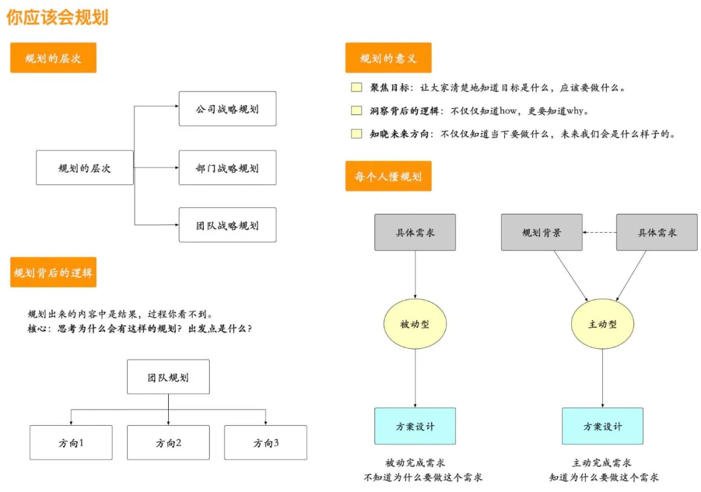
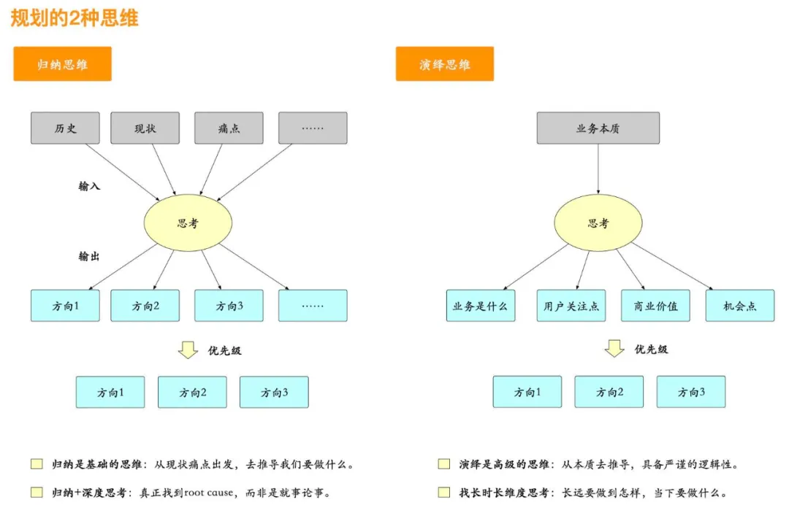
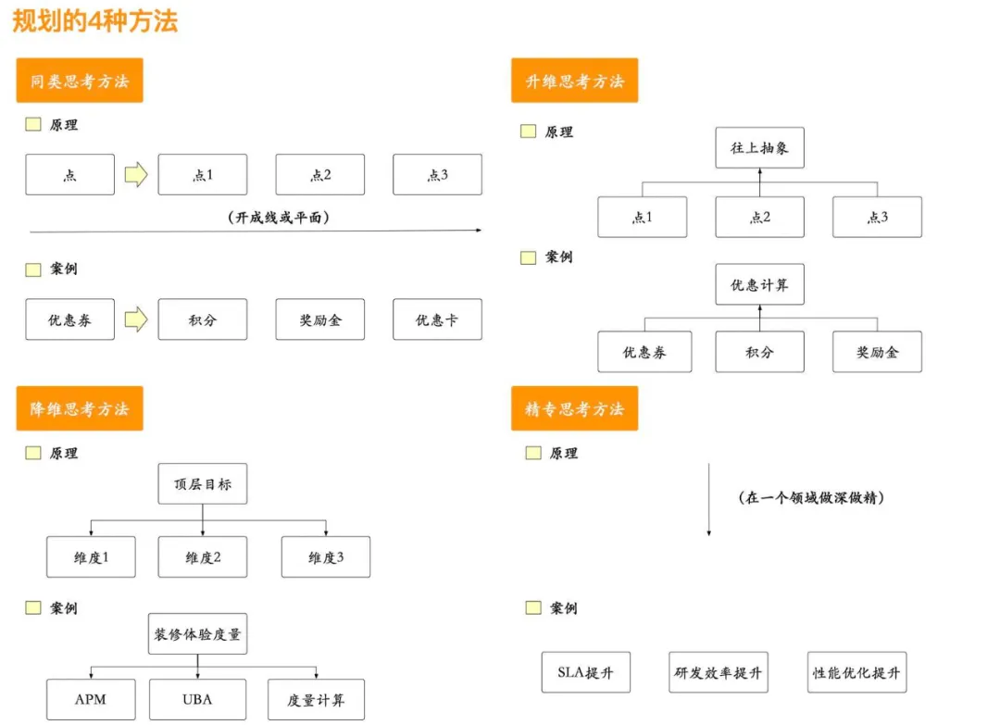
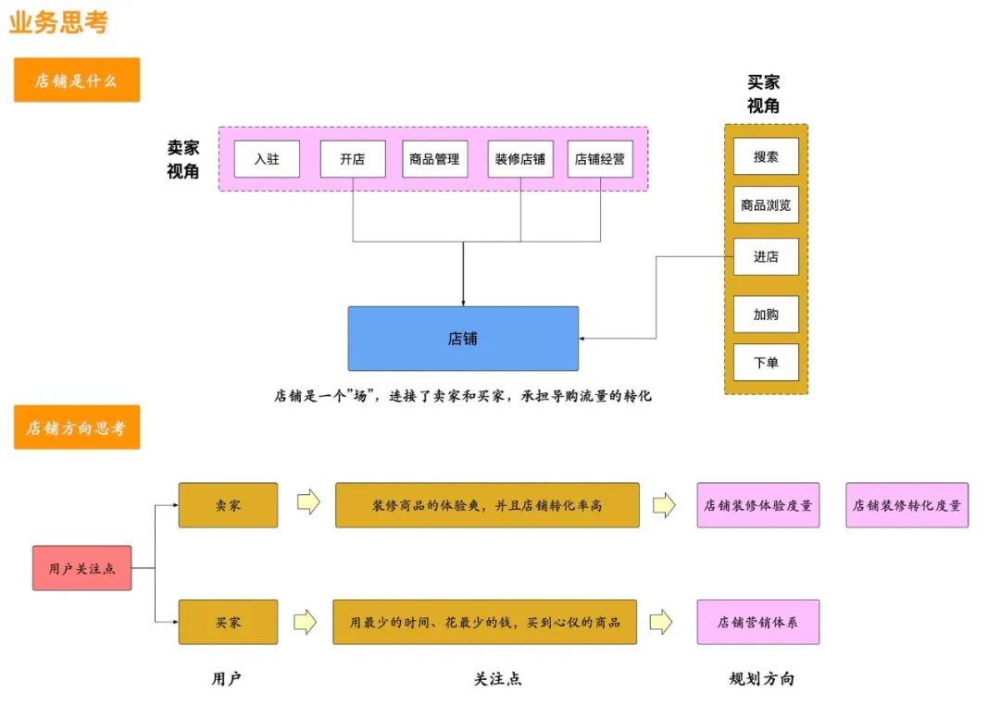
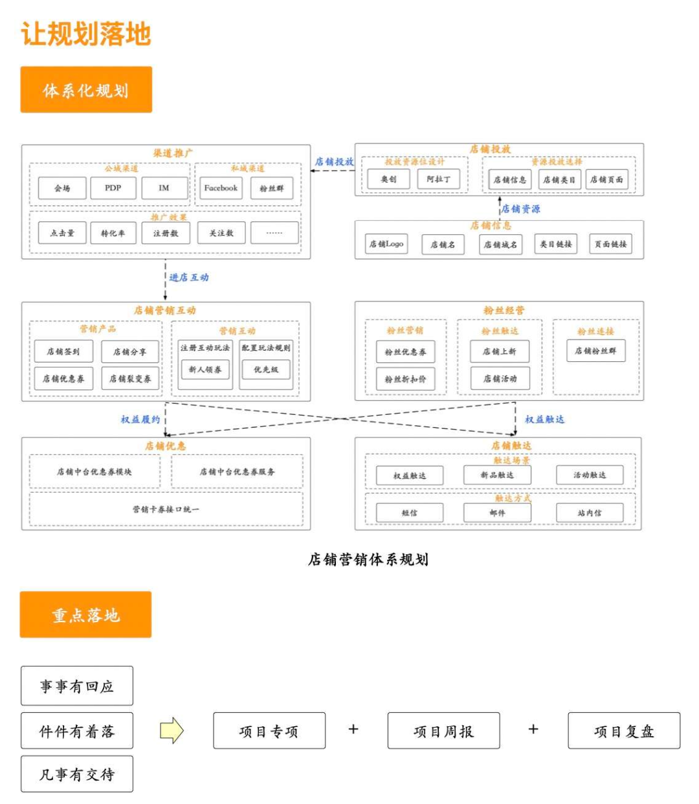

# 如何做规划？分享2种思维和4个方法

[不拔 阿里技术 2021年5月17日](https://mp.weixin.qq.com/s/LILm--w9vj_K7qjI4EakBw)

## 一  你应该学会规划

### 1  规划不只是高层的事

规划不仅仅是高层的事，每个人都要学会规划，只是每个人规划事情的格局不一样，高层做战略规划，下面的人做战术规划。规划也是分层次的，有战略规划、部门规划、团队规划、个人规划，站在每一层中，你看到的内容是不一样的，一般都是高层规划包含底层规划，底层规划支撑高层规划。

有些人认为规划是主管的事，自己只要按照规划去做事就行，这是一种被动接受干活的心态，你很有可能不了解做这件事的背景是什么，要解决什么问题，深层次的目标是什么。当你的输入更多时，你所做的方案设计也就不一样了，技术选型也会不一样，架构设计也会不一样。

### 2  规划具有重要的意义

笔者认为规划有三个重要的意义：

#### 聚焦目标

规划的一个最为重要的作用就是让目标更清晰。团队里的人知道要做什么，有一部分人觉得迷茫，很大程度是目标不清楚，好像知道要做什么事，又不知道如何下手。这个目标可大可小，小的方面就是要完成一个项目或一个需求，大的方面就是要建立一套体系。笔者曾经就有这样的切身经历，有一段时间显得非常迷茫，不知道自己要做什么，人一迷茫就会焦虑。一旦有这样的状态，就要思考是不是目标不够清晰，目标度量是不是不够细。当目标明确之后，大家"心向一处想，劲往一处使"，这样的工作状态效率是非常高的，团队的氛围也是非常好的。

#### 洞察背后逻辑

规划出来的内容是结果，最为重要的是思考为什么要做这些事，背后的逻辑才是核心。分析当前的现状、痛点、业界发展状况……结合业务本身，去做一些决策、取舍。不同的人思考出发点不一样，大家在一起碰撞时，会有一些想法闪现出来，也是思想的交流。我们做事不仅仅要懂得how，更要懂得why，当把why讲清楚之后，how也就是水到渠成的事，往往我们的一个困惑是不知道why。

#### 知晓未来方向

规划有短期规划，也有长期规划，一般笔者是先思考长期规划，思考3年之后，我们要具备怎样的能力，再回到短期上，我们当下这个阶段要做到怎样的程度。有些事不紧急，但很重要，可以放晚一点做；有的事非常重要，又非常紧急，优先级就要提高。当我们知道了方向之后，即使当下没有去做一些事，也知道将来我们要做成什么样。以笔者的过往经历，一个团队有一两年的长远规划，团队里的成员达成共识之后，这个团队在一两年内是稳定的，因为大家知道两年之后我们会做成什么样，远方一直有一个目标在照亮着我们，大家一起努力不断逼近那个目标。

## 二  规划的2种思维

### 1  归纳思维

规划使用的第一种思维是归纳法。这是大家最常用的方法，一般是从现状出发，思考当下有哪些问题、业界是怎么做的，从这些输入中去归纳我们需要去做什么。比如当下工单咨询比较多，那么就需要对工单进行分类，如归纳成产品设计问题、程序代码问题、依赖方问题、交互设计问题，针对每类问题，再去思考我们应该要做到哪些工作。在店铺平台建设中的规划中，我们就梳理了当下的一些痛点问题，如平台只有一些基础的能力，没有给业务方提供强大的能力支撑，那么接下来就要加强店铺能力建设，丰富店铺能力。

归纳思维有一个缺点就是就事论事，解决了表层的问题，比如竞品有什么，我们没有该项能力，是不是我们就要去做同样的事。归纳思维要配合深度思考一起做规划设计，真正挖掘出我们当下的痛点是什么，比如一个工单，用户只会提出他遇到了什么问题，此时就要深入分析它的root cause，有的时候只需要一个清晰的提示文案就可能解决用户的问题。

### 2  演绎思维

规划使用的第二种思维是演绎思维。演绎思维是一种更高级的思维模式，它需要一个人对事物有非常深刻的认识，当洞察出了底层的规律之后，再去思考我们要做什么。一般的人并不习惯用这种思维模式，它对人的要求非常高，一旦掌握之后，规划也就容易得多，很多科学家更偏向使用演绎思维。

在店铺规划中，笔者就运用了演绎的思维。比如在规划之前，笔者就思考两个问题：店铺的本质是什么、店铺要提供的商业价值是什么。当把这两个问题想清楚之后，沿着价值方向去思考我们应该要给用户提供怎样的能力，这是一步一步推导出来的。店铺的本质是一个"场"，它连接了卖家和买家。针对这两种角色，卖家最为关注的是怎么使用得好店铺，包含使用得爽、店铺转化好；买家最为关注的是怎么通过最少的钱、最少的时间买到心仪的商品。沿着卖家和买家关注点，继续思考我们怎么让卖家用得爽、用得好呢？其中一个点是我们要知道卖家现在有哪些不好的体验，一定要能度量得出来，而不是定性地去分析，当定量地度量出体验指标之后，这样就可以非常有针对性地去做一些体验优化工作。站在买家的角度，可以给买家一些优惠，让他更愿意购物，这也即是我们规划店铺营销的初衷。

## 三  规划的4个方法

### 1  同类思考方法

同类思考的方法是通过当前的一个点，去思考还有没有并列的事物。比如在优惠体系中，优惠券是非常常见的营销手段，那么就要思考，有没有与优惠券等同的营销手段呢？这样思路一下子就打开了，除了优惠券外，还会有积分、奖励金、卡等，这样就形成了卡、券、分、金的基础优惠体系。同类思考的方法是最简单的，也是最容易实践的，只要在现有的事物上，进一步去思考同类事物就行。它最好的特点就是丰富能力，尤其在平台型业务建设的过程中，丰富能力一直是一个重要的规划，当把同类的能力都补齐之后，整个平台的能力就非常丰富。

同类思考的方法除了用在规划上，还可以用在解决具体的问题上，比如，我们接受到一个工单：创建店铺时提示"service error"，这个提示就是非常技术化的表达，用户根本不知道出错的原因是什么。那么就要思考，在其它的交互流程中，是否也有类似的问题，我们在解决问题时，不要只单点地解决问题，至少要形成一条线，解决一类的问题。

### 2  升维思考方法

升维思考的方法是往向抽象一层，屏蔽下层的实现细节，本质来讲是简化认识和提升认识的维度。还是回到上面优惠的例子，有了优惠券、积分、奖励金这些优惠工具，外部业务系统怎么去感知呢？不可能每次新增加一种优惠能力，还要让业务侧去感知，如交易在下单时，要扣减优惠金额，非常不好的体验是交易分别去调用优惠、奖励金系统的接口，往后只要新增加一种优惠能力，交易扣减逻辑就要修改，显然不符合"开闭原则"。解决这个问题就要使用到升维思考的方法，往上抽象优惠计算的能力，交易、导购只用关注优惠计算接口就行，至于有多少种优惠它并不关心。

升维思考非常有用，再比如优化卖家店铺装修体验，我们能想到一些具体的措施：优化交互、优化流程、增加用户文档……虽然这些具体的措施对提升卖家装修体验是有好处的，但有一个问题我们始终没有定义清楚：到底什么在影响着卖家装修体验？换句话讲，我们需要知道影响卖家装修体验的定量指标，只有把定量的指标找到之后，就非常有针对性去做一些体验优化的工作。

升维思考的格局比同类思考的格局要大一些，同类思考只是站在同类的维度去思考还有什么，而升维思考站在的维度更高，它可以往下拆解出不同的子项出来，如稳定性建设，它可以拆解出稳定性监控、稳定性预案、稳定性应急处理……如果说同类思考是横向思考，那么升级思考就是纵向思考，这两者结合在一起就形成了一个平面。

### 3  降维思考方法

降维思考的方法与升维思考的方法相反，它是往下一层去思考。这种方法比较适用于目标非常明确的场景，去思考具体要去做什么事。比如店铺营销，它相当是一个命题，店铺营销需要哪些能力去支撑，如何体系化地表达出来就非常重要。降维思考更像是一种逆向思考，目标已经有了，怎么去推导需要哪些能力去支撑，这些能力就是需要去建设的。回到例子本身，店铺营销，至少要包含：店铺优惠、店铺互动、店铺投放、店铺权益履约、店铺触达，还可以往下细分去思考每块的内容，如店铺互动，需要思考有哪些不同的店铺互动类型，常见的有新人进店领取优惠券、关注店铺领取优惠券、玩游戏领取优惠券……一层层地往下细化，整个体系就搭建起来了。

如果说升维思考更适合做平台类的建设，那么降维思考就适合场景类的建设，一个面向抽象规划，一个面向具体规划。降维思考方法也是非常有用的，比如店铺域要用到营销能力，本身底层的营销能力又是营销域负责的，那么店铺营销能做的事就是将营销能力应用到具体的场景上，如关注店铺领取积分、积分兑换装修模板……平台思维和场景思维是两个不同的思维方式，平台思维偏通用类的规划设计，更多的是运用归纳的思维，而场景思维是偏具体业务的规划设计，更多的是运用演绎的思维。

### 4  精专思考方法

精专思考的方式是专注于特定领域，将某一件事做到极致。比如做芯片，5nm就是一个技术挑战，在这个领域没有足够多的研究，是很难达到5nm的标准。精专思维应用到规划上，更多的偏向具体度量指标的提升上，比如性能优化，RT从xx降到xx，QPS从xx提升至xx……研发效能，研发时间从xx降到xx，效率从xx提升至xx……SLA从99.99%提升至99.999%……这样的规划案例非常多，精专体现的是深度，当把基础的能力都建设得差不多之后，要么选择更广阔的空间，要么选择做得更深，比如营销中怎么去预防资损就是一个深度问题，还有怎么去提升研发效能上，是通过架构升级，还是流程改进，亦或是框架优化……越往底层，对专业能力的要求就非常高。

降维和精专又是从另外一个角度去思考问题，和前面两种方法构成了立体的视角。如果规划中能灵活运用这四种方法，整个规划的内容就丰富，既有广度的内容，又有深度的内容。

## 四  规划方法只是一个工具

### 1  不要过分沉迷方法

方法只是一种工具，让我们更好地去工作，但我们不能过分去强调方法，本质上还是要回归到业务认识上，正所谓"巧妇难为无米之炊"，同样的道理，对业务没有思考，空有方法也是没有用的。笔者的建议是不同的人有不同的规划方法，真正吸取一两个人的方法之后，真正去实践，从实践中再总结出适合自己的方法。不同的人对方法的表述不一样，本质上是大同小异的，真正掌握4、5种方法就足够用了，不用贪多，把方法的原理、思路了解好了，多去实践，在实践中再去体会，多规划几次，你也就懂了。

### 2  深度思考业务才是正道

在上一节中也提到不要过分地沉迷于方法，深度思考业务才是正道，一般懂一个业务是需要时间的，要不断去思考业务的本质是什么，业务的商业价值是什么，从本质和商业价值中去寻找我们的机会。比如笔者就花了很长时间去思考店铺的本质是什么，它的商业价值是什么，不管是业务本质还是商业价值都是简单的，如果不能够用一两句话讲清楚，很有可能你还没有深刻理解（有可能你知道但没有表达出来）。以店铺业务为例，站在卖家的视角，店铺给卖家的商业价值就是让卖家用得爽店铺、用得好店铺，用得爽就是卖家在装修店铺的过程中，他的体验是好的，这也是人之常情，你用一个东西，用得很不通畅，你也就不想去用它；用得好就是装修出来的店铺，买家更愿意在店铺里购物，即转化率要高。

在规划时，应该多关注业务，多思考业务上的痛点问题、业务的本质、这个业务的初衷是什么，所要做事的方向就会清晰一些，我们所做的规划一定是有目的地，解决一个痛点，解决一个难题，新增加能力……背后是有决策依据的，当把背后的思考讲清楚之后，大家的目标感、方向感就会更清晰。

## 五  让规划落地

### 1  规划能看得出一个人的格局

不同的人看到的问题不一样，所接受的输入信息也不一样，思维模式也不一样，因此不同的人思考的出发点不一样，他所做的规划也就不一样。有的人思考深刻，考虑周全，规划的内容非常有体系化；有的人专注于某一个领域，不断探索底层的问题，规划的内容非常有深度；也有的人思考的问题比较单一，规划的内容比较零散……

从规划出来的内容，可以看得出一个人的格局，这个格局或大或小，或深或浅，它直接影响着今后一段时间工作的方向。我们更希望有大格局的规划，就像国家有5年规划、10年规划、100年规划，能清晰地知道我们要驶向何方，未来是什么。规划的内容要有一定的挑战性，去挑战一些未知区域的内容，这样也就有巨大的优势，在这个赛道上，很早就开始布局了，即使别人要追上来，也不是一两年的事。在这个领域上保持着领先地位。要达到这样的效果，绝对不是漫无目的做出来的，一定是很早就开始规划，一步一步走到今天才可以。

### 2  体系化的规划

规划要体系化，而不是散点去规划，散点做事不成体系，东一榔头西一棒槌，散点规划并不能看出清晰的目标。比如在规划度量装修体验的度量指标时，它所包含的内容就非常多，如确定业务目标、业务目标拆解、数量埋点、接口监控、行为路径分析、问卷设计、实时反馈通道、指标相关性计算等，整个形成一个体系，从逻辑上是自洽的。不成体系的规划，往往会受别人的质疑，很明显缺少一些能力支撑。

### 3  重点落地

当有了规划之后，接下最为重要的就是把规划里的内容实现出来，我们最为牛逼的就是一两年后把我们当初设计的规划都实现了，那个时候是最有成就感的。我们规划的格局要大，同时落地要实，实实在在地完成规划的内容，否则即使规划再好，最终也不会有很好的结果，阿里有一句话："为结果买单，为过程鼓掌"。

一般PM要承担项目管理的角色，把控项目进度，及时发现风险并且协调资源解决问题。以我们团队为例，会有一些专项去落实规划的内容，做好需求分析、方案设计，每周会有项目周报，跟踪项目进度和项目风险，没有管理的项目，延期的风险是巨大的。

