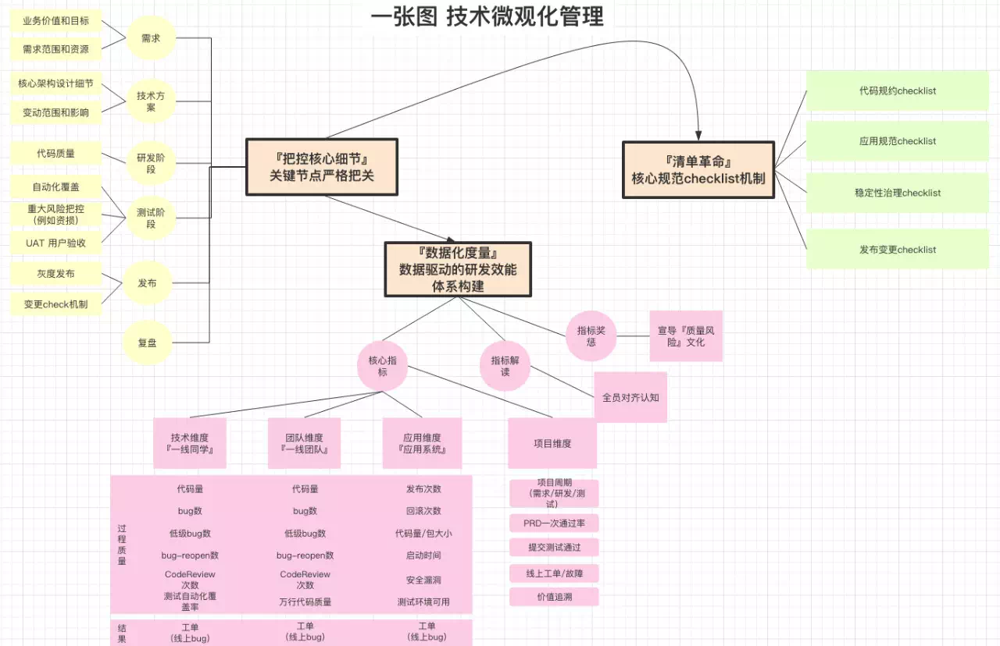
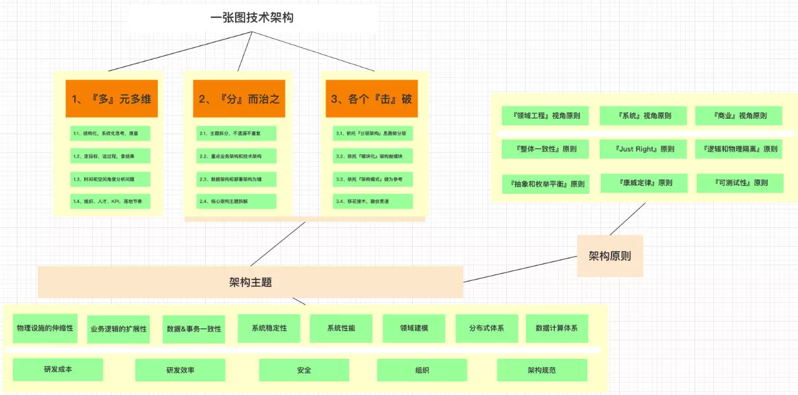

# 技术三板斧：关于技术规划、管理、架构的思考

[毕啸 阿里技术 2019-05-30](https://mp.weixin.qq.com/s/vL9_PQBCDxEgCyzh1lGFeQ)

大约半年前，开始总结自己关于工程技术的一些核心要点，关于规划、技术管理以及架构，三个方面的一些心得。结合自己团队的现状、自己对于周边做得比较好的同学的观察，于是有了文中的这几张图。

## 一、关于技术规划三板斧

技术规划规划做得好，能起到比较好的正向引导作用，个人及团队的整体目标感会好很多，分为三个部分的内容：

### 第一部分是全局分析

这需要溯源历史，思考未来，要对未来有一定的预判。能够基于数据，基于专业，基于客户价值，同时结合顶层的战略、公司的战役情况和组织的现状做分析。

### 第二部分是定目标

这一部分非常关键，定义好目标以及非目标，哪些事情是不要做的也要讲明白，并且确认目标的实现路径，做好拆解。

### 最后一部分是以终为始

从最终结果的角度，来溯源开始。从技术支撑业务发展、平台能力输出或者赋能、平台研发效能以及技术数据驱动业务等不同的角度审视结果。

另外，关于创新，可以有几个不同维度的方法，例如通过上下左右的比较，用比较思维法来获取信息；例如移花接木，通过不同行业的分析来完成方案的嫁接；例如第一性思考，深度分析业务以及技术的场景，产出最后的方案。

## 二、关于技术管理三板斧

这里的管理，不是团队管理，是指技术本身的管理。其实最近一年多，一直在倡导一件事情，就是技术的微观化管理，技术和其他的事务不太一样，一旦宏观化管理，不能 Deep Dive 细节，就非常容易引发各种各样的问题。例如，在研发质量中体现为研发效率降低，架构孵化。总体提供三个方面的建议：

### 首先，把控核心细节

软件工程这些年，本质是没变的。不管是偏互联网的部分还是偏企业级的部分，关键细节是需要严格把关的。

### 另外，就是数据化度量

通过数据驱动研发体系的重建，通过质量风险文化的宣导以及核心指标的跟进，起到督导的作用。

### 最后，就是清单革命

清单革命是一本书的名字，这里借用过来，合适是 checklist，不管是代码规约、应用规范还是稳定性治理等，都容易由于不重视或者不 check 而逐渐孵化。这时候，一个好的 checklist 非常关键重要。

## 三、关于技术架构三板斧

关于架构，其实讲架构模式、TOGAF 架构、互联网架构等的书不少。架构本身有一些通用的方法的，但是方法一旦通用，就会偏虚无缥缈。这里总结了三个部分：

### 第一，是多元多维

这个概念来自穷查理宝典，因为架构需要良好的上下文输入，需要思考时间和空间维度，需要思考组织人才和 KPI ，需要思考目标过程和结果，这些和架构本身关系不大，但是关联到架构是否能够良好地落地。

### 第二和第三是相辅相成的，核心是分而治之，各个击破

架构本身是解决问题的过程，问题太复杂了，只能采用分而治之的办法。怎么分？利用金字塔原理，不遗漏、不重复，重点在业务架构和技术架构，同时在数据化上做思考，之后按照架构主题做拆分。怎么击破？分层架构和模块化架构，是比较通用的两个方法，业界有架构模式的参照，也可以用一些移花接木的方法。另外，关键架构主题和架构模式，也可以有checklist，方便在做架构的时候，通过清单对照不会漏掉重要内容。

## 四、关于赛车、赛道、赛手三段论

去年六七月份，针对市面上已有的物流机器人公司，做了一个全局的分析。在分析公司上，是有一些方法论的，正当尝试总结的时候，正好看到“得到”的一个专栏，一名证券公司的分析师分析如何快速搞懂一家公司。于是，做了总结：一个前提，就是分析宏观背景，例如经济形势。接下来是三部分：赛道很容易理解，就是这个行业发展的情况，赛道够不够宽，赛道够不够长；第二个就是赛车，公司有没有核心的商业模式以及核心竞争力；第三个就是赛手，公司的人和文化，这个也非常重要。

## 五、关于点线面体的思考

曾鸣老师的智能商业，是比较有深度的讲解互联网的一本书，中间有一篇文章是讲点线面体的，内容很不错。公司战略和个人发展战略，都可以从点、线、面、体的角度来思考。这里做一个引用：

> 点线面体，是一种全新的战略定位思考方法。这些年，很多人来找我讨论，公司的下一步应该怎么做。讨论多了我慢慢发现，传统的战略理论框架很多已经不适应现在新的环境了。战略的最核心是定位，很多人都耳熟能详。定位最传统的理论框架是波特提出来的成本领先、差异化和利基市场的竞争战略。虽然在未来这种定位还是大家需要去思考的，但实际上在网络时代有更重要的问题要先回答。
>
> 曾鸣《智能商业》
