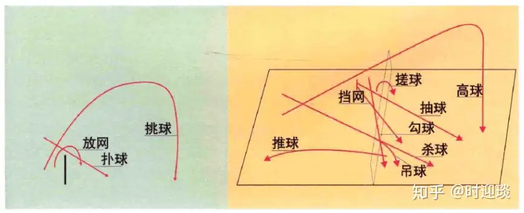
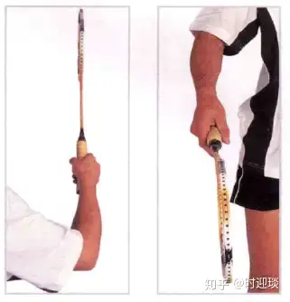
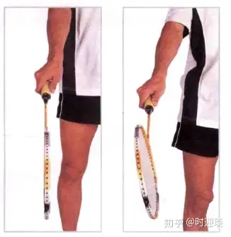

# 羽毛球

[初学者如何正确入门羽毛球运动？ - 知乎](https://www.zhihu.com/question/27898739)

## 初学者

1. 中规中矩的拍子 胜利9500。
2. 羽毛球鞋，降低受伤次数
3. 避免伤痛
   1. 手部的旋转发力
   2. 练习步伐，且每天半蹲五分钟
   3. 肩膀伤痛，防止办法举哑铃，增强三角肌前束肌肉。
4. 练好动作基础
   1. 学步伐 米字步伐
   2.

## 术语

技术术语

- 搓球：利用球拍切削球托侧面，使球旋转翻滚过网的网前技术，
- 放网：利用球拍轻切球托侧面或正面，使球直线过网的网前技术。
- 推球：利用球拍快速正击球托，使球平射至对方后场的击球技术。
- 勾球：利用球拍在网前一段将球勾至网的另一端的击球技术
- 挑球：将网前区域低手位的球由下至上，击至对方后场端线上空的击球技术。
- 扑球：将对方回击网前弧线较高的球，以抢高点的形式向对方场区下方扑压的击球技术
- 高球：将对方击至本方后场端线附近的球回击得又高又远，落至对方端线附近的击球技术
- 吊球：在后场以切削下压的形式，将球击至对方近网区的击球技术。
- 杀球：在后场或中场争取尽量高的击球点，并全力用正拍面将球由高点往对方中场区向下扣压的击球技术。
- 抽球：将对方击至中场的球，用正拍面快速抽击至对方中场或后场的击球技术。
- 挡网：将对方击至中场的球轻挡至对方网前的击球技术。

## 握拍

### 正手握拍

食指与中指分开一个手指的距离，这样有利于发力。

手掌心与球拍有一定的缝隙，不能握得太死，这样打出的球就会缺少变化。

上面的拇指和食指负责旋转球拍，下面三指负责球拍的发力。

### 反手握拍

大拇指顶在拍柄的宽面上，其余四指位于下方，撑住球拍，有利于反手发力

### 钳式握拍

多数应用于网前球（搓球，放网）。大拇指不同于其他手指处于另一侧，拍头略微下沉。

### 锤式握拍

五指合并，食指指尖位于大拇指下面并与之接触，握紧球拍，如同握紧锤子往木板上钉钉子一样，力量型挥拍。

## 挥拍

羽毛球的挥拍对速度要求高，对力量要求不是太高。

### 内旋挥拍

正手挥拍方式，前臂内侧转动。

头顶击球：手腕向外翻动带动球拍做顺时针旋转击球，球拍打正。

正手挑球：前臂向外作好击球准备动作，用力向内旋前臂挥拍。

### 外旋挥拍

反手挥拍方式，前臂外旋转动，手腕的外伸后带动球拍做逆时针旋转击球。

转身后，腿弓步，肘关节向前向上顶起，抬高肘关节直至最高，球拍从身体的腹部向上挥，下面三指用力，拇指和食指放松。

前臂首先内旋，不要停顿，肘部伸直，前臂反向外旋。

在大力击球时，内外旋手臂混合使用。在反手击球时，外旋前有一个内旋，需要预先使肌肉紧张起来，增大加速过程。

### 摆臂挥拍

主要用于接发高球。

加速过程尽量要长。

在软击球中（如正手头顶吊球）加速过程并不重要。

## 步法

步法被誉为“羽毛球运动的灵魂”。

1. 并步
2. 交叉步：前交叉步，后交叉步。
3. 垫步：一般用作调整步距。
4. 蹬跨步：多用于上网击球，在向后场底线两角移动抽球时也常采用。
