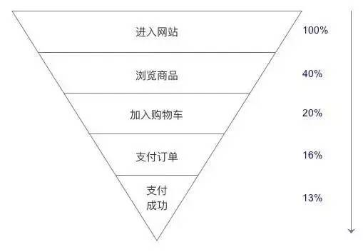
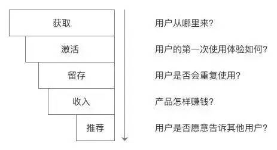

[TOC]

## 一篇文章让你看懂数据分析的目的、方法、工具及实际应用
杜王丹 鸟哥笔记 [一篇文章让你看懂数据分析的目的、方法、工具及实际应用](https://mp.weixin.qq.com/s?__biz=MjM5MzIxNTQ2MA==&mid=2650659405&idx=1&sn=898d07c2e3cfa86ff2e27f672e3f3982)

### 收集数据的方法
埋点: 在正常的功能逻辑中添加统计代码，将自己需要的数据统计出来。
目前主流的数据埋点方式有两种：
1. 自己研发。开发时加入统计代码，并搭建自己的数据查询系统
2. 利用第三方统计工具

常见的第三方统计工具有：
* 网站分析工具
  Alexa、中国网站排名、网络媒体排名（iwebchoice）、Google Analytics、百度统计
* 移动应用分析工具
  Flurry、Google Analytics、友盟、TalkingData、Crashlytics

### 产品的基本数据指标
新增：新用户增加的数量和速度。如：日新增、月新增等。  
活跃：有多少人正在使用产品。如日活跃（DAU）、月活跃（MAU）等。用户的活跃数越多，越有可能为产品带来价值。  
留存率：用户会在多长时间内使用产品。如：次日留存率、周留存率等。  
传播：平均每位老用户会带来几位新用户。  
流失率：一段时间内流失的用户，占这段时间内活跃用户数的比例。

### 常见的数据分析法和模型
#### 漏斗分析法
例子,分析从用户进入网站到最终购买商品的变化趋势,从用户进入网站到浏览商品页面，转化率是40%；浏览商品到加入购物车转化率是20%等，那要找出哪个环节的转化率最低，我们需要有对比数据。

比如第一个，进入网站到浏览商品，如果同行业水平的转化率是45%，而我们只有40%，那说明这个过程，没有达到行业平均水平，我们就需要分析具体原因在哪里，再有针对性的去优化和改善。

#### AARRR模型
AARRR（Acquisition、Activation、Retention、Revenue、Refer）是硅谷的一个风险投资人戴维 · 麦克鲁尔在2008年时创建的，分别是指获取、激活、留存、收入和推荐

